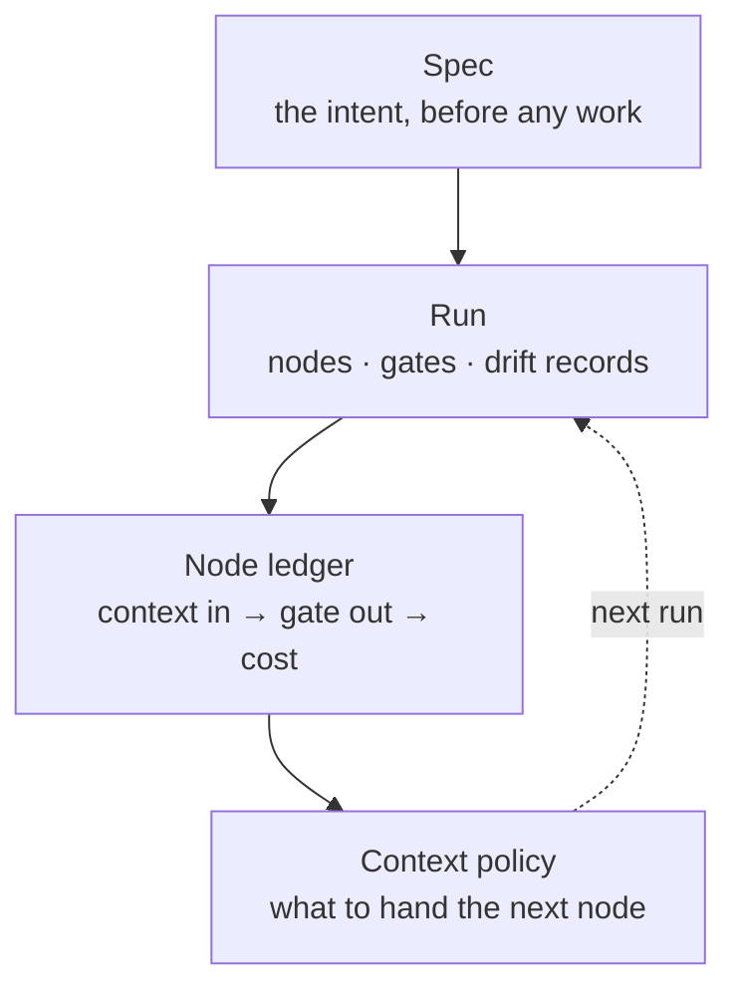
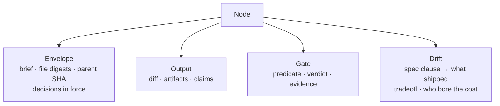
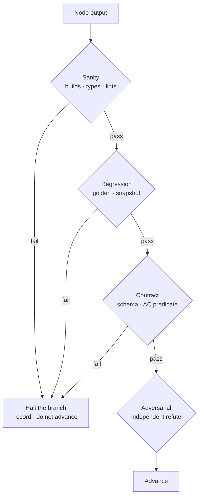
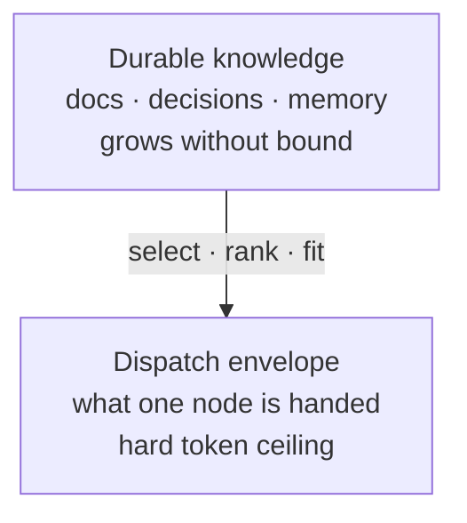
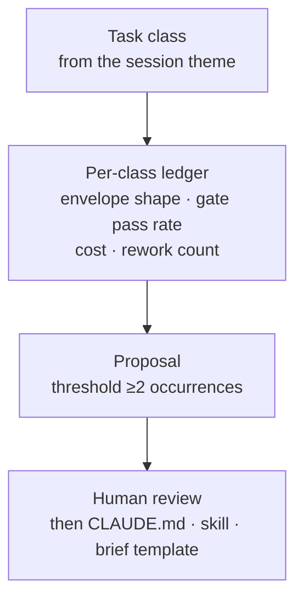

# Agent loop — long-horizon execution and the context policy that learns from it

**Status: scoping. Nothing here is built beyond the instrumentation fix noted in §7.**

## The claim this document makes

Two things were raised as separate projects — *a self-improving context manager* and *a
long-horizon task runner*. **They are one system, and building them apart is why neither
works.** The runner emits the only evidence the manager could learn from; the manager
supplies the only context policy the runner could improve on.

**Read the arrow from `L` to `P` as the whole thesis.** A self-improvement loop with no
per-node ledger is doing credit assignment — attributing an outcome to a cause — against
session-level averages, which cannot distinguish "the brief was too thin" from "the model
was wrong" from "the gate was miscalibrated."

---

## 1 · What already exists — do not rebuild it

The laziest correct scope is small, because most of the machinery ships already.

| Need | Already provided by | Gap |
|---|---|---|
| Node graph, fan-out, phases | `Workflow` — `pipeline()` / `parallel()` / `phase()` | None |
| Per-node output recorded | `Workflow` journal (`journal.jsonl`, one row per `agent()` return) | Records the **output**, never the **input** |
| Resume after edit or crash | `Workflow` `resumeFromRunId` — longest unchanged prefix cached | None |
| Structured node contract | `agent(..., {schema})` — validated at the tool layer, model retries on mismatch | None |
| Version control of artifacts | git | Nothing joins a node to the SHA it ran against |
| Decision journal | `docs/DECISIONS.md` convention (every repo) | Hand-written; not derived from runs |
| Archive-vs-update for **documents** | The knowledge-lifecycle driver named in `CLAUDE.local.md` — front-matter validation, `--stale`, `--provenance`, `superseded-by` verification | Scoped to one repo; covers docs, not agent context |
| Task-class label per session | `statusline.py` themes (`state-<id>.json → themes[].label`) | Never joined to outcomes |
| Cost / context per session | `telemetry/cost-ledger.jsonl` | **Was null on all 125 rows** — fixed, §7 |

**Five gaps, and they are all joins.** Not one of them is a new engine.

---

## 2 · The node contract — what "version controlled in terms of context" means

A node is a unit of work with a **context envelope** (everything it was given) and an
**acceptance predicate** (executable code that decides whether it may advance). Today the
journal keeps the return value and throws the envelope away, so a later session can read
what an agent concluded but never what it knew.

| Field | Why it must be recorded, not reconstructed |
|---|---|
| `envelope_digest` | Hash of each briefing input. Reconstructing "what it knew" from a mutable repo is guesswork once files move on |
| `parent_sha` | Without it the diff is uninterpretable a week later |
| `gate` | The predicate **as it ran**, plus its verdict. A gate silently loosened is the failure mode this exists to catch |
| `drift[]` | `{spec_clause, shipped, tradeoff, reversible}` — the ADR row, written at the moment the tradeoff was taken rather than reconstructed at review |
| `cost`, `ctx_pct` | The signal §5 learns on |

**`reversible` is the load-bearing flag.** It is already the escalation test in the global
execution contract; recording it per node is what lets a review pass filter a hundred drift
rows down to the handful that cannot be undone.

---

## 3 · Gates — deterministic means executable

A gate is a **postcondition**: code that returns pass or fail against the node's output,
written during scoping, never authored by the agent it judges. Prose criteria are not gates —
an agent grading its own homework against a sentence will pass.

Rules that make the ladder mean something:

- **Fail closed, halt the branch, never the run.** A failed node stops its own descendants
  and leaves siblings running — the pipeline shape already does this.
- **Gates 1–3 are code. Gate 4 is a separate agent with a refute mandate**, never the author.
- **A gate that has never failed is unvalidated.** Land one deliberately-broken node per gate
  at authoring time and confirm it halts. An always-green gate is decoration.
- **No silent caps.** If a run bounds coverage — top-N, sampling, no retry — it logs what it
  dropped. Silent truncation reads as full coverage in every downstream summary.

---

## 4 · Two context pools, and only one of them is solved

This is where the "archive versus update" question dissolves. **The word "context" is
covering two different things**, and conflating them is why the problem feels open.

| Pool | The real question | State |
|---|---|---|
| **Durable knowledge** | Update in place, or archive with a pointer? | **Solved, in code.** `index_docs.py` already enforces it: revise while the topic is right, archive on answered / superseded / retracted, backdate, verify `superseded-by` resolves |
| **Dispatch envelope** | Which subset goes into *this* brief? | **The actual gap.** This is selection under a budget — a retrieval and ranking problem over your own documents, not an eviction policy |

The mistake worth naming: an envelope is not a cache of the knowledge tree, so it has no
eviction policy. It is **assembled fresh per node**, and the only question is relevance
against a token ceiling. `/brief` is where that decision already lives, hand-rolled, with
no feedback on whether its choices helped.

**So the improvement target is `/brief`'s selection, scored by whether the node it briefed
passed its gate.** That is a small, measurable objective — and unlike "improve the agent,"
it is falsifiable.

---

## 5 · Per-use-case learning — what it can and cannot be

The ask was improvement *per use case over time*. That requires a **task class** on every
run to join outcomes to; the statusline's condensed theme label is already that key, unjoined.

**Deliberately not a learned controller.** Three reasons, and they are not squeamishness:

1. **Sample size.** A few hundred sessions across dozens of task classes will not support a
   policy that is distinguishable from noise.
2. **Goodhart.** Optimising an envelope against gate pass rate teaches the system to prefer
   briefs that pass gates, which is only the goal if the gates are perfect. They are not.
3. **Non-stationarity.** Model, harness, and repo all move underneath. A policy fitted to
   last month's conditions decays silently, and nothing here would notice.

The honest version is a **proposal engine with a human approval step** — which is exactly
what `/self-improve` already specifies. It has simply never run: `~/.claude/improve/` holds
`config.json` and no `history.jsonl`, and its inputs were null until §7.

---

## 6 · Spec → shipped drift

The concern raised — *did the final form still honour the initial spec, and what was traded
away* — is answered by making drift a **node output rather than a review activity**.

| When | What is written | Where it lands |
|---|---|---|
| Node authors a tradeoff | `{spec_clause, shipped, tradeoff, reversible}` | Node record |
| Run completes | Every drift row, grouped by spec clause | Run summary |
| Human reviews | Irreversible rows promoted verbatim | `docs/DECISIONS.md` as `assumed` + revisit trigger |

**Reversible drift never escalates** — it is logged with a trigger and the run continues.
That is the existing contract; the only change is that the node writes the row instead of a
human reconstructing it afterwards.

---

## 7 · What was blocking this, and is now fixed

`cost_usd` and `ctx_pct` were `null` on **all 125 rows** of `telemetry/cost-ledger.jsonl`.

**Root cause:** the `Stop` hook payload carries neither field. Only the `statusLine` payload
does, and `statusline.py` read them for display and discarded them, while
`analyze-session.py` looked for them in its own stdin. The existing test seeded them into the
Stop payload, so it exercised a path production never takes.

**Fix:** the status line persists them to `telemetry/meta-<session>.json`; `analyze-session.py`
falls back to that file. A separate file rather than a key on `state-<id>.json`, because the
status line writes on every assistant message while `log-prompt.py` read-modify-writes the
state file, and a merged write loses one or the other. Covered by
`tests/hooks.test.py` driving the real path — 88 pass.

**The ledger only fills going forward.** The 125 historical rows stay null; any baseline
starts from today.

---

## 8 · Build order

Each step is independently useful, and each has a criterion that kills it.

| # | Step | Kill criterion |
|---|---|---|
| **1** | Ledger accumulates — 2 weeks, no code | If cost and context stay null, everything downstream is unfalsifiable. Re-open §7 |
| **2** | Join task class → outcome. One script over themes + reports + ledger | If classes do not recur ≥2× in a fortnight, per-use-case learning has no sample. Stop at reporting |
| **3** | Node record: envelope digest, parent SHA, gate verdict, drift rows | If `Workflow`'s journal plus git can already answer "what did it know", drop the envelope digest |
| **4** | Gate ladder as executable predicates, one repo first | If gates never fail, they are not gates. Validate with a deliberately broken node |
| **5** | Run `/self-improve` against real data; measure proposal acceptance | If humans reject most proposals, the threshold or the evidence is wrong — fix that before automating anything |

**Steps 1 and 2 are the whole bet.** If task classes do not recur, the per-use-case premise
is refuted cheaply and steps 3–5 are never built.

---

## 9 · Open — carried, not assumed

| # | Question | Consequence |
|---|---|---|
| **AL-1** | Does this stay in `claudence`, or become a repo under `~/repo/AI/`? | `claudence` is dotfiles and is guarded against going public. An execution engine is not dotfiles |
| **AL-2** | Is `/brief` selection quality actually the bottleneck, or is it gate coverage? | Decides whether §4 or §3 is built first. Answerable from step 2's data |
| **AL-3** | What is a task class, concretely? | The statusline theme is a starting key; whether its granularity matches how work recurs is unmeasured |
| **AL-4** | Does the envelope digest record content hashes or file paths? | Paths are cheap and break on move; hashes are durable and larger |

## Related

- `~/.claude/CLAUDE.md` — Production Application Governance, Autonomous Execution Contract,
  Skill-First Dispatch. This document is the *mechanism* those rules currently assert as prose
- `telemetry/DESIGN.md` — the friction tracker whose ledger §5 learns on
- `~/.claude/skills/self-improve/SKILL.md` — the proposal engine, specified and never run
- The knowledge-lifecycle driver listed under *Reference implementations* in `CLAUDE.local.md` —
  the archive-vs-update policy §4 says is already solved
