# Dark Factory — Consolidated Audit (2026-09-07)

> Triggered by: "I think we've already started working on dark factory mode across two codebases — consolidate and see how far we got."
> Source memory: `project_roadmap_dark_factory.md` (stated 2026-09-06, marked "not started" — this audit shows that framing undersold it: component parts exist in **three** places, never wired together).

## The three places this idea already lives

```mermaid
flowchart TD
    subgraph B["1 · AI/bifrost — bespoke engine"]
        B1[Goal + context pack] --> B2[Bidirectional planner<br/>meet-in-middle]
        B2 --> B3[Build-graph DAG SSOT]
        B3 --> B4[Self-regulating loop<br/>build → gate → advance/repair]
    end
    subgraph H["2 · ~/.claude harness — process, not code"]
        H1[Autonomous Execution<br/>Contract, global CLAUDE.md] --> H2[fanout-design-build-audit<br/>Workflow template]
        H2 --> H3["/orchestrate role-flows"]
        H3 --> H4["/feature-pipeline<br/>kill-gate + FR/NFR wrapper"]
    end
    subgraph C["3 · Life/second-brain — Helm/Cortex"]
        C1[Idea bank markdown] --> C2[Capacity + launch<br/>tmux/WezTerm session]
        C2 --> C3[helm-status.json /<br/>helm-directive.json heartbeat]
    end
```

**None of the three is "the dark factory."** Each solved a different third of it, independently, months apart, and never got wired together.

---

## 1 · AI/bifrost — the engineered attempt

`D:/repo/AI/bifrost` — Python + pydantic, `deploymentTier: pre-traffic`, local git only (no push planned beyond `origin` already set to `github.com/sibulus13/bifrost`).

- **What it is:** a real planner/executor — searches forward from repo state and backward from a stated goal, meets in the middle to fix a critical path, then runs a loop that only advances a build-graph node when its **deterministic gate** (pytest, not self-report) goes green.
- **Distinctive ideas not present anywhere else in this audit** (worth keeping regardless of what happens to the codebase):
  - **Continuity validation** (`planner/continuity.py`) — `requires ⊆ upstream produces` checked statically + via a state-walk smoke test, *before* any build starts.
  - **RigorPolicy dial** (`schema/rigor.py`) — mvp/standard/production trades velocity for scrutiny, defaulted from `deployment_tier`. This is the same "gate strength scales with blast radius" rule from global CLAUDE.md, but implemented as a first-class schema object instead of a paragraph of prose.
  - **Human-approval as a graph node** (`GateKind.HUMAN_APPROVAL`), not a side-channel check — so a full-auto run still physically halts at the tier-`live` human gate instead of relying on the model to remember to stop.
- **Where it actually is:** design + prototype complete, independently adversarially reviewed (37-agent Workflow fan-out, **CONDITIONAL GO**), P0/P1 fixes landed. **44 pytest passing.** Last commit `23c5087` (2026-07-20, static `dashboard/index.html` roadmap console — cosmetic, not wired to the executor).
- **The actual blocker (unchanged since 2026-07-15):** planning and estimation are still **mocked**, not behind the swappable `Provider` seam — B1 in `docs/DECISIONS.md`. The engine has never planned or built anything against a real model. **Scout** (`Life/notion ideas/context/top-5/04-scout.md`) was picked as the first real validation target and has never been run.
- **Verdict:** a real, tested core with zero live miles. Seven weeks untouched.

## 2 · The harness itself — the process attempt

`~/.claude` (claudence repo) — not a product, the operating contract you're already running under.

- **The loop already exists and is already live**, right now, every session: global `CLAUDE.md`'s **Autonomous Execution Contract** — identify next milestone → implement → test → commit+push → repeat, with three named hard-blockers (missing creds w/ no agentic path, irreversible action, genuinely-ambiguous-and-hard-to-reverse choice). This *is* a dark-factory loop; it's just implemented as an instruction I follow rather than code that runs.
- **`fanout-design-build-audit.js`** (`~/.claude/workflows/`) is the reusable multi-agent version of Bifrost's loop: Design → Design Review → Build → (Build Review + Adversarial Audit → Fix) per component, until converged — deterministic pipeline via the `Workflow` tool instead of a hand-rolled Python executor.
- **`/orchestrate`** sequences six named role-flows (feature/bugfix/arch-decision/security-review/go-to-market/hotfix) on top of that.
- **`/feature-pipeline`** is the closest thing that exists to the *trigger* the dark-factory memory asked for: phase 1 is a **kill gate** ("which persona use case, what evidence, what metric would confirm it worked — no map, don't build") before anything is designed, then phases 2–3 produce FR/NFR + a coupling map, then phase 4 explicitly **delegates** to `/orchestrate` + `fanout-design-build-audit` rather than reimplementing them.
- **What's missing:** every one of these is **manually invoked** (`/feature-pipeline`, `/orchestrate`). Nothing watches a project's `DECISIONS.md`/spec status for "locked" and *starts* the loop on its own — the trigger half of ask #2 in the dark-factory memory doesn't exist here either.
- **Verdict:** further along in practice (it's what's actually building things today) but exists as *documentation + skills*, not as an inspectable system with its own tests or state.

## 3 · Life/second-brain (Helm/Cortex) — the dispatch console

`D:/repo/Life/second-brain` — Next.js, part of the `Life` git repo (not its own remote).

- **What it is:** a human-operated console — reads the idea bank (`Life/notion ideas/*.md`), tracks a concurrency budget (`data/capacity.json`), launches a Claude Code session per assigned idea (tmux, WezTerm fallback on win32), and polls a heartbeat contract (`helm-status.json` written by the agent, `helm-directive.json` written by the operator for mid-run redirects).
- **Where it stalled:** M8 done 2026-06-21 (status/directive heartbeat wired into 3 active projects' `CLAUDE.md`s). M9 (glanceable status cards) was next and was never started — repo's own commit history since then is almost entirely `pylon`/billing work, not Helm.
- **Relationship to dark factory:** this is the **operator console** a real trigger would eventually plug into (it already has the launch + liveness + redirect primitives), not the autonomous engine itself — there is no "spec locked → auto-launch" logic here, only "human clicks assign → launch."
- **Verdict:** the UI half of "roadmap by phase" (ask #1 in the dark-factory memory) has scaffolding here (idea cards with priority/effort/impact), but not phase-based (research/design/build-ready) — that categorization doesn't exist anywhere yet.

---

## Consolidated status against the two original asks

| Ask (from `project_roadmap_dark_factory.md`) | Status |
|---|---|
| **1. Cross-project roadmap by phase** (research/design/build-ready) | Not built anywhere. Closest analogs: Bifrost's own SDLC-stage table in `STATE.md` (self-only, not cross-project) and Helm's idea cards (priority/effort/impact, not phase). |
| **2. Autonomous build loop triggered on spec-lock** | The **loop mechanics** exist twice over (Bifrost's executor, engineered; the harness's Autonomous Execution Contract + fanout workflow, process-based) — but the **trigger** (detect "spec locked" → start) exists in neither. `/feature-pipeline`'s phase-1 kill gate is the nearest thing to a formal readiness gate, and it's manual. |

## The actual defect this audit surfaces

Per your own standing rule (single canonical per concern — augment, don't proliferate): **there are now two competing execution engines for the same job** — Bifrost's bespoke Python planner/executor, and the harness-native Workflow/skill stack. That's the same class of problem as the "duplicate component" reuse-check rule, one level up (duplicate *subsystem*, not duplicate *file*).

**Recommendation (not yet actioned — this session did analysis only):** consolidate onto the harness-native path (`/feature-pipeline` → `/orchestrate` → `fanout-design-build-audit`) as the one dark-factory implementation, since it reuses the agent/Workflow primitives that already exist rather than re-deriving a planner/executor from scratch — and port Bifrost's three distinctive, well-tested ideas into it rather than discarding them:

1. **Continuity validation** — before a fan-out build phase starts, check every component's stated dependency is actually produced upstream (would have caught real bugs per Bifrost's own adversarial review).
2. **RigorPolicy-as-schema** — turn the prose blast-radius/tier rule into a typed object the pipeline can branch on, not just a paragraph an agent reads.
3. **Human-approval as a graph/state node** — give `/feature-pipeline`'s phase-1 kill gate (and any tier-`live` gate) an explicit halted-state representation instead of relying on the agent remembering to stop.

Bifrost itself would then be archived as "ideas harvested, engine retired" rather than kept as a second live implementation — but that's a call worth putting to you explicitly, not deciding unilaterally, since it's seven weeks of engineered, tested work.
