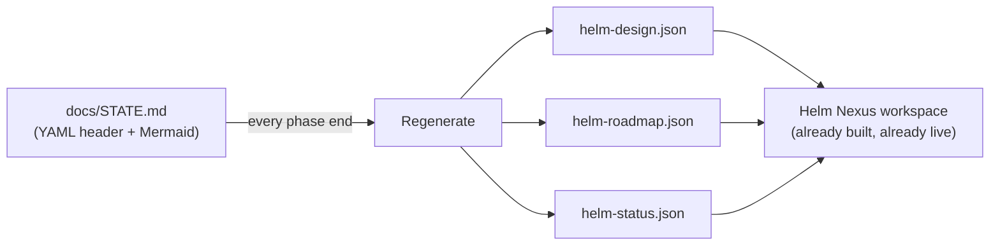
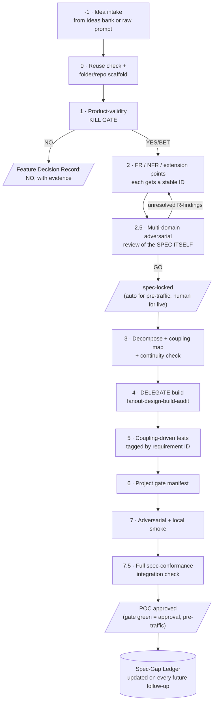
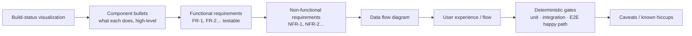
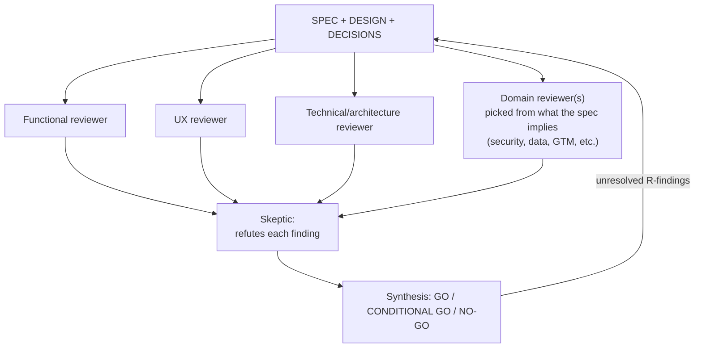
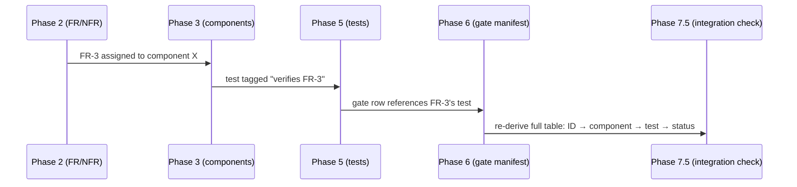
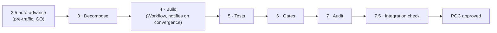

# Dark Factory v1 — Consolidated Design

> Supersedes the "two competing engines" state described in `DARK-FACTORY-AUDIT.md`. Consolidates onto the harness-native path (`~/.claude/skills/dark-factory` → `/orchestrate` → `fanout-design-build-audit`), extended with Bifrost's three distinctive ideas and the requirements below. `deploymentTier: pre-traffic` (this is tooling; no live users of the factory itself). **Renamed from `feature-pipeline` to `dark-factory` 2026-09-07** — the skill builds whole products from zero, not just features; "feature-add" is now one entry mode among several (see "Entry modes" below), not the skill's whole identity.

## What changed vs. the audit

`feature-pipeline` (now `dark-factory`) already had 7 of the ~10 pieces this needs (kill gate, FR/NFR, decomposition, delegated build, test strategy, audit gates, adversarial smoke). This design adds the pieces it was missing and states where each lands:

| Missing piece | Landed in |
|---|---|
| Validate a **brand-new idea from zero**, not just a feature in an existing repo | New Phase -1 |
| One canonical spec sheet, template-enforced, with a build-status visualization | New Phase 0 template |
| Multi-domain review of the *spec itself* before decomposition (not just code after) | New Phase 2.5 |
| Traceability: every requirement → component → test → status, so a break points at a node | Requirement IDs threaded through Phases 2/3/5/6 + new Phase 7.5 |
| Full re-check against the original spec once integrated | New Phase 7.5 |
| Record every post-ship follow-up as a spec gap, feed forward to the *next* idea's spec phase | New Spec-Gap Ledger (cross-project) |
| Bifrost's continuity check, rigor dial, human-approval-as-node | Ported into Phases 3/2/4+7 |
| Run without a human clicking through each gate | Phase 1/2.5 auto-advance rule + continuous same-run execution (event-driven, not scheduled) |
| **Reusable in pieces, not all-or-nothing** (2026-09-07 ask) | New **Entry modes** — `new-product` / `feature-add` / `spec-only` / `review-only` / `build-only` / `integration-check` / `gap-log` |
| **Visualize in-progress build status** (2026-09-07 ask, = Ask #1 from the original dark-factory memory) | **Not a new dashboard** — the pipeline now writes `helm-design.json` / `helm-roadmap.json` / `helm-status.json`, which Helm's existing "Nexus" workspace (`Life/second-brain`) already renders live |

---

## Entry modes — decomposable, not all-or-nothing

The full -1→7.5 chain is `new-product`, the default — but any subset is independently runnable so you can reuse only the piece you need instead of the whole pipeline:

| Mode | Runs | Use when |
|---|---|---|
| `new-product` | -1 → 7.5 | Building something from zero |
| `feature-add` | 0 → 7.5, scoped to the increment | Iterating a new feature onto a product this pipeline (or anything else) already built — appends new FR/NFR IDs to the existing SPEC.md rather than starting a fresh doc, and phase 2.5 reviews only the diff |
| `spec-only` | -1 → 2.5 | Want a validated, reviewed, locked spec without building yet |
| `review-only` | 2.5 only | Retrofitting the multi-domain review onto a spec written outside this pipeline |
| `build-only` | 3 → 7.5 | Spec already locked; resume straight into decomposition |
| `integration-check` | 7.5 only | Periodic health check on a shipped project; refresh `docs/TRACE.md` |
| `gap-log` | Spec-Gap Ledger append only | Record a spec miss without running anything else |

Full detail (including the `STATE.md.pipelineMode`/`phasesRun` tracking that makes a later `build-only` know where a prior partial run stopped): `~/.claude/skills/dark-factory/SKILL.md` ("Entry modes").

---

## Visualizing in-progress builds — reuse, not a new dashboard

**Reuse check, stated:** before designing anything, searched `Life/second-brain` (Helm) for a "visualize build status" role. Found it already built and wired: `components/WorkspaceView.tsx` ("Nexus" — a per-project workspace with Live-context / System-design / Spec / Roadmap / Schedule tabs), `DesignTree` + `RoadmapTimeline` components, and `app/api/projects/[filename]/{design,roadmap}/route.ts` reading `helm-design.json` (`HelmDesignSchema`: a `DesignNode` tree with `status: stable|in-progress|planned|deprecated`) and `helm-roadmap.json` (`RoadmapSchema`: `Milestone[]` with `status: done|in-progress|planned|gate|blocked`) from any idea-bank entry's `repoPath`. The existing `helm-status.json`/`helm-directive.json` heartbeat contract (from Helm's M8) already gives live context + mid-run redirects for any Helm-tracked project's `CLAUDE.md`. **All of this predates this design and already works end to end** — it was simply never fed by anything, since no project had regenerated those three files since Helm's own M8 changelog entries (`Life/second-brain/helm-roadmap.json`'s own milestone list stalls at 2026-06-21).

- `STATE.md`'s YAML header (below) is the single source of truth; the three Helm files are **derived views**, regenerated at the end of every phase in every mode — so Nexus is never looking at stale state.
- Component build-status (`⬜`/`🚧`/`✅` from the Phase 0 template's Mermaid) maps to `HelmDesignSchema`'s `planned`/`in-progress`/`stable`.
- Each pipeline phase actually run becomes one `Milestone`; phase 1 and phase 2.5 (the kill/lock gates) get `status: gate` specifically, since Helm's schema already has a dedicated value for exactly that shape of milestone.
- Phase -1 sets the idea-bank entry's `Repo path` and copies the "Helm Integration" `CLAUDE.md` block from an existing Helm-tracked project — this is what makes a brand-new `dark-factory` project show up in Nexus's sidebar automatically, with zero new code written.
- **This also closes Ask #1 from the original dark-factory memory** (a cross-project roadmap by phase, research/design/build-ready) — Nexus's sidebar-of-projects-with-a-roadmap-tab-each *is* that view, once every tracked project's `helm-roadmap.json` reflects real phase status.

---

## Pipeline shape (v1)

Phases 0, 1, 3–7 are the existing pipeline (unchanged in spirit, renamed skill). **-1, 2.5, 7.5, and the ledger are new.** Phase 4 is still a delegation to `fanout-design-build-audit` / `/orchestrate` — this design does not reimplement a build engine.

---

## Phase -1 · Idea intake (new)

Two entry shapes:

1. **From the Ideas bank** (`Life/notion ideas/*.md` + `context/top-5/*.md`) — an idea that already has a deep-dive. Read it as the seed for Phase 1/2, not a rubber stamp — the kill gate still runs.
2. **From a raw prompt** ("build me X") with no prior idea-bank entry — write a minimal idea file into the bank first (same schema `SCHEMA.md` already defines), so every built thing is traceable back to an idea record even if it started as a one-off ask.

**Scaffold, once past the kill gate (Phase 1):** create the project's home per the standing Repository Organization rule — `D:\repo\<Category>\<project>` — never bare. State the chosen category. Initialize git. Copy the Phase 0 template (below) into `docs/`.

---

## Phase 0 template · the one source-of-truth spec sheet

Every Dark Factory project's `docs/SPEC.md` (or `STATE.md` for the resume-facing view) **must** contain these sections — this is now enforced by Phase 2.5's reviewer, not just convention:

- **Build-status visualization** — a Mermaid flowchart or state diagram, ≤5 nodes per row, colored/labeled `✅ built` / `🚧 in progress` / `⬜ not started` per component. This is `STATE.md`'s job (mirrors Bifrost's `STATE.md` pattern, now mandatory everywhere, not just Bifrost).
- **Component bullets** — one bullet per component, what it does at a glance, no implementation detail.
- **FR / NFR** — each gets a stable ID (`FR-1`, `NFR-1`, …). IDs are never renumbered once a component or test references them; a removed requirement is marked `~~FR-3~~ (superseded, see DECISIONS D-n)`, not deleted, so old test/trace references don't dangle.
- **Data flow** — `sequenceDiagram` or `flowchart`, ≤5 participants.
- **UX** — the user-visible flow (even for a personal tool: what does using it feel like, step by step).
- **Deterministic gates** — named unit / integration / E2E-happy scenarios, matching the existing Test Gate convention (`pytest` green / `vitest` green / etc.) — this section is what Phase 4's delegated build and Phase 5's coupling-driven tests are built against.
- **Caveats** — known risks, deliberately deferred items, revisit triggers (same shape as `DECISIONS.md` entries).

---

## Phase 2.5 · Multi-domain adversarial review of the spec (new)

This is the global-CLAUDE.md "Production Application Governance" step 2, made concrete and mandatory in the pipeline rather than a principle to remember. Runs on the **doc suite**, before any component is decomposed or built.

- **Dimension selection is not fixed** — always run Functional + UX + Technical; add Security if the spec touches auth/PII/money, Data if it defines a schema, GTM if it's a product with users beyond the builder. Name which dimensions ran and why in the record.
- **A weak review is not a pass.** "Found little" only counts as approved if the skeptic pass actually tried to refute and failed — mirrors the existing global rule, restated here because this is the step most likely to get rubber-stamped under autonomous execution.
- **Auto-advance rule (this is what makes "no human intervention" real):**
  - `deploymentTier: pre-traffic` → a synthesis of **GO** or **CONDITIONAL GO with only F/H-severity findings** (Bifrost's R/F/H scale: **R**eal-now-fix, **F**uture/deferred, **H**ardening) auto-sets `spec-locked` and the pipeline continues into Phase 3 unattended. Any **R**-severity finding routes back to Phase 2, no human needed to trigger the loop.
  - `deploymentTier: live` → synthesis output is recorded, but `spec-locked` requires an explicit human field set in `STATE.md` (`approvedBy`, `approvedAt`) — this is the one place a human is structurally required, matching the existing tier rule.

---

## Traceability (new)

Every requirement ID introduced in Phase 2 flows through the rest of the pipeline instead of being abandoned after the FR/NFR table is written:

- Phase 3 (decomposition): each component's spec states **which FR/NFR IDs it satisfies** — this is the traceability seam, not an afterthought.
- Phase 5 (tests): each test's name or docstring states which ID it verifies.
- Phase 7.5 (new — full integration check): re-read the ORIGINAL `SPEC.md` line by line, and for every FR/NFR produce one row: `ID | requirement | owning component | verifying test | status (met/partial/failed)`. This table becomes `docs/TRACE.md`, refreshed at every Phase 7.5 run — **this is the artifact that answers "what broke" by pointing at a node**, not just "something's red."
- When something regresses later, the fix locates the owning component via `TRACE.md` first, rather than re-deriving it from scratch.

---

## Continuity check (ported from Bifrost, new sub-step in Phase 3)

Before Phase 4 delegates any build work: for every component's stated dependency (`requires: X`), verify some other component in the decomposition actually `produces: X`. This is a static check over the Phase 3 coupling map — cheap, and it was Bifrost's single highest-value catch (an `initial_state` bug the design claimed away but the code couldn't see). A component with an unmet `requires` is **not buildable yet**; Phase 3 is not done until every edge resolves.

## RigorPolicy (ported from Bifrost, formalized in STATE.md)

`STATE.md` now carries an explicit field, derived from `deploymentTier`:

| Tier | `rigor` | Repair budget (fix-loop iterations before escalating) | Continuity failure | Terminal gate |
|---|---|---|---|---|
| `pre-traffic` | `mvp` | 3 | warn, don't block | gate green = approved |
| `live` | `production` | 1 (escalate fast) | blocks Phase 4 | human-approval node, see below |

This replaces the prose-only tier rule with a value the pipeline can branch on, per project, without re-deriving it from CLAUDE.md each time.

## Human-approval-as-node (ported from Bifrost)

For `deploymentTier: live` only: Phase 2.5's lock and Phase 7.5's ship-readiness are both **explicit halted states** in `STATE.md` (`status: awaiting-human-approval`), not just an instruction the agent is trusted to remember. This resumes on the approval event itself (see below), not a check. `pre-traffic` projects never enter this state.

---

## Continuous execution — corrected 2026-09-07, event-driven not time-driven

**The scheduled-cron design originally here was wrong**, and the user caught it directly: *"as soon as it completes any dependency leading up to the next phase, shouldn't it automatically queue up as event-driven architecture rather than time-driven?"* Conceded — a fixed-interval poll inserts exactly the delay a continuous pipeline should never have.

- **No trigger needed between phases.** Each phase's gate passing is itself what starts the next one, in the *same run* — this is just the standing Autonomous Execution Contract loop (next unblocked step → do it → repeat until done or a hard blocker) applied to this pipeline. There is nothing to schedule because there is no gap to fill.
- **Phase 4's delegation is already event-driven.** `fanout-design-build-audit` runs as a background `Workflow`; its own task-notification is what resumes the pipeline the instant it converges — the harness's existing event mechanism, not something new to build.
- **Kickoff remains a deliberate invocation** (of `/dark-factory`, with a mode, by a human or an upstream agent) — that is the one real "start" event, and it happens exactly when asked, which is already as fast as possible. A fully unattended kickoff (new idea appears in the bank → pipeline starts with nobody asking) is a separate, later capability, not required by "front-load into the spec, autonomous after."
- **The one genuine suspend point** — `awaiting-human-approval`, `live` tier only — resumes on the approval event itself (the human sets the field and re-invokes), never on a timer. `pre-traffic` projects never reach this state.
- **Crucible's every-6-hours auto-implementer** (`Stock/Research 2026`) stays a useful reference for *that* domain's shape (hundreds of independent trading strategies genuinely do warrant a regular re-scan), but is not a template to copy here — this pipeline's phases are dependent and sequential, not an independent batch to re-poll.

---

## Spec-Gap Ledger (new, cross-project)

`~/.claude/docs/SPEC-GAP-LEDGER.md` — every time a post-ship follow-up reveals the original spec should have caught something (a correction, a "why didn't this handle X", a scope the user had to point out manually), it gets one row here, not just a note in that project's own `DECISIONS.md`:

| Date | Project | What was missed | Category | Now checked in Phase 2 as |
|---|---|---|---|---|

Phase 2 (FR/NFR) of every future run **reads this ledger first** and explicitly checks the running list of categories against the new spec before calling requirements complete — this is the literal "front-load into the initial spec" mechanism the user asked for. The ledger is append-only; entries are never deleted, only marked resolved-by-convention once a category has been checked in 3+ consecutive specs without a repeat miss.

---

## Decisions (assumed, pre-traffic — logged here per the global Decision Journal convention)

| id | decision | status | rationale | revisit-when |
|---|---|---|---|---|
| DF-1 | Extend `feature-pipeline` in place rather than create a parallel skill | confirmed | single-canonical-per-concern rule; feature-pipeline already claimed "or evaluating whether a product bet is worth building" | never — this is the design |
| DF-5 | Renamed `feature-pipeline` → `dark-factory` | confirmed 2026-09-07 | user: "does it make sense to call it feature pipeline when the reality is we want to build our fully flush solution and product overall" — correct, the old name undersold the scope and made "feature-add" read as the whole skill instead of one mode | if the pipeline later needs to shed the "dark factory" framing entirely (e.g. productized under a different name), revisit together with all doc cross-references |
| DF-6 | Pipeline decomposed into named entry modes (`new-product`/`feature-add`/`spec-only`/`review-only`/`build-only`/`integration-check`/`gap-log`) rather than one all-or-nothing chain | confirmed 2026-09-07 | user: needs to reuse only parts, and to switch off phases when iterating a feature onto existing scope | a mode's phase subset stops matching real usage — split or merge modes, don't bolt on ad hoc flags |
| DF-7 | Build-status visualization reuses Helm's existing Nexus workspace (`helm-design.json`/`helm-roadmap.json`/`helm-status.json`) instead of a new dashboard | confirmed 2026-09-07 | reuse-check found the UI, schemas, and API routes already built and wired — a new dashboard would have duplicated a working system | Nexus's tab set stops covering what dark-factory projects need to show — extend Nexus's own components first, still don't fork a second dashboard |
| DF-2 | Bifrost retired as a standalone engine; its 3 ideas ported, code kept but not developed further | confirmed 2026-09-07 (user said "let's consolidate") | avoids two competing engines | if a future project needs true multi-day unattended planning search Claude Code role-flows can't do |
| DF-3 | ~~Autonomous trigger = scheduled cron~~ **superseded** — continuous same-run execution, event-driven via task-notifications; no cadence to choose | corrected 2026-09-07 | user: "shouldn't it queue up event-driven rather than time-driven" — conceded, a fixed-interval poll is exactly the delay a continuous pipeline shouldn't have | if a genuinely async, no-session-running kickoff is wanted later, revisit as its own capability, not by reviving cron |
| DF-4 | `pre-traffic` auto-advances past the spec-lock gate on GO/CONDITIONAL-GO with no R-findings; `live` always halts for a human field | assumed | mirrors existing tier table exactly | if a pre-traffic project's auto-advance ships something the user didn't want, tighten to always-halt |

## Open item — needs you

Nothing is blocking the pipeline itself anymore — it's usable today via `/dark-factory`. The
only remaining open question is a product choice, not an architecture one:
1. **Pilot idea** — which idea from the bank should be the first one run end-to-end through this
   pipeline, to prove it out? (Scout was Bifrost's intended validation target and is already
   scoped at `context/top-5/04-scout.md`, if that's still a reasonable default.)
