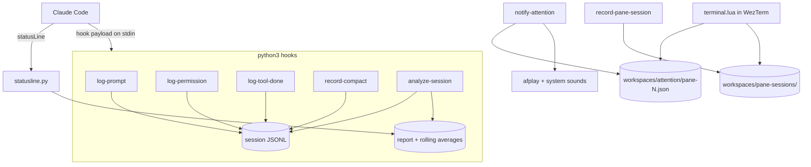
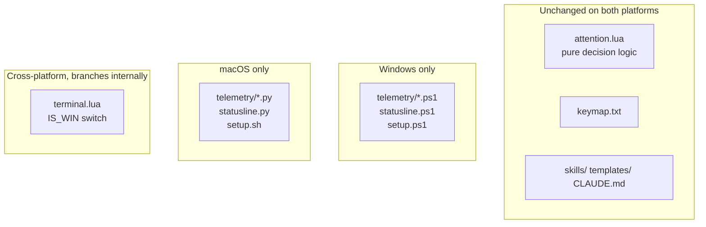

# macOS Port

The upstream build is Windows-only: ~1,600 lines of PowerShell for the hooks and
status bar, and a `terminal.lua` that spawns `powershell.exe` for its shell, repo
launcher, keymap popup and link handler. This branch (`macos`) makes the whole
thing run on macOS without forking it — the Windows paths are all still there,
behind a platform check.

## What runs where





## Layout

| Path | Platform | Notes |
|------|----------|-------|
| `telemetry/*.ps1`, `statusline.ps1`, `setup.ps1` | Windows | untouched, still upstream's |
| `telemetry/*.py`, `statusline.py`, `startup-reminder.py`, `setup.sh` | macOS | the ports |
| `telemetry/lib/hooklib.py` | macOS | shared plumbing: payload parsing, timestamps, sound |
| `telemetry/lib/classification.py` | macOS | port of `classification.ps1` |
| `terminal.lua` | both | branches on `IS_WIN` |
| `attention.lua`, `keymap.txt`, `skills/`, `templates/` | both | pure logic / content, no changes needed |
| `settings.json` / `settings.macos.json` | Windows / macOS | `setup.sh` installs the latter |
| `wezterm.loader.lua` | macOS | installed as `~/.config/wezterm/wezterm.lua` |

Install is by **symlink**, not copy: `setup.sh` links the code into `~/.claude`, so
the checkout is the only copy you edit. `settings.json` is copied instead —
Claude Code rewrites it when settings change, and a write-via-rename would
silently replace a symlink with a regular file.

## Translations

| Windows | macOS |
|---------|-------|
| `System.Media.SoundPlayer` + `C:\Windows\Media\*.wav` | `afplay -v 0.56` + `/System/Library/Sounds/Bottle.aiff` |
| `setup.ps1` rewrites PCM samples to 80% volume | `afplay -v 0.56`; no files to generate |
| `powershell.exe -NoExit -Command "Set-Location …; cmd"` | `$SHELL -lc "cd …; { cmd; }; exec $SHELL -l"` |
| `default_prog` = PowerShell + PSReadLine history | nothing — zsh persists history itself |
| Pruned `Get-ChildItem` walk for the Alt+O launcher | `find … -prune -o -name .git -print -prune` |
| `open-in-vscode.ps1` (+ SendKeys markdown preview) | `open-in-editor.sh` (`$VISUAL`/`code`/`cursor`/`subl`, else `open`) |
| Drive-letter hyperlink rule (`D:\x\y.ts:12`) | POSIX rule (`/Users/x/y.ts:12`, `~/y.ts`) |
| Pester 5 test suite | `tests/*.py` + the existing WezTerm-Lua harness |
| `%TEMP%\claude_start.txt` | `telemetry/start-<session>.stamp` (per session) |

Sound names (`ring-half`, `notify-half`, `ding-half`) are kept as logical names so
hook arguments read the same on both platforms. Drop `ring-half.aiff` into
`~/.claude/sounds/` to override the mapping without touching code.

**The macOS side diverges on policy, not just files.** Windows plays three distinct
sounds on every Stop; macOS maps all three names to Bottle and plays nothing at all
unless the turn ran longer than 30s, scored friction, or a retro is due. A chime heard
after every reply is one you stop hearing, so it was spent only where it buys something.
The tab-bar flag is unchanged and still marks every finished session.

## Not carried over

- **Markdown preview on click.** The Windows script sent Ctrl+Shift+F8 to VS Code
  via `System.Windows.Forms.SendKeys` to flip a clicked `.md` into preview. There
  is no equivalent that does not require granting Accessibility permissions, so a
  clicked markdown file opens in the editor normally.
- **Line/column when no editor CLI is installed.** `open` cannot carry a position.
  Install the `code` CLI (VS Code → *Shell Command: Install 'code' command in PATH*)
  and clicked `file.ts:42` links land on the line.
- **`dev.ps1` / `restart.ps1` / `start.ps1` / `run.ps1`** as startup-command
  candidates — they cannot run here. `.startup-cmd`, `dev.sh`, `package.json`,
  compose files and `Makefile` targets are all still detected.
- **`Skill(PowerShell)`** is dropped from the `permissions.allow` list.

## Known caveats (upstream design, not port defects)

- **Attention flags assume a single WezTerm instance.** Flags are keyed by
  `$WEZTERM_PANE`, and pane ids are allocated per mux process, so two GUI
  instances each see the other's flags as orphaned panes and reap them on the
  next status tick. One instance with many windows/tabs — the normal setup — is
  unaffected. Observed while testing with a second instance running.
- **A flag for the tab you are already sitting on clears immediately.** The dwell
  timer restarts only when the *active tab changes*, so if you have been on a tab
  for a while, a new flag for it is treated as already attended. That is the
  intent (you are looking at it), but it means the amber dot is only ever visible
  for a tab you are not currently on.
- **A restored right-hand pane can lose a short command's output.** The saved
  command runs (verified), but the pane is resized as the split is created, and a
  one-shot `echo` can be lost to the reflow. Long-running commands — which is what
  gets saved in practice (`claude --resume`, `pnpm dev`) — keep drawing and are
  unaffected.

## Upstream bugs fixed in the port

These are behaviour differences, not translations — each one disabled a feature
outright, and each has a regression test in `tests/hooks.test.py`.

1. **Permission events were written under a name nothing reads.**
   `log-permission.ps1` wrote a first-time request as `event: "perm_req"`, but
   `analyze-session.ps1`, `classification.ps1` and the Pester fixtures all look
   for `permission_req`. Consequences: permission friction never scored, no
   allow-rule suggestions were ever generated, `denial_context` never triggered,
   and the repeat check (which also looked for `permission_req`) never matched, so
   `perm_req_repeat` was never emitted either. The port writes `permission_req`.

2. **Permission KPIs were written to a file nothing reads.**
   `log-permission.ps1` maintained `telemetry/current-session.json`, while
   `log-prompt.ps1` and `statusline.ps1` use `telemetry/state-<session_id>.json`.
   The port writes to the per-session state file.

3. **Elapsed time was shared between concurrent sessions.**
   `log-prompt.ps1` stamped a single `%TEMP%\claude_start.txt` and
   `analyze-session.ps1` read it back, so with two terminals open each Stop
   measured whichever session had most recently submitted a prompt — and the
   ring-vs-notify sound decision was wrong. The stamp is now per session.

Upstream also gates the pre-commit hook on `telemetry/` only, which let an edit
to `attention.lua` commit ungated; the hook now watches the tested files on both
platforms.

## Testing

```
tests/run-tests.sh          # everything
tests/run-tests.sh --quiet  # summary only (what the pre-commit hook runs)
```

| Suite | Count | What it covers |
|-------|-------|----------------|
| `classification.test.py` | 72 | the Pester cases 1:1, plus timestamp-shape and event-name cases |
| `hooks.test.py` | 86 | every hook run as a subprocess against a temp `HOME`, asserting the files it writes |
| `attention.test.lua` | 81 | upstream's cases plus POSIX-path and macOS-process-name sections |

There is no `lua` binary on this machine (and no Homebrew to install one), so the
Lua suite runs in WezTerm's own bundled interpreter — `wezterm --config-file`
executes a config file's top-level code. It resolves `attention.lua` relative to
itself, so it runs straight from the checkout, before `setup.sh` has installed
anything.

`CLAUDENCE_SILENT=1` suppresses `afplay` — the test suite sets it, and it doubles
as the escape hatch for a quiet session.
