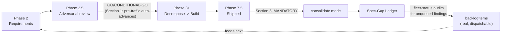

# Orchestration Preferences

Read by the `dark-factory` skill (and `fleet-status`, when judging whether a gate
applies) **before starting new work** — this file is the durable, editable
customization layer global CLAUDE.md's own governance table always pointed at
in principle but never had a concrete home for. Update it directly when a
standing preference changes; don't bury a policy shift in chat history where
the next session (or a headless dispatch) can't see it.

---

## 1. Approval-gate default — EXPERIMENTAL, adopted 2026-09-14

**Pre-traffic-tier work auto-advances past Phase 2.5 with no extra human-click
gate beyond what global CLAUDE.md's own tier table already allows.** Concretely:
a spec that reaches a GO or CONDITIONAL-GO synthesis (zero unresolved R-findings)
sets `status: spec-locked` and continues straight into Phase 3/build — do NOT
add a second, project-specific "needs explicit human approval" banner on top of
that for a pre-traffic project by default anymore.

**Explicitly named as an experiment, not a permanent policy** — direct
instruction: "we want to see what happens when we just let the agents take the
reins." Section 3 below (mandatory consolidation) is what turns this from a
one-way door into a monitored one: every completed spec gets checked afterward
for whether the auto-advanced result actually matched intent, and THAT feedback
— not a fixed calendar date — is what should trigger revisiting this default if
it's not working.

**This does NOT touch the `live`-tier hard blocker.** That gate still applies,
unchanged, per global CLAUDE.md — this section only removes the EXTRA gate this
session had been layering on top of pre-traffic's own already-permissive default
for a few specific features earlier tonight (Catwalk's roadmap-graph and
fleet-observability specs). Section 2 below is what decides which tier a
project actually is; this section says what happens once that's settled.

## 2. Tier boundary, clarified — a project's CURRENT state, never a stated future target

Direct clarification, 2026-09-14: a project stays `pre-traffic` for as long as
it has no real users depending on it and isn't moving real money **right now**
— a *stated future goal* in its own docs (e.g. Crucible/Research 2026's own
CLAUDE.md naming a "Real-money target: July 2026") does NOT itself promote the
tier early. The trigger for promotion to `live` is one of:

- **Real users are actually tied to it** (not the builder, not personally
  recruited testers — see dark-factory SKILL.md's own kill-gate persona-evidence
  distinction).
- **It is actually moving real money as a productionalized platform** — not
  "backtested," not "paper trading," not "a documented future milestone."

**Crucible/Research 2026, named as the concrete example this rule exists for**:
its 14-config fleet trades on a PAPER account (`live_trading/logs`, Alpaca
paper). No real money moves. It is `pre-traffic` under this rule, in full,
including for dispatch/auto-advance purposes — the "real-money target" language
in its own CLAUDE.md is a roadmap intention, not its current tier. **The moment
that fleet (or any successor) is funded with real capital, re-classify it
`live` in the same commit that changes the funding** — do not let the tier lag
behind the actual money.

**A structural gap this does NOT resolve, named explicitly so it isn't
conflated with the approval question**: Foreman's own `runner.js` only knows
how to dispatch already-spec-locked work ("resume from Phase 3... open a PR") —
it has no path to autonomously run Phase 2/2.5 (write + review a spec) for a
brand-new feature. Auto-approving removes the human-click gate; it does not
make Foreman capable of dispatching spec-authoring itself. That's tracked
separately as Foreman's own `runner-multimode-dispatch` backlog item — until it
ships, a NEW spec (not yet locked) still needs an interactive session to author
and review it, same as every spec written this session, even under this
experiment.

## 3. Mandatory post-completion consolidation — the feedback half

**The moment a feature slice reaches Phase 7.5 (`integration-checked`/`shipped`),
immediately run dark-factory's own `consolidate` entry mode against that
feature's spec range** — not an occasional or manually-remembered step, a
standing part of finishing a feature, every time, in every mode that reaches
Phase 7.5. This is what closes the loop: "what actually got built and merged"
vs. "what the spec imagined," and whether the same category of gap/finding is
recurring across features (which is exactly what `consolidate` mode already
mines for, per dark-factory SKILL.md's own definition — this section makes
invoking it non-optional, not a new mechanism).

Concretely, `consolidate`'s existing output IS the feedback artifact requested:
new `docs/SPEC-GAP-LEDGER.md` rows for any recurring pattern, and a
`docs/SPEC-DIFF-LEDGER.md` row recording what changed between the spec's first
draft and its shipped state. **Both already flow into `fleet-status`'s own
Ledger audit (added the same day this preference was)** — so a consolidation
finding that itself never gets promoted to `backlogItems` is caught on the next
status check, closing the loop Section 1 depends on to be a monitored
experiment rather than a one-way door.

**Route the finding correctly, per dark-factory's own existing rule**: a
recurring pattern worth checking on every future project → `docs/SPEC-GAP-LEDGER.md`.
A one-off, project-local finding → that project's own `docs/DECISIONS.md` with a
revisit-when trigger. Do not invent a third bucket for "auto-approve
experiment" findings specifically — they're the same shape of finding this
mechanism already handles.

## 4. Where this fits in the pipeline

