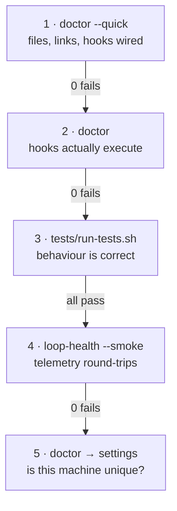

# Setup — and how to know it worked

**The problem this document exists for:** claudence was written on one Windows desktop and ported
to one Mac. Every part of it quietly assumes a single tenant — one home directory, one keychain
identity, one PATH, one set of symlinks. None of that was checked anywhere, so a fresh or drifted
install fails *silently*: a hook never fires, and the first symptom is that something you expected
to happen simply didn't.

**So: never assume the loaded context is current. Verify it.**

```bash
./scripts/doctor.py          # is every aspect unblocked?
./scripts/doctor.py --fix    # repair symlinks (safe, idempotent)
./scripts/doctor.py --quick  # skip checks that spawn processes
```

Exit `0` ready · `1` needs attention · `2` broken install. Every failure prints the command
that fixes it.

## What a fresh machine needs

| # | Prerequisite | Check | If missing |
|---|---|---|---|
| 1 | Homebrew at `/opt/homebrew` | `command -v brew` | Install Homebrew first — nothing else resolves without it |
| 2 | `python3` (Homebrew **and** system) | `doctor.py` → environment | Hooks run under either, so both must work. Drivers stay stdlib-only for this reason |
| 3 | The checkout at `~/repo/claudence` | — | `git clone`, then `./setup.sh` |
| 4 | `~/.claude` symlinked into it | `doctor.py` → links | `./scripts/doctor.py --fix` |
| 5 | `CLAUDE.local.md` | `doctor.py` → context | `setup.sh` creates it from `CLAUDE.local.example.md` |

## The agentic setup flow

Run this as a sequence, not a checklist — **each step gates the next**, and stopping at the first
failure is the point. A later step passing while an earlier one failed means the check is lying.



| Step | Command | Answers | Stop if |
|---|---|---|---|
| **1** | `./scripts/doctor.py --quick` | Is it wired up at all? | Any `FAIL` in links or hooks — nothing downstream is meaningful |
| **2** | `./scripts/doctor.py` | Do the hooks *execute*, or just exist? | Status line or loop-health won't run |
| **3** | `./tests/run-tests.sh` | Do they behave correctly? | Any test fails |
| **4** | `telemetry/loop-health.py --smoke` | Does telemetry round-trip end to end? | Cost or context doesn't survive the status-line → Stop handoff |
| **5** | `./scripts/doctor.py` → `SETTINGS` | Has this machine drifted from the repo? | Never blocking — but read it, see below |

**Why step 4 is separate from step 3.** The suite once passed while production was broken: the
test seeded `cost` into the Stop payload, which Claude Code never does. A smoke test that drives
the real hooks and asserts a known value round-trips is the only thing that catches a payload the
harness never sends.

## Drift, in both directions

`settings.json` is deliberately a **copy**, not a symlink — Claude Code rewrites it when settings
change, and a symlink would have the app editing the checkout. `setup.sh` installs
`settings.macos.json` over it. That means it drifts, and each direction is a different problem:

| Direction | Meaning | Severity |
|---|---|---|
| **Repo ahead of live** | This machine never received a change. Hooks here are stale | **FAIL** — re-run `./setup.sh` |
| **Live ahead of repo** | The change exists *only here*. A second machine would not reproduce it | **WARN** — the single-tenant assumption biting |

**The second one is the one nobody notices until they set up a second machine**, which is exactly
how this install got into its current state: `datadog` and `ponytail` are enabled here and absent
from `settings.macos.json`, so a fresh checkout silently lacks both.

## What is legitimately machine-specific

Not everything should be folded back into the repo. These are *meant* to differ:

- **`env.PATH`** in settings — absolute, machine-local, and pinned precisely because hooks do not
  source a profile. A hook that shells out to anything outside `/usr/bin` needs its interpreter
  present in that pinned PATH.
- **`CLAUDE.local.md`** — clients, tenants, absolute paths. Never committed.
- **`improve/ledger-baseline.json`**, `last-health-check.json`, `telemetry/health.log` — runtime
  state, gitignored.
- **launchd plists** — shipped as `.template` with `__HOME__`, substituted at install, because
  launchd needs absolute paths and does not expand `~`.

## Git identity — the failure with a misleading error

`doctor.py` checks this because the error message does not explain itself: a push returns
**403 Permission denied** whether the repo is private, public, or missing — and **a public repo is
world-readable, not world-writable.** Push always needs write permission.

macOS keeps *one* keychain entry per host, so a single `github.com` credential serves every remote.
If the remote's owner differs from that credential's account, every push fails. Two fixes:

```bash
# A · use a different identity for this repo (keeps work and personal separate)
git remote set-url origin https://<owner>@github.com/<owner>/<repo>.git
git push            # prompts for that account's token, stored separately

# B · grant the current identity access
#     repo → Settings → Collaborators → Add people → role: Write
#     then the invited account accepts at github.com/<owner>/<repo>/invitations
```

Prefer **A** for a public personal repo: **B** publicly links a work account to it, and commits
are attributable either way.

## After setup

`doctor.py` runs on demand; `telemetry/loop-health.py` runs daily at 09:15 via launchd. Install the
schedule with the command in `scripts/com.claudence.loop-health.plist.template`, and confirm with
`doctor.py` → `SCHEDULE`.

## Related

- [`MACOS-PORT.md`](MACOS-PORT.md) — what changed from the PowerShell originals, and what is not carried over
- [`AGENT-LOOP.md`](AGENT-LOOP.md) §5 — the loop's own health checks, and why the smoke test drives real hooks
- `../telemetry/DESIGN.md` — the friction tracker these hooks feed
