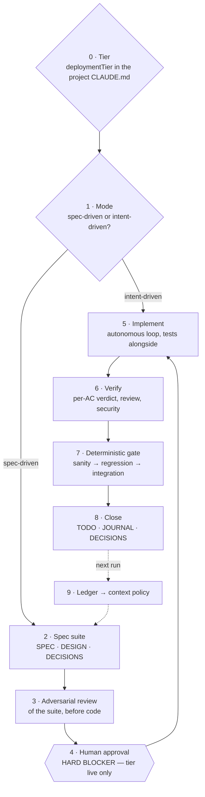

# Spec-driven development — the graph the work runs on

**The claim: work does not start with code, it starts with a contract, and the contract is a
file.** Everything below already existed as prose in `CLAUDE.md`. What this document adds is the
**order**, and an honest column saying which nodes can actually stop you.

## The nodes, and what actually holds them up

**A node with no enforcer is a habit, not a foundation.** That column is the point of this table.

| # | Node | Writer — what produces it | Enforcer — what fails without it |
|---|---|---|---|
| 0 | **Tier declaration** — blast radius, not the word "production" | The project's own `CLAUDE.md`, one line | `state-health.py --spec` reads it; absent tier = opted out, silent |
| 1 | **Mode** — spec-driven where output feeds something else; intent-driven where the right answer is still unknown | Judgement, at scoping | None, and correctly so — this is a reading, not a rule |
| 2 | **Spec suite** — `SPEC.md` (contract, AC, gate rows), `DESIGN.md` (schema, sequences, state machine, edge cases), `DECISIONS.md` (ADR-lite) | **`templates/SPEC.md`** · `templates/STATE.md` for the state page | `--spec` fails a tier-`live` repo missing any of the three |
| 3 | **Adversarial review of the suite** | `/orchestrate` role flows · `Workflow` fan-out with an independent refuter | None. A weak review reads exactly like a clean one |
| 4 | **Human approval** | A person | **Nothing. This is the gap** — see below |
| 5 | **Implement** | Autonomous Execution Contract · the persona ladder | Build + test green |
| 6 | **Verify** | `/qa` per-AC verdict · `/code-review` · `/security-review` | `/qa` returns MET / PARTIAL / FAILED per criterion |
| 7 | **Deterministic gate** — designed at scoping, not after | The gate rows in `SPEC.md` | The gate itself; a deploy blocker |
| 8 | **Close** — the step that gets skipped | Session Start Protocol's five files | `--sanity`, `--drift` |
| 9 | **Ledger → context policy** | [`AGENT-LOOP.md`](AGENT-LOOP.md) | Scoping only — nothing built |

## The major steps, in the order a session runs them

1. **Declare the tier before anything else.** `pre-traffic` may go straight to prod on a build+test
   gate; `live` — real users, real money, irreversible data — takes the full phased gate. A tier
   that is never declared means the project opted out of every check below, silently.
2. **Pick the mode.** Spec-driven when wrong here is wrong everywhere downstream. Intent-driven for
   exploration. **Say which, out loud** — an unstated mode defaults to whichever is more convenient.
3. **Write the contract before the code.** `SPEC.md` first: purpose, non-goals, the data shapes,
   the acceptance criteria as checkable statements, and **the gate rows those criteria compile to**.
   Design the gate as foresight; a gate written after the code tests what was built, not what was
   asked for.
4. **Review the suite adversarially, and cross-doc.** Independent skeptics, refuting rather than
   confirming. Finding little is not approval — it is a prompt to re-review.
5. **Take approval at tier `live`.** Between design and code. Not after.
6. **Implement in the autonomous loop**, tests alongside, reversible ambiguity resolved by an
   `assumed` row in `DECISIONS.md` with a revisit trigger rather than a question.
7. **Verify against the criteria, one by one**, then run the gate. Green before complete.
8. **Close the session into the registers.** That is what makes the next one cheap.

## Three gaps found while wiring this, 2026-08-24

- **The approval blocker has no enforcer.** `CLAUDE.md` claims dual enforcement — "memory =
  awareness; orchestration = enforcement" — but `~/.claude/skills/orchestrate/SKILL.md` is 141
  lines containing no occurrence of *approval*, *spec*, *tier* or *blocker*. Half the claim is
  fiction, and it is the half that was supposed to be non-bypassable.
- **The spec suite had no writer.** `templates/` shipped `STATE.md` and four stack snippets;
  `SPEC.md` and `DESIGN.md` were named in governance and produced by nobody. Fixed by
  `templates/SPEC.md`.
- **Nothing read the tier.** `deploymentTier:` decided gate strength and no script parsed it.
  Fixed by `state-health.py --spec`, which is opt-in: a repo that declares no tier is not nagged.

## Other frameworks — what to graft, what to steal from, what to leave

**The spine stays.** Spec-driven is the only candidate that produces a *machine-checkable artifact*;
every alternative below is a practice, and a practice with no file cannot be gated. The question
worth asking is not *which framework instead*, it is **which node is weakest** — and the answer is
node 1's right-hand branch, where intent-driven work runs with no discipline at all.

| Framework | What it is | Verdict |
|---|---|---|
| **Pre-registration / registered reports** — from empirical science | State the hypothesis, the metric and the falsifier **before seeing any result**, so a finding cannot be retrofitted to what the data happened to show | **Graft it onto the intent-driven branch.** The highest-value change available. This estate's named failure mode is exactly post-hoc rationalisation — the anti-overfitting hardening track exists because of it, and the baseline-and-placebo rule is already half of a pre-registration. Cost: one paragraph before the run |
| **Shape Up** — appetite, pitch, fixed time / variable scope | Budget the *time* first and cut scope to fit, rather than estimating scope and discovering the time | **Graft the appetite onto node 0.** Tier answers *how much ceremony*; appetite answers *how much time*, which nothing currently answers. It is the missing counter-pressure to gold-plating |
| **GitHub Spec Kit** · **Kiro** — spec-driven toolchains | Phase artifacts: requirements → design → tasks, generated and tracked by a CLI or IDE | **Steal the shape, not the tool.** The three artifacts are the three files we already have. Worth reading for how they decompose design into tasks; not worth a dependency. Verify current behaviour before borrowing anything specific |
| **Design by Contract** — preconditions, postconditions, invariants | Obligations declared at the boundary and checked at runtime | **Already node 2**, as the runtime-validated shape at every boundary. No change |
| **TDD / ATDD** | Test first, red-green-refactor | **Already node 7.** The gate rows *are* the acceptance tests, written before the code. Adopting TDD wholesale adds ritual, not coverage |
| **BMAD-METHOD** — agentic agile with personas and sharded PRDs | Agent roles driving a document pipeline | **Leave it.** The persona ladder and role flows already exist here and are lighter |
| **Diátaxis** — tutorial / how-to / reference / explanation | A taxonomy for documentation | **Leave it.** One-canonical-per-concern already solves the sprawl this addresses, and a second taxonomy would compete with the five-file state contract |

**So: two grafts, both one paragraph long.** A pre-registration line on intent-driven work, and an
appetite on node 0. Neither adds a file, and both attach to nodes that already exist.
