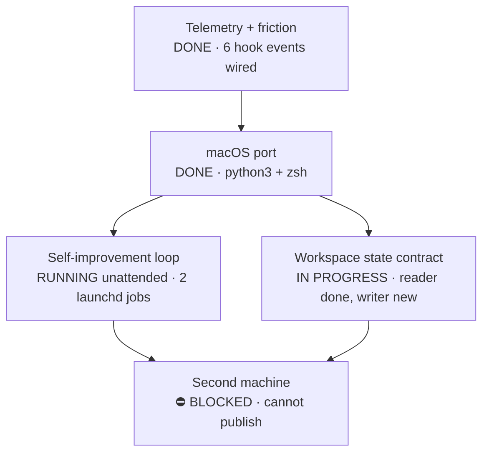
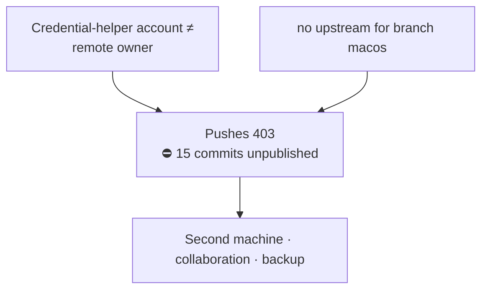
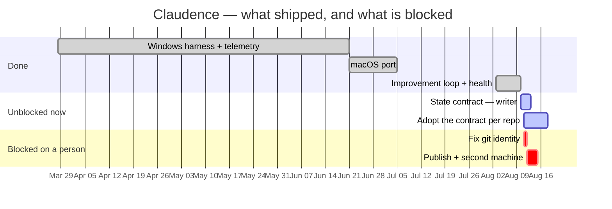

# Claudence — state of the project

> **One page, by design.** Every section is a glance; the detail lives behind the backlinks in §7.

Supersedes [`archive/2026-03-30-claudence-status-windows.md`](archive/2026-03-30-claudence-status-windows.md),
which described the pre-port Windows harness and went 4½ months stale under a filename the
state-reader it shipped could not find. That is the failure this file exists to not repeat.

## 1 · Where the project is

The harness works and measures itself: 6 hook events, 2 scheduled jobs, 170 passing python checks.
**What does not work is leaving this machine.** Every capability is real and none of it is
reproducible elsewhere, because the repo cannot be pushed — §3. Treat "works" as "works here".

## 2 · Requirements at a glance

| # | Functional — must | Source |
|---|---|---|
| F-a | Measure friction per session without being asked — classify prompts, score overrides | Original purpose; `telemetry/log-prompt.py` |
| F-b | Surface findings where they are seen, not in a JSON nobody opens | `workspace-state.py:improve_state`, added after the auditor ran unread |
| F-c | Point a fresh session at the workspace's state instead of letting it re-derive | Session Start Protocol, `CLAUDE.md` |
| F-d | Propose governance changes; **never apply them autonomously** | `AGENT-LOOP.md` §5 blast-radius scoping |
| F-e | Verify its own install rather than assume it | `scripts/doctor.py`, after a drifted install failed silently |
| F-f | Open a project's live state document with its terminal workspace | `scripts/open-workspace.sh`, 2026-08-10 |

| # | Non-functional — must | Anchor |
|---|---|---|
| N-a | **Standard library only** in every hook and driver | Two `python3` builds exist (Homebrew 3.14, Xcode 3.9.6); a hook must run identically under both |
| N-b | Hooks see only the **explicit `env.PATH`** in `settings.json` — no profile | `fnm`'s PATH entry is an ephemeral per-shell dir; this is what broke the ponytail plugin's hooks on install |
| N-c | Silent when a convention does not apply | A harness that nags in every unrelated repo gets uninstalled |
| N-d | The loop must be able to **fail loudly** | A loop running unattended makes "silently broken" and "nothing to improve" look identical |
| N-e | Governance files bounded — 500 lines/file, 60/section | `AGENT-LOOP.md` §4b. A loop that only adds rules degrades monotonically |
| N-f | Never a hardcoded username or absolute machine path | Publication requires it; `doctor.py` checks it |

## 3 · The blocking dependency

**Everything else in this document can proceed today; this cannot, and it is the only thing that
makes the work durable.** `doctor.py` reports both, names the two accounts involved, and gives the
fixes: grant the keychain's account access, or prefix the remote host so a separate credential entry
is used. Until then the harness exists on exactly one disk with no verified backup.

*(Which accounts, and on which machine, is client-specific — it lives in `~/.claude/CLAUDE.local.md`
and in `doctor.py`'s live output, not in this public repo.)*

## 4 · Time horizon

**Dates are what happened, plus the next review point.** Start 2026-03-28 · macOS port 2026-06-21 ·
contract 2026-08-10.

**Read the chart for one thing: the red bars are one decision each, and they are the only ones
nobody can start without you.** The two `active` bars need no permission.

## 5 · Milestone decisions

| id | Decision | Status | Why it mattered |
|---|---|---|---|
| — | **Measure and judge are separate halves** — `improve/audit.py` on Stop measures; `/self-improve` judges | `confirmed` | Deterministic measurement runs every session; judgement never runs unattended |
| — | **Propose-only for `CLAUDE.md` and memory** | `confirmed` | An autonomous loop editing its own governance has no bound on blast radius |
| — | **No durable cron** — launchd and hooks only | `confirmed` | `CronCreate` jobs are session-only and expire in 7 days; anything else silently stops |
| — | **`settings.json` is copied, not symlinked** | `confirmed` | Claude Code rewrites the file; a symlink would have the app editing the checkout |
| — | **`OVERVIEW.md` and `STATE.md` stay separate** | `confirmed` | Weekly status churn would bury a change to the premise |

Full register and revisit triggers: **`DECISIONS.md` does not exist yet** — decisions currently live
scattered across `AGENT-LOOP.md`, `MACOS-PORT.md` and commit messages. Consolidating them is in
[`TODO.md`](TODO.md).

## 6 · Progress

Newest first. Reasoning is in the journal — see the §7 note on where it currently lives.

| Date | Milestone reached |
|---|---|
| 2026-08-10 | State-contract **writer**: `templates/STATE.md`, workspace launcher opens the state doc, this file exists |
| 2026-08-10 | Hook injects `## Next`, newest journal entry, and the commit log — the catch-up gap closed |
| 2026-08-10 | Install doctor + setup flow that verifies; found two plugins present only on this machine |
| 2026-08-10 | Workspace state contract adopted; SessionStart hook points a fresh agent at it |
| 2026-08-10 | Loop health checks (`sanity`/`smoke`/`health`) + daily launchd job |
| 2026-08-03 | Self-improvement loop split into measure (Stop hook) and judge (`/self-improve`) |
| 2026-06-21 | macOS port — 29 commits: python3 hooks, zsh launcher, WezTerm workspaces |
| 2026-03-28 | Start — PowerShell friction telemetry on Windows |

## 7 · Detailed scope — backlinks

| Document | Its single concern |
|---|---|
| [`../README.md`](../README.md) | What it is and how to install it — serves as `OVERVIEW.md` |
| [`TODO.md`](TODO.md) | Outstanding work — Now / Next / Backlog. **The only home for task state** |
| [`AGENT-LOOP.md`](AGENT-LOOP.md) | Long-horizon execution, the context policy, blast-radius scoping |
| [`SETUP.md`](SETUP.md) | Install, and what `doctor.py` verifies |
| [`MACOS-PORT.md`](MACOS-PORT.md) | What the port changed and what was **not** carried over |
| [`ARTIFACTS.md`](ARTIFACTS.md) | Published artifacts with URLs |
| [`../templates/STATE.md`](../templates/STATE.md) | The template this file is an instance of |

**Two contract files are missing:** `JOURNAL.md` (its role is partly served by `MACOS-PORT.md`) and
`DECISIONS.md` (partly by `AGENT-LOOP.md` §5, §9). Both are in [`TODO.md`](TODO.md) — recorded as a
gap rather than papered over, because the project that defines the contract should not be the one
exempt from it.

## 8 · Risks, with evidence

| Risk | Evidence |
|---|---|
| **One disk, no verified backup** | 15 commits unpushed; `doctor.py` reports no upstream and a 403-inducing identity mismatch |
| **A second machine silently lacks two plugins** | `doctor.py`: `datadog` and `ponytail` are live here and absent from the repo's canonical settings |
| **`env.PATH` drift breaks hooks invisibly** | `doctor.py`: pinned PATH lists `/usr/local/bin`, which does not exist. Symptom of a bad PATH is a hook that does not fire, not an error |
| **The loop adds rules faster than it removes them** | `CLAUDE.md` is 42 KB. §4b thresholds exist as counter-pressure; whether they fire is unmeasured |
| **Governance describes unimplemented behaviour** | `CLAUDE.md` claims `/orchestrate` defines six role flows. It does not — found 2026-08-10 |
