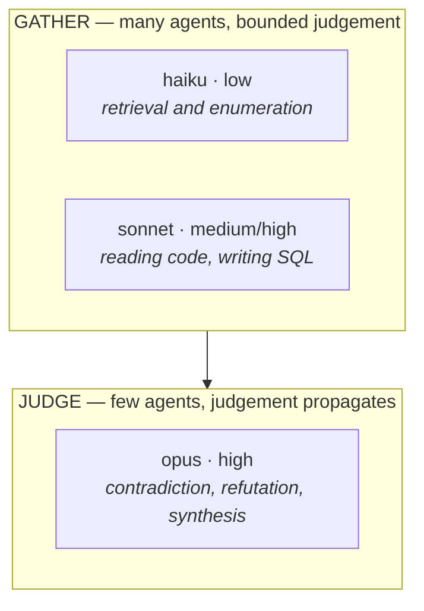

# Workflow personas — who runs which stage, and why

**The persona → model mapping is defined in `~/.claude/CLAUDE.md` ("Agent Personas — Model Tier
Allocation"). This file maps *workflow stages* onto those personas.** CLAUDE.md is the authority on the
tier; this is the authority on the assignment.

## Why this exists

Before 2026-08-13 **every agent in every workflow inherited the main-loop model.** A 51-agent
`module-analysis` run therefore executed 51 Opus agents, including the ones whose whole job was
`SELECT count(*)` and a table listing. Two runs on 2026-08-13 consumed **~4.5M subagent tokens each**
and ended on a session limit.

**The problem was not cost alone — it was misallocation in both directions.** Enumeration stages were
over-powered while nothing was *deliberately* strengthened for the stages where a wrong judgement
propagates: refutation and synthesis.

**The shape of the rule:** *many* agents at the gathering edge run cheap; the *few* whose output every
later stage depends on run expensive. Cost falls and quality rises, because the saving is spent where
it changes the answer.

## The assignment

### `adversarial-research.js`

| Stage | Persona | Model · effort | Why this tier |
|---|---|---|---|
| `sweep:code` | Researcher (deep) | **sonnet · high** | Ruby semantics and call tracing. Haiku produced confident absence claims on namespaced models before |
| `sweep:database` | Researcher (deep) | **sonnet · high** | Writing correct SQL against 188 tables, and reading polymorphic pairs |
| `sweep:datadog` | Researcher | **sonnet · medium** | Needs the skill-discovery discipline the MCP server requires, then aggregation |
| `sweep:external` | Researcher | **sonnet · medium** | Must judge source quality, not just retrieve |
| `sweep:slack` | Researcher | **haiku · medium** | Search named channels and extract. Retrieval, not reasoning |
| `sweep:productboard` | Researcher | **haiku · low** | Read records and report fields |
| `sweep:mcp` | Researcher | **haiku · low** | Search Notion/GitHub/Drive |
| `rank-and-consolidate` | **Architect** | **opus · high** | Merging seven blind answers and surfacing contradictions is the highest-value reasoning in the pipeline. A missed contradiction is averaged away silently |
| `deepen:*` | Designer | **sonnet · high** | Focused follow-up on one named thread |
| `refute:*` | **Reviewer (adversarial)** | **opus · high** | **The quality gate.** A refuter that rubber-stamps is worse than no refuter, because it launders a claim. This is where today's wrong claims should have died |
| `synthesize` | **Architect** | **opus · high** | The document is what gets quoted |
| `critique` | Reviewer | **sonnet · medium** | Enumerating what is missing against a checklist |

### `module-analysis.js`

| Stage | Persona | Model · effort | Why this tier |
|---|---|---|---|
| `scope:*` | Researcher | **haiku · low** | List tables, row counts, entry points. Pure enumeration — and it now reads the lookup register first, which is a file read |
| `lens:schema` | Researcher | **sonnet · medium** | Column types, samples, shapes |
| `lens:relations` | Researcher (deep) | **sonnet · high** | Match rates and polymorphic resolution — where a wrong join produces a wrong number |
| `lens:code` | Researcher (deep) | **sonnet · high** | 82 of 225 models are in namespaced subdirs; association names differ from class names |
| `lens:crosscutting` | Designer | **sonnet · high** | What the module *shares* rather than owns — the hardest lens to get right |
| `lens:ui` | Researcher | **sonnet · medium** | Browser work against an alpha tenant |
| `lens:intent` | Researcher | **haiku · medium** | Wiki and doc retrieval |
| `lens:observability` | Researcher | **sonnet · medium** | Datadog aggregation with environment discipline |
| `spot:*` | **Reviewer (adversarial)** | **opus · high** | **The gate that has already corrected several published claims.** Every load-bearing claim passes here or does not ship |
| `report` | **Architect** | **opus · high** | The document is what gets quoted |

## Rules that go with the assignment

1. **Never let a gathering persona certify its own finding.** The author and the refuter are different
   agents at different tiers. That separation is why `spot:*` and `refute:*` are the only stages
   deliberately raised above the gathering tier.
2. **A cheap stage that reports absence is the dangerous case.** "No file references this" from a haiku
   agent is the claim most likely to be wrong — a script reading one directory reported 58 modelless
   tables when 43 had models. Absence claims belong at sonnet or above, or must be re-verified.
3. **Effort is the cheaper dial than model.** Prefer `effort: 'high'` on sonnet before reaching for
   opus; reserve opus for stages where the *shape* of the reasoning matters, not just its depth.
4. **An agent with no explicit persona/tier configured runs `haiku · medium`.** The default is the
   floor, not the average — inheriting the main-loop model is what produced the 51-Opus enumeration
   run. Any stage that needs more must say so explicitly, which is the point: tier is a decision,
   not an inheritance. (Set by the user 2026-08-13.)
5. **The literal is duplicated in each script, deliberately.** Workflow scripts are self-contained —
   no imports, no filesystem — so each carries its own `PERSONAS` table with a pointer back here. **If
   you change a tier, change it in both scripts and here.** A single source of truth that scripts
   cannot read is not a source of truth.

## What has not been validated

**No run has yet executed under these assignments.** The tiers are reasoned from what each stage does
and from failures already recorded, not from measured output quality per tier. **The falsifier:** run
`module-analysis` on `tenant` and compare its corrections-per-claim against the `report` and `identity`
runs, which executed entirely on opus. **If the spot-check catches materially less, the gathering tier
is too low and the saving was not free.**
