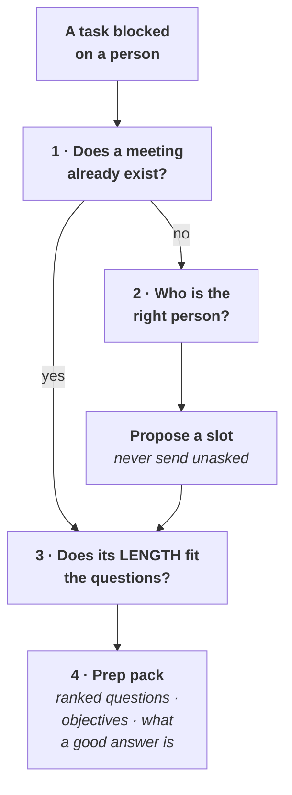

# A blocker on a person is a meeting that has not been booked yet

**"Blocked on a person" is not a status. It is an unscheduled conversation**, and left as a status it
sits in the ledger for weeks. This skill converts it, in one pass, and **never sends anything without
being told to.**

## The order, and why it is this order

**Step 1 comes first because the meeting usually already exists.** Proposing one that is already on
the calendar is the failure this skill was written to stop.

## 1 · Check the calendar before proposing anything

| Do | Not |
|---|---|
| `search_events` on the topic first — open-ended keyword search is what it is for | Do not `list_events` a wide window and read it yourself; that is slow and misses the ones titled differently |
| Then `list_events` on the specific day, to see what else is around it | Do not assume a note in the work log means a booking. **A dated reminder and a calendar event are different things** |
| Report the **length**, not just the existence | A 25-minute intro call and a 60-minute working session settle different numbers of questions |

**If a meeting exists, say so and go to step 3.** Naming a meeting that is already booked is a
finding — it converts "blocked indefinitely" into "answered on a date".

## 2 · If none exists, find the right person, then PROPOSE

**Never guess the person from a job title alone.** Resolve in this order, and say which one answered:

1. **Who attended prior meetings on this topic** — the calendar's own attendee history is the most
   reliable org chart available, and it is already in reach.
2. **The organisational chart or team directory**, if the workspace holds one.
3. **Ask.** A wrong invite costs someone else's time, so an unresolved owner is a question, not a guess.

**Then propose the slot, honouring the stated timing preference:**

| Preference | What it means |
|---|---|
| **As soon as possible** | The next slot both are free. Use `suggest_time` rather than eyeballing |
| **After one or two days** — the usual default | **Deliberate: it buys time to consolidate the facts and present an initial high-level understanding**, so the meeting starts from a position rather than from zero |

**Timezones are not decoration.** Colleagues here span at least Vancouver and Taipei. Resolve both
sides' working hours before proposing, and state the time **in both zones** in the proposal.

## 3 · The length test, and it is usually failed

**Count the questions the meeting must settle, then divide.** A 25-minute call cannot resolve four
open outputs, and discovering that in the room wastes the only slot you have.

| If | Then |
|---|---|
| The questions fit | Proceed to the prep pack |
| **They do not fit** | **Say so, rank ruthlessly, and name what will NOT be asked.** An unranked list means the important question arrives at minute 24 |
| It is an *intro* call | Treat it as establishing the relationship and the vocabulary. **Ask for the second meeting in the first one** |

## 4 · The prep pack — the actual deliverable

**Written before the meeting, not after.** Four parts, and the last is the one people skip:

| Part | What it holds |
|---|---|
| **The objective, in one line** | What is true after this meeting that was not true before |
| **Ranked questions** | Most-blocking first, each with *why it is blocked on this person specifically*. **A question anyone could answer should not be in the room** |
| **What a good answer looks like** | Per question — a number, a name, a yes/no, a story. **Without this a warm conversation reads as a productive one** |
| **What it unblocks** | Name the tasks that move. This is what justifies the time, and what to say if the meeting is cut short |

**Also prepare what you will GIVE.** A meeting where one side only extracts is a meeting that is
harder to get a second time. Bring the one finding they would want to know.

## The hard rule

**A calendar invite lands in someone else's day and cannot be unsent.** So:

- **Draft it, show it, and wait for an explicit yes** — the proposed time in both zones, the length,
  the attendees, and the agenda line.
- **Permission is per invite**, never standing. Approval to book one conversation is not approval to
  book the next.
- **Never add an attendee who was not confirmed.** An optional-attendee list is not a guess space.

## What this skill will not do

- **Send an invite on its own**, however clearly the blocker calls for one.
- **Name individuals in any written artifact.** Roles only — the prep pack is a working document and
  the estate's identifier rules apply to it.
- **Treat a booked meeting as a cleared blocker.** It clears when the answer is recorded.
