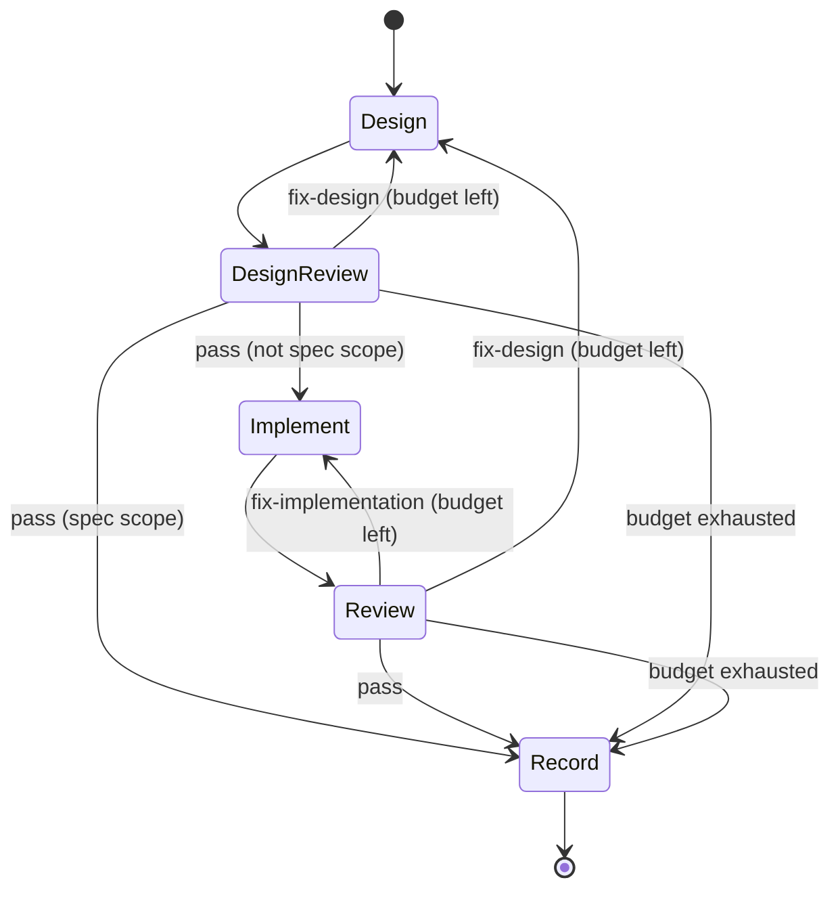
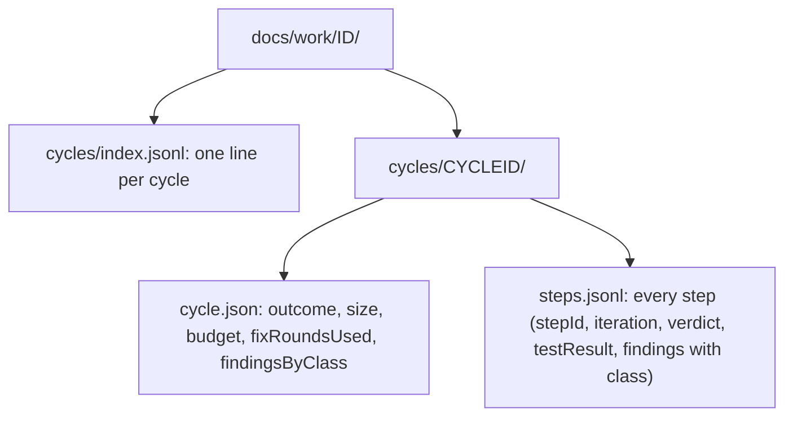
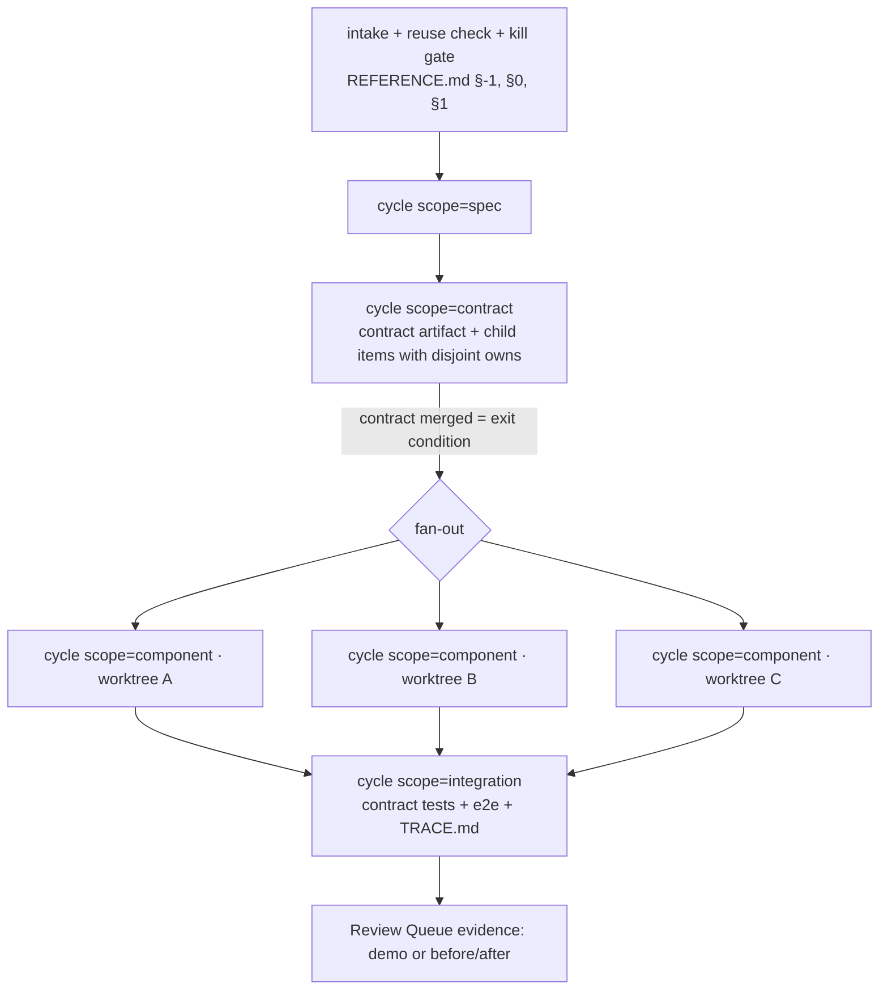

# The cycle: dark-factory's one atomic unit

Adopted 2026-09-26 at the owner's request: "minimize the workflow into one atomic chunk we can replicate". It is implemented as `C:/Users/Michael/.claude/workflows/cycle.js`, verified against a stubbed run of all 6 control-flow paths.

## Inputs (all pinned by the caller; the cycle never guesses)

| arg | meaning |
|---|---|
| `repo` | absolute path of the checkout or worktree this cycle edits. Parallel cycles each get their own worktree |
| `workItem` | `docs/work/<id>` slug |
| `scope` | `spec` · `contract` · `component` · `integration` |
| `cycleId` | a UUID generated by the caller (scripts cannot generate one). Every step is `cycleId.NN` |
| `startedAt` | ISO time from the caller |
| `testCommand` | the exact gate command. Required for every scope except spec |
| `owns` | glob list this cycle may edit (component scope) |
| `contract` | path of the contract artifact to import and never edit |
| `size` / `budget` | optional. Size S/M/L gives a fix budget of 1/2/3. Absent, the designer's own size estimate decides. Max 3 |
| `parentCycleId` | links a component or integration cycle to its parent work item |

## Personas per step (Fan-Out checklist items 1, 2 and 6)

- **Design:** the `designer` agent.
- **Design review and review:** the `reviewer` agent at high effort, a fresh context that never authored what it reviews.
- **Implement:** the `implementer` agent, which edits only its `owns` globs.
- **Record:** a low-effort writer.

## Trace (what makes it reviewable later)

Every finding carries a `class`: design / implementation / test / spec, meaning **where the root cause lives**. That is what answers "should we change the design step or the implementation step" as numbers over many cycles (Foreman `factory-scorecard` reads `cycles/index.jsonl`).

## The whole pipeline is this unit replicated at four scopes

- A small slice skips the contract cycle and runs a single component cycle.
- The kill gate and reuse check (REFERENCE §0–§1) run once, before the spec cycle.
- A budget-exhausted cycle sets `attentionClass: repair-budget-exhausted`, which is the only way a cycle reaches the owner (the Attention budget).

## Gate plan: tests are designed, minimal, and grow from caveats (owner rule, 2026-09-26)

The **Design** step writes `## Gate plan` into the work item README and returns it as `gatePlan[]`. Each entry is `{risk, kind, check, gate}`:

| Scope / change | kind | gate |
|---|---|---|
| logic, schemas and contracts, data transforms, state machines, APIs | **deterministic**: unit / golden / contract / integration assertion | blocking (inside `testCommand`) |
| UI, visual output, generated text or media, "does it feel right" | **qualitative**: rubric-scored judgement, demo video, before/after | advisory, as review evidence (Attention budget) |
| UI behavior | both: a deterministic behavior test **and** qualitative evidence | blocking + advisory |

- **Only three kinds exist:** sanity/smoke · one per acceptance criterion (it freezes intent) · regression written test-first when a regression actually happens. Anything else is padding (global CLAUDE.md, Testing contract).
- **Minimum, not maximum.** Add one check per real regression risk (an acceptance criterion, a coupling point, a known caveat). The design reviewer flags gaps **and** padding.
- **Caveat → test.** Every review finding, discovered caveat or production bug gets a pinning regression test in the same fix. The reviewer rejects a fix that has none. This is how the suite grows: from real failures, not from speculation.
- The integration cycle's gate plan becomes the project's standing regression gate (the deploy blocker, per the global test-gate rule).

## Caller rules (learned from pilot 1, 2026-09-26: budget-exhausted, 3 rounds, ~700k tokens, 0 useful output)

1. **Pass `ownerIntent`**: the owner's clarified intent, verbatim. Workflow subagents are also relayed the owner's raw latest message, told it outranks their prompt. In pilot 1 the designer read an ambiguous phrase from that message without the clarification, and redesigned a different item in another repo for all 3 rounds. The cycle now states its authority in every step, and **aborts if the designer writes nothing or writes outside `repo`**.
2. **Create the worktree from the latest `origin/<default>` immediately before the call**, and **do not edit the work item's files elsewhere while the cycle runs.** In pilot 1, redesign docs committed to master mid-cycle made the reviewer's worktree stale, which it rightly flagged as critical.
3. **Reviewers first check that the item actually changed** (`git status` / `diff`). An unchanged item gets exactly one finding ("no changes produced") instead of a re-review of stale content.
4. After the cycle, **commit its `cycles/<cycleId>/` trace with the work**. The trace is part of the evidence.
5. **Only R findings block** (from pilot 2: budget-exhausted on a 25-AC spec whose round-3 findings were precision polish). Each finding is rated R/F/H (Real-now / Future / Hardening, the rating from the old §2.5 review). The script passes a review with no R findings; F and H are recorded as `deferred` on the step. Reviewers get the earlier round's findings and must first mark each resolved or still open.
6. **Budget = the larger of the caller's size and the designer's own estimate** (pilot 2 was capped at M while its designer sized it L).
7. **`startAt: "review"` + `priorFindings`** re-verifies an existing design without redesigning it.
