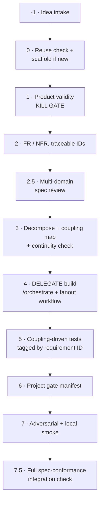
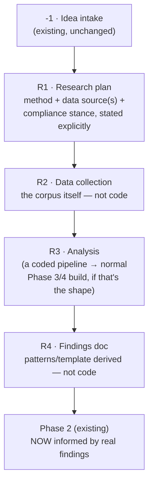
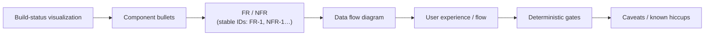
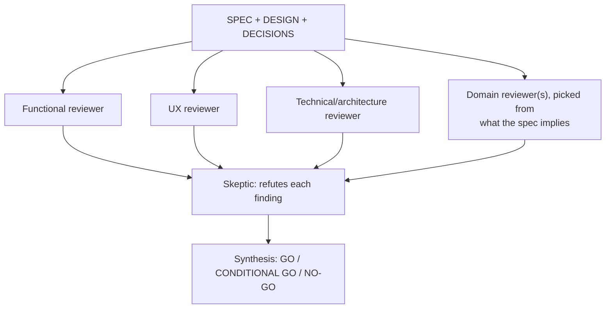

# dark-factory

**This skill does not replace `/orchestrate` or `fanout-design-build-audit`. It wraps them.**

Those two already handle *how* to build well: role sequencing, per-component design review,
adversarial audit, convergence. What they assume is that the feature **should exist** and that
you know what "done" means. This skill supplies everything they do not: idea validation,
spec authoring with traceable requirements, a multi-domain review of the *spec itself*, and a
final check that what got built actually satisfies what was asked.



Phases -1, 0–3, and 5–7.5 are this skill. **Phase 4 is a delegation, not a reimplementation.**

---

## Entry modes — decomposable, not all-or-nothing

**The full chain above is one mode, not the only mode.** Any subset is independently invocable —
say the mode explicitly when starting, or infer it from what's being asked (a follow-up on an
existing project reads as `feature-add`, a bare idea with nothing built yet reads as `new-product`).

| Mode | Runs | Skips | Use when |
|---|---|---|---|
| **`new-product`** (default) | -1 → 7.5, full chain | nothing | Building something from zero |
| **`feature-add`** | 0 → 7.5; kill gate (1) scoped to the increment; phase 2's FR/NFR are appended to the existing `SPEC.md` with new IDs, not a fresh document; phase 2.5 reviews only the diff | -1 (idea intake), repo scaffold | Iterating a new feature onto a product this pipeline (or anything else) already built |
| **`spec-only`** | -1 → 2.5 | 3 onward | Want a validated, reviewed, locked spec, not ready to build yet — e.g. queuing work, or handing the spec to a human |
| **`review-only`** | 2.5 only, against an already-written doc suite | everything else | Retrofitting the multi-domain review onto a spec authored outside this pipeline |
| **`build-only`** | 3 → 7.5 | -1, 0, 1, 2, 2.5 | Spec already locked (by a prior `spec-only` run, or by hand); resume straight into decomposition |
| **`integration-check`** | 7.5 only | everything else | Periodic health check on an already-shipped project — re-verify it still matches its spec, refresh `docs/TRACE.md` |
| **`gap-log`** | nothing — appends one row to the Spec-Gap Ledger | everything | A follow-up just revealed a spec miss; record it without running the pipeline |
| **`consolidate`** | nothing from the phase chain — diffs a spec range, harvests recurring patterns | everything | A feature slice is done (spec-locked, built, or at a natural pause) and it's time to check what review actually changed, and whether any of it is a recurring pattern worth pushing into the Spec-Gap Ledger / this skill itself |
| **`research`** | -1 → a new R1-R4 chain (below) → feeds Phase 2 as informed input, not code | 3-4's "delegate to `/orchestrate`" build model, until R4 hands off | The deliverable isn't buildable yet because the requirements themselves depend on findings that don't exist — a corpus needs collecting/analyzing, a heuristic needs deriving, before Phase 2 can write a testable FR |

Record which mode ran and which phases it covered in `docs/STATE.md`'s `pipelineMode` /
`phasesRun` fields (schema below) — this is what makes a later `build-only` or
`integration-check` run know where a previous partial run left off, and what makes the mode
itself part of the traceability story instead of an undocumented shortcut.

---

## `docs/STATE.md` — machine-readable header (every mode writes this)

`STATE.md` carries a small YAML front-matter block ahead of its prose/Mermaid content, so both
this pipeline and Catwalk (the build-status dashboard, below) can read it without parsing English:

```yaml
---
project: <name>
category: <D:\repo category, e.g. AI | web | Bot | Data | Experiment | _Misc>
deploymentTier: pre-traffic | live
rigor: mvp | production
status: proposed | validated | spec-drafted | spec-locked | decomposing | building | poc |
        integration-checked | shipped | blocked | awaiting-human-approval | killed
pipelineMode: new-product | feature-add | spec-only | review-only | build-only |
              integration-check
phasesRun: [ "-1", "0", "1", "2", "2.5" ]
lastCompletedPhase: "2.5"
updatedAt: <ISO timestamp>
blockers: []
definitionOfDone:
  shippedMeans: <one sentence, decided in Phase 2 — see "Definition of done" below>
  happyPathDemo: <null, or a short name/ID for this project's standing demo scenario>
backlogItems:
  - id: <e.g. "D102", the DECISIONS.md entry this came from, or a short slug if there isn't one>
    summary: <one sentence, imperative — becomes the GitHub issue title verbatim>
    source: <repo-relative path + anchor, e.g. "docs/DECISIONS.md#d102">
    addedAt: <ISO timestamp>
    opened: false   # flips to true (never removed) once Foreman opens the issue — idempotency guard
roadmap:   # optional — only projects with a long-horizon, multi-phase-type initiative carry this.
           # See "Long-horizon roadmap" below. A normal single-feature project has no roadmap block.
  - id: <stable id, e.g. "R1-corpus-analysis" — referenced by other nodes' prerequisites/enables>
    type: research | build | experiment | data-collection | integration
    title: <short name>
    spec: <what this node does — inline if short, a doc pointer if long>
    prerequisites: [<upstream node ids>]
    enables: [<downstream node ids — what depends on this finishing>]
    expectedOutcome: <one sentence, concrete and checkable — not "improve X">
    quantitativeGates: [<deterministic, measurable pass/fail criteria>]
    qualitativeScoring: <the rubric — dimensions + how judged, for whatever a gate can't reduce to a number>
    status: not-started | in-progress | blocked | done
featureHistory:
  - name: <short feature-slice name, e.g. "Correction & Personalization Layer">
    kind: new-product | feature-add | pivot | correction
    frRange: <e.g. "FR-10..FR-14">
    specWrittenAt: <ISO date the FR/NFR IDs were first assigned, phase 2>
    status: proposed | spec-locked | building | built | killed
    reviewRounds: <int, optional — this slice's own Phase 2.5 round count, once known>
---
```

Update this block at the end of **every** phase, in every mode — it is the single source both
the pipeline's own resumption logic and Catwalk (below) read from.

**`featureHistory` — the project-level iteration counter, distinct from a single phase's
review-round count.** Added 2026-09-08 after being asked directly whether iteration counts
(spec additions, feature additions, pivots) are tracked across a PROJECT's whole lifetime, not
just within one Phase 2.5 review chain. `PHASE-LOG.jsonl`'s `iterations` field (above) answers
"how many rounds did THIS phase take"; `featureHistory` answers "how many times has this
project's spec grown or changed direction, ever." **Every Phase 2 (Requirements) run — whether
`new-product`'s first pass or a later `feature-add` — appends exactly one entry here, at the end
of that phase, never retroactively batched.** `kind: pivot` is for a spec addition that reverses
or materially changes an earlier decision (not just extends it) — mark it explicitly rather than
letting it read as an ordinary addition; `kind: correction` is for a fix to a previously
mis-specified requirement (not a real new capability). This is what lets Catwalk show "N feature
slices, M pivots" per project without re-deriving it from git archaeology each time it's asked —
found the hard way: nuwa's own history required a manual git-log reconstruction (4 real spec
commits, `docs/M3-UI-DESIGN.md`) the first time this was asked, because nothing had been tracking
it. Never skipped for a "small" addition — a one-FR addition is still one `featureHistory` entry.

**Also append one line to `docs/PHASE-LOG.jsonl`** at the end of every phase, in every mode —
added 2026-09-08 (FR-D3/D5, `D:/repo/AI/foreman/docs/VISUALIZATION-REQUIREMENTS.md`) after a
real dispatch made clear that STATE.md's single phase number can't answer "what did this phase
actually produce" or "is this really sequential or does it fan out into parallel components."
One JSON object per line (same convention as this codebase's other JSONL logs —
`corrections.jsonl`, `reasoner_failures.jsonl`):

```json
{"phase": "<id>", "completedAt": "<ISO>", "summary": "<one sentence, what actually happened>", "needsAttention": false, "attentionReason": "<required if needsAttention is true, else omit>", "artifacts": [{"label": "<name>", "path": "<repo-relative>"} , {"label": "<name>", "url": "<link>"}], "graph": {"nodes": [{"id": "<component key>", "label": "<short>", "status": "done|live|queued|pending|failed", "dependsOn": ["<other component key>"], "satisfies": ["FR-1"]}]}}
```

**`needsAttention` — the handoff signal between steps, not just a historical log.** Added
2026-09-08, the direct fix for a real gap: a build session was killed mid-Phase-7 by a system
OOM event, and nothing in the pipeline itself carried forward "the last step was interrupted,
here's what's verified vs. not" — a human had to notice a stray notification and manually
reconstruct the state from a diff. `summary`/`artifacts` are a historical record of what
happened; `needsAttention` is different in kind — it is a claim about what the NEXT step, or
whoever resumes this project, must not silently skip past.

- **Set `needsAttention: true`** whenever a phase completes (successfully or not) leaving
  something the next step needs to know before proceeding — a real finding deferred rather than
  fixed, a verification that couldn't be completed, an assumption the next phase must not
  silently trust. A phase that finished cleanly with nothing outstanding omits the field
  (defaults false) — don't set it defensively "just in case," that trains the next reader to
  ignore it.
- **Every phase, in every mode, reads the single most recent PHASE-LOG.jsonl entry — across
  ALL phases, not just its own — before doing any real work.** If `needsAttention` is true there,
  either resolve it as this phase's first action, or state explicitly why it's safe to proceed
  without resolving it (e.g. it's out of this phase's scope and already tracked elsewhere) —
  never silently continue past a flagged entry as if it said nothing.
- **`docs/STATE.md`'s `blockers` array is the human-facing summary of the SAME signal** — a
  phase that sets `needsAttention: true` for something still unresolved at the end of its own
  run also adds (or keeps) the matching entry in `STATE.md`'s `blockers`. The two stay in sync:
  `PHASE-LOG` is the granular, per-event record; `blockers` is "what's true right now." Clearing
  a blocker means removing it from `STATE.md`, not just moving on.
- **This is also the mechanism a crash-recovery pass uses.** When a run is found interrupted
  (see Foreman's `docs/DECISIONS.md` and the worktree-reconcile hardening it names) and real,
  recoverable work is found in the orphaned worktree, the recovery step writes a `needsAttention`
  entry summarizing exactly what was verified and what wasn't — the next thing to touch this
  project reads that, not a from-scratch investigation.

`summary` + `artifacts` are a pointer, never a duplicate of the real content (the same
"backlink instead of explaining" principle the Terse-Output Contract applies to chat, applied
here for a machine/UI consumer) — link to the real spec section, build output, or PR, don't
paste it. `graph` is populated **only** for phase 3 (from the decomposition table you already
wrote — `id`/`dependsOn`/`satisfies` map directly onto its Component/Depends-on/Satisfies
columns) and phase 4 (same nodes, `status` updated as each component's build/review/audit/fix
cycle actually progresses) — every other phase omits `graph` entirely. **Only write what
actually happened** — an artifact that doesn't exist yet (e.g. a build-record file a sub-step
was supposed to produce but didn't) does not get a fabricated entry; note the gap in `summary`
honestly instead.

**`backlogItems` — ready-to-build-now work, distinct from both `blockers` and a `DECISIONS.md`
revisit-when.** Added 2026-09-09, direct response to a real gap: Foreman's own event loop only
ever dispatches GitHub issues that already exist and carry `factory:approved` — it has zero
awareness of dark-factory pipeline state, so a project could sit with real, already-diagnosed,
ready-to-fix follow-ups (a missing test, a named regression, a skipped pipeline phase) for
sessions at a time, with nothing ever turning that into a dispatched issue until a human happened
to notice and open one by hand. `backlogItems` is the structured, machine-actionable list Foreman
(`core/scheduler.js`'s backlog-discovery step, D25) actually consumes — this is why it's a
separate field from the other two, not a rename:

- **A `DECISIONS.md` revisit-when is gated on a future condition** ("if this pattern recurs a
  third time", "if a real OOM happens in this exact window") — it names something to watch for,
  not something ready to build today. **Never** auto-convert a revisit-when into a `backlogItems`
  entry; that conflates "relevant later, under condition X" with "buildable right now," and would
  turn Foreman's full-auto pre-traffic mode into an issue-storm the instant a project accumulates
  a normal number of deferred hardening notes.
- **`blockers` (and a phase's `needsAttention`) are about THIS project's own next step** — something
  the very next phase run must not silently skip. `backlogItems` is broader: a queue of
  independently-buildable follow-ups that may sit for a while, each dispatched as its own scoped
  issue whenever Foreman gets to it.
- **Add an entry the moment a phase (typically 7 or 7.5) names a real, ungated, ready-to-fix
  follow-up it is deliberately NOT fixing in scope** — the same moment you would write the
  `DECISIONS.md` row anyway. Write both: the `DECISIONS.md` entry is the durable rationale a
  human reads later; the `backlogItems` entry is what makes it independently dispatchable without
  a human re-deriving "is this actually actionable" from prose.
- **`opened` is a one-way idempotency flag, never unset.** Foreman's discovery step sets it `true`
  in the same commit it opens the GitHub issue, so the same item is never queued twice. If the
  resulting issue is later closed without fixing the item (a real rejection, not a merge), that is
  itself a `DECISIONS.md`-worthy event — add a FRESH `backlogItems` entry with a new `id` rather
  than flipping `opened` back to `false` on the old one.
- **Tier-gated, matching the existing pre-traffic/live governance split** (global CLAUDE.md
  "Production Application Governance"): Foreman only auto-opens **and** auto-approves
  (`factory:approved`) items for `deploymentTier: pre-traffic` repos. A `live`-tier repo's
  `backlogItems` entries still get discovered and opened, but labeled for human review, never
  self-approved — the human-approval hard blocker is not something a backlog scanner gets to
  route around.
- **Rate-limited per tick** (Foreman-side, `D25`) so a large backlog dump (e.g. backfilling
  several existing `DECISIONS.md` follow-ups into `backlogItems` at once) opens a trickle of
  issues over several dispatcher ticks, not a burst.

---

## `research` mode — when the requirements don't exist yet, only the questions do

Added 2026-09-09, direct response to a real case: a feature request (analyze a corpus of viral
short-form video for structural patterns, derive a template) couldn't get a real Phase 2 FR/NFR
written yet — not because the idea was vague, but because the actual requirement depends on
findings nobody has yet (what patterns are real, what threshold counts as "viral," which corpus
is even legally obtainable). Phase 4's normal build model ("delegate to `/orchestrate`, which
assumes the deliverable is code") doesn't fit a phase whose deliverable is a *dataset* or a
*document*. `research` mode inserts a chain BEFORE Phase 2 that produces the missing input,
instead of Phase 2 guessing at requirements a human will revise from scratch once real findings
exist anyway:



- **R1 is a real, named gate — not a formality.** State explicitly: what data, what method,
  and — whenever the data involves a third party's platform/content — the compliance/legal
  stance, with its reasoning, not just a conclusion. This is where the corpus-sourcing decision
  for the viral-video example was made (D114-equivalent: Apify, logged-out/public-only, citing
  *Meta v. Bright Data*'s "public access ≠ restricted 'use'" holding as the reasoning, not just
  "we picked Apify"). **A `research` mode run that skips stating this explicitly hasn't actually
  done R1**, regardless of whether R2 technically produced data.
- **R2's deliverable is the corpus itself, not code** — no Phase 6 gate manifest, no Phase 7
  adversarial code review. Its own definition of done is closer to `research`-mode-specific:
  "N items collected, from source X, under compliance stance Y, stored at Z."
- **R3 CAN be a normal software build** (if the analysis is a coded pipeline — e.g. a script that
  runs frame extraction + classification across the corpus) — reuse Phase 3/4 for that slice
  rather than inventing a parallel build path. Only R1/R2/R4 are structurally different from
  normal dark-factory phases; R3 often isn't.
- **R4's deliverable is a findings document** (patterns found, a derived template/heuristic, each
  with real supporting examples — never asserted without evidence, same "asserted-not-verified"
  gate this skill already applies elsewhere) that becomes the actual INPUT to a normal Phase 2 run
  — the FR/NFR Phase 2 writes next cites R4's findings directly ("the story designer anchors on
  hook-template X, derived from N real examples"), not a hunch.
- **Skip `research` mode entirely when the requirements are already knowable** — most feature work
  still starts at `new-product`/`feature-add`'s normal Phase 2. This mode exists for the narrower
  case where Phase 1's own kill-gate question ("what measured evidence says this is real") can't
  be answered without first going and finding the evidence.

## Long-horizon roadmap — the abstraction layer above one build loop

Added 2026-09-09, direct response to a real ask: Foreman's dispatch loop already handles *one*
build iteration well (an approved issue → a worktree → a PR → a gate → a merge), but a real
initiative (research → build → integration, spanning weeks, mixing node *types*) has no
persistent representation above that — nothing shows the whole shape, what blocks what, or what
"done" means for a research node versus a build node. `docs/STATE.md`'s new `roadmap` field
(schema above) is that layer: **it generalizes Phase 3's own decomposition table** (component ·
interface · dependencies · satisfies) from "the components of one feature" to "the phases of a
whole initiative," adding the two things a same-feature decomposition table doesn't need: a
**`type`** per node (Phase 3 components are implicitly always `build`; a roadmap node might be
`research`, `experiment`, or `data-collection` instead) and **`qualitativeScoring`** alongside the
deterministic gates (not everything a research/experiment node produces reduces to a pass/fail
check).

- **Every node states all seven fields — this is not optional shorthand.** `prerequisites` and
  `enables` are BOTH required (not just upstream) so a reader can walk the graph in either
  direction without cross-referencing every other node's `prerequisites` by hand.
  `quantitativeGates` and `qualitativeScoring` are both required too — a node with only one or the
  other is under-specified: a pure metric misses "is this actually good," a pure judgment call
  gives nothing checkable.
- **Only projects with a real long-horizon initiative carry a `roadmap` block** — a normal
  single-feature project has none; don't add one speculatively.
- **Catwalk renders this as a dedicated Roadmap view** — separate from the existing per-project
  pipeline flowchart (which shows dark-factory's own -1→7.5 phases for the CURRENT build), showing
  the dependency graph across node types, each node expandable to its full spec/gates/scoring —
  see `D:/repo/AI/foreman/docs/VISUALIZATION-REQUIREMENTS.md` for how Catwalk's existing
  requirements doc should grow to cover this, rather than a second, competing requirements doc.

---

## Visualizing build status — Catwalk, reuse not a new dashboard

**Superseded 2026-09-07 (D13/D14, `~/.claude/docs/DECISIONS.md`):** this section previously
described syncing `STATE.md` into Helm's "Nexus" workspace via generated `helm-*.json` files.
Helm was verified dormant (3 commits ever, no runtime data since build day) and archived.
Its design was extracted into requirements for a purpose-built replacement, **Catwalk**
(`D:\repo\AI\catwalk`), which shipped 2026-09-07.

**No file generation needed — this is simpler than the section it replaced.** Catwalk polls
`~/.foreman/repos.json` (the project registry) and each registered project's `docs/STATE.md`
directly every 5s; there is no intermediate JSON to keep in sync. The only actions this pipeline
takes:

- **Phase -1, when scaffolding a `new-product`:** register the repo once — `foreman repos add
  <path>` (see `D:\repo\AI\foreman\docs\SPEC.md`) — so it appears in Catwalk's sidebar.
- **Every phase, every mode:** keep `STATE.md`'s YAML block and build-status Mermaid current
  (already required above). That alone is what Catwalk renders — the phase highlighting comes
  straight from `phasesRun` / `lastCompletedPhase` / `status`.

---

## -1 · Idea intake

Two entry shapes — handle both:

1. **From the idea bank** (`Life/notion ideas/*.md`, deep dives in `context/top-5/*.md` when they
   exist) — read the deep dive as the seed for phases 1–2. It is context, not a rubber stamp: the
   kill gate in phase 1 still runs for real.
2. **From a raw ask** with no prior idea-bank entry (someone just describes what they want built) —
   write a minimal entry into the idea bank first, following its existing schema
   (`Life/notion ideas/SCHEMA.md`), so everything built stays traceable back to an idea record even
   when it started as a one-off request. Skip this for a feature inside an already-existing,
   already-tracked project — only new, from-zero ideas need a bank entry (this is the
   `feature-add` mode).

If phase 1 says **BUILD** and this is a new idea (not a feature in an existing repo): scaffold its
home now, per the standing Repository Organization rule — `D:\repo\<Category>\<project>`, never
bare at the root. State the chosen category. `git init`. Create `docs/SPEC.md`, `docs/DESIGN.md`,
`docs/DECISIONS.md`, `docs/STATE.md` from "Spec template" below, plus the `Repo path` +
`CLAUDE.md` "Helm Integration" step from "Syncing to Helm's Nexus workspace" above.

---

## Spec template — the one source-of-truth sheet

Every project's `docs/SPEC.md` (features inside an existing repo may fold this into the Feature
Decision Record instead) **must** carry these sections, in this order. Phase 2.5 below rejects a
spec that is missing one:



- **Build-status visualization** — a Mermaid flowchart/state diagram, ≤5 nodes per row, each
  component tagged `✅ built` / `🚧 in progress` / `⬜ not started`. Lives in `docs/STATE.md`,
  refreshed at the end of every session that touches this project (mirrors Bifrost's `STATE.md`
  pattern — now standard for every Dark Factory project, not just that one).
- **Component bullets** — one line per component, what it does, no implementation detail.
- **FR / NFR with stable IDs** — assigned in phase 2 below, never renumbered; a dropped requirement
  is struck through with a pointer to the `DECISIONS.md` entry that superseded it, not deleted.
- **Data flow** — `sequenceDiagram` or `flowchart`, ≤5 participants.
- **UX** — the user-visible flow, step by step, even for a single-user personal tool.
- **Deterministic gates** — named unit / integration / E2E-happy scenarios; this is what phase 5's
  tests are written against.
- **Caveats** — known risks and deliberately deferred items, same shape as a `DECISIONS.md` row
  (decision · rationale · revisit-when).

---

## 0 · Reuse check — mandatory, and must be stated

Before designing anything, per the global rule:

1. `ls` the directory you would add to, and `grep` for the **role** (not the name you have in mind).
2. **State the result in one line**: *"Searched `<dir>` for `<role>` — found `<X>`; extending `<X>` / none fit because `<reason>`."*
3. Two implementations of the same role already existing is a **defect to consolidate**, not a menu.

Also run the `/orchestrate` pre-flight: real test/build/typecheck commands read from the repo,
real interpreter path, worktree-by-default for parallel writers.

---

## 1 · Product validity — the kill gate

**The gate the other skills do not have.** Answer before any design:

1. **Which persona use case does this resolve?** Quote it from the project's persona doc.
2. **What measured evidence says that use case is real?** Cite a number and where it came from.
3. **What would we observe if this feature worked?** A metric, named now, before building.

**Three failure modes that stop the pipeline here:**

- **No use case maps** → do not build. Say so plainly and stop.
- **The persona is unvalidated** → proceed only as an explicit bet, and label it. A persona
  derived from the team's own usage, or from personally-recruited users, is **not evidence** —
  it describes who was recruited, not who would adopt.
- **The binding constraint is elsewhere.** If the project's actual bottleneck is traffic, trust,
  or distribution, a feature does not move it. **Building product when the problem is
  distribution is the most expensive way to avoid the real question.**

Record the verdict. A "no" here is the highest-value output this skill produces.

---

## 2 · Requirements — functional, non-functional, and extension points

**Check the Spec-Gap Ledger first** (`docs/SPEC-GAP-LEDGER.md` at the session docs root — see
"Spec-Gap Ledger" near the end of this file). It is a running list of categories that past
projects' specs *missed*, discovered only after a post-ship follow-up pointed it out. Walk the
list before calling requirements complete — this is the mechanism that stops the same category of
miss from recurring project after project.

**Append one `featureHistory` entry to `docs/STATE.md` before this phase is considered done** —
see the schema block above. This is the project-level iteration counter (spec additions, feature
additions, pivots); it is not optional bookkeeping, and it is not the same as the phase 2.5
review-round count (that's tracked separately, per-slice, once its review chain locks).

**"Definition of done," including what `shipped` means for THIS project, is decided here — not
debated after the fact.** Added 2026-09-08 after being asked directly why a merged, fully
integration-checked feature still wasn't `status: shipped`, with no defined answer for what would
make it so. `docs/STATE.md`'s YAML header gains a `definitionOfDone` block, written once per
project (not per feature-slice) and revisited only when the project's own nature changes:

```yaml
definitionOfDone:
  shippedMeans: <one sentence — e.g. "merged to master and running locally" for a no-deploy personal
    tool; "deployed to production and traffic-serving" for a hosted app; state it explicitly, per
    project, never assumed>
  happyPathDemo: <null, or a short name/ID for a standing, REUSABLE demo scenario this project
    replays at Phase 7/7.5 — see below>
```

- **A no-deploy personal tool** (this session's own precedent: nuwa, Foreman, Catwalk) has no
  further step after "merged and integration-checked" — for these, `shippedMeans` should say so
  explicitly, and Phase 7.5 passing auto-promotes `status: shipped` in the SAME commit, not a
  separate human click. A hosted product with a real deploy step keeps them distinct.
- **`happyPathDemo`, when the project has one, is a STANDING, NAMED, REUSABLE scenario** — not
  invented fresh per feature. The precedent this convention formalizes: nuwa's own "casual speeder
  vs competitive speeder" story premise (`docs/DECISIONS.md` D90, D97) was reused across multiple
  real builds, unplanned, simply because it was a good real-content example someone kept reaching
  for — and caught two real, otherwise-missed bugs (a highlight-window trim clamp, D90; a reasoner
  domain-anchoring miss, D97) purely because a HUMAN watched the actual rendered output. Naming and
  storing the scenario once (real inputs, expected shape, where its output artifact lives) turns
  that into a repeatable Phase 7 check instead of a lucky one-off. A project with no natural
  "watch it happen" surface (a headless daemon like Foreman) sets `happyPathDemo: null` — Phase 7's
  recorded-demo requirement (below) only applies where one exists.

**Every FR and NFR gets a stable ID** (`FR-1`, `FR-2`, …, `NFR-1`, …), assigned here and never
reused or renumbered for the life of the project. These IDs are the traceability spine: phase 3
tags each component with the IDs it satisfies, phase 5 tags each test with the ID it verifies,
and phase 7.5 rebuilds the full requirement → component → test → status table from them. A
requirement with no ID cannot be traced later — assign one even for a one-line NFR.

**Commit the freshly-written FR/NFR set BEFORE phase 2.5 touches it — never bundle spec-writing
and review-fixing into one commit.** Added 2026-09-08 after checking: every feature slice built
this session bundled the initial spec text and every review round's fixes into a single commit,
so `git diff` between "the spec as first written" and "the spec after N rounds of review" is
unrecoverable after the fact — there is no commit anywhere that captures the pre-review state.
The fix is procedural, not a schema: commit here, at the end of phase 2, tagging the commit
message with a `Spec-Baseline: <ID range>` trailer (e.g. `Spec-Baseline: FR-21..FR-26`) —
searchable later via `git log --grep`. Phase 2.5's fixes land in their own commit(s) per round,
same as this session already does for the findings-table narrative. This is what makes the
`consolidate` entry mode (below) possible at all — it diffs the baseline commit against the
current one, and that diff does not exist without this discipline.

**Functional (FR)** — each written as a *testable statement*, not a description. If you cannot
imagine the assertion, the requirement is not yet a requirement.

**Non-functional (NFR)** — minimum set, every time:

| NFR | Question it must answer |
|---|---|
| Failure behaviour | What does the user see when each dependency fails? |
| Observability | How would we know this broke **in production, without a user reporting it**? |
| Performance | What is the expected volume, and what breaks at 10×? |
| Security | What is the trust boundary and what crosses it? |
| Data | Retention, migration, and what happens to existing rows? |
| **Extensibility** | **What is the next likely addition, and what does it cost?** |
| **Concurrency / race safety** | **Name every actor — including the system's OWN other autonomous processes, not just external users — that can read or write this same state. For each check-then-act sequence, is it atomic, and if not, what's the real TOCTOU window? Does any success/failure classifier over an external resource enumerate that resource's actual states (e.g. a PR is open/merged/closed), or does it collapse a multi-state resource into a binary check that silently mishandles every state it didn't anticipate?** |
| **Schema / type integrity** (TypeScript stacks) | **Is every runtime-validated field (zod or equivalent) symmetric with its TS type by construction (`z.infer`), never independently maintained? When a field is added to one, is the other updated in the SAME change, with a test that fails if they drift? Does the validator fail closed (reject the whole record) or silently drop unknown/malformed data — and is that choice stated explicitly, not accidental?** |
| **Probabilistic-call reliability** (only if the feature calls an LLM/reasoner/any non-deterministic model) | **Is there a real E2E test against the REAL model** (never fake-only), a bounded retry with failure tracing, and does the spec name the model's known failure shapes (malformed output, wrong-field placement, transient error) explicitly? |
| **Creative/domain-direction anchoring** (only if the feature generates subjective/creative output — copy, a story, an edit, a design) | **Does the prompt/spec state the concrete domain/audience explicitly** (not just the output format), and does the spec name a judged example the output must resolve correctly — not just "valid schema, 200 OK"? |

Both rows above exist because they were missed in production and cost a real user-visible failure
before being caught — see `~/.claude/docs/SPEC-GAP-LEDGER.md`'s `nuwa-m3` rows (2026-09-07): a
reasoner call that passed every unit/integration/E2E test still failed on first real interactive
use (a markdown-fence-wrapped response no test exercised), and a schema-valid, 200-OK output that
was *semantically* wrong (a domain-ambiguous word resolved to the wrong subject entirely, because
the prompt never stated the account's real content domain). **Schema validity and a green test
suite are necessary, never sufficient, for a probabilistic or creative-output feature** — this is
the standing lesson, not a one-off fix.

**The concurrency and schema-integrity rows above were added 2026-09-08 after two real,
live-discovered bugs in this pipeline's own supporting tools, both of a kind Phase 2.5 review
should have caught before any code was written.** Foreman's PR-merge success classifier
(`core/runner.js`) checked only for an OPEN pull request — under `full` autonomy the dispatched
agent is itself instructed to (and does) merge the PR before returning, so a fully-successful,
fully-merged build was silently misclassified `needs-human`. The spec for that classifier never
named the actual states a GitHub PR can be in (open/merged/closed), nor the fact that the
system's own dispatched process — not just a human — is an actor that mutates the tracked
resource. Separately, Catwalk's `GraphNode` TypeScript interface gained two new fields that were
never mirrored into the matching zod runtime schema — zod's default is to silently strip unknown
keys, so the feature compiled, rendered, and looked shipped while quietly discarding the exact
data it existed to show; caught only by live browser click-testing, not by any test or
type-check. Both are exactly what asking the two questions above of the SPEC, before Phase 3
decomposition starts, would have surfaced — this is not hypothetical hardening, it is what
actually happened, twice, in one evening, in code written specifically to make other builds more
observable. See `~/.claude/docs/SPEC-GAP-LEDGER.md`'s `concurrent-actor-incomplete` and
`runtime-schema-drift` rows.

**Every claim about a dependency's behavior needs a verification pointer, or it doesn't go in.**
Added 2026-09-08 after the SAME failure recurred 4 times across rounds 1/4/4→5 of one feature's
review (`~/.claude/docs/SPEC-GAP-LEDGER.md`'s `asserted-not-verified-claim` row): an FR/NFR stated
a dependency persists to disk, that a mechanism is extensible, that a field list is exhaustive, that
N calls can run in parallel — each stated as plain fact, none checked against the real function
signature/schema/execution model it described. A claim about what an EXISTING piece of code, schema,
or system actually does (not what you intend to build) must name the specific file/line/function it
was verified against — "`_store` persists (`m3_service.py:12`, in-memory dict)" not "`_store`
persists." A claim with no verification pointer is the smell Phase 2.5's reviewers now check for
by name, not just something they might happen to notice.

**Extension points, named explicitly.** For each, state the seam and how a future addition plugs
in without editing existing logic:

- Prefer a **registry/manifest** over a switch statement.
- Prefer a **typed union + exhaustive check** over an if-chain, so the compiler names every site
  a new case must touch.
- Prefer **config-as-data** over config-as-code.
- **Test the seam, not just the instance:** add a test that registers a *fake* second
  implementation and asserts it works. That test is what proves the thing is actually extensible
  rather than merely intended to be.

---

## 2.5 · Multi-domain adversarial review of the spec itself — the lock gate

**This runs on the doc suite (SPEC/DESIGN/DECISIONS), before any component is decomposed or
built.** It is the global CLAUDE.md's "adversarial review of the complete documentation suite"
step, made a mandatory pipeline phase instead of a principle to remember.



- **Functional, UX, and Technical reviewers always run.** Add **Security** if the spec touches
  auth/PII/money, **OR** if it involves state mutated by more than one actor/process (race
  conditions are a security-adjacent correctness class, not just a performance one — see the
  Concurrency/race-safety NFR above), **OR** if it defines/extends a runtime-validated schema on
  a TypeScript stack (schema drift is a security-adjacent completeness gap). Add **Data** if it
  defines a schema or migration, **GTM** if it has users beyond the builder. State which
  dimensions ran and why. **These triggers apply regardless of `deploymentTier`** — a
  `pre-traffic` tool's own tooling can still ship a real race condition or a silently-dropped
  field, as it did in this pipeline's own supporting repos; the deployment-tier gate (below)
  controls whether a human must click through the lock, not whether these checks run at all.
- **A weak review is not a pass.** The skeptic pass must genuinely attempt to refute each finding;
  "found little" only counts as approved if refutation was actually attempted, not skipped. This
  is the step most likely to get rubber-stamped when nothing forces a human to read it — say
  explicitly what the skeptic tried and why it failed to break each surviving finding.
- **Rate every finding R / F / H** (Real-now-fix / Future-deferred / Hardening) — Bifrost's scale.
  Route every **R** finding back to phase 2, not forward.
- **Auto-advance rule — this is what makes unattended operation real, not aspirational:**
  - `deploymentTier: pre-traffic` (read from the project's `CLAUDE.md` / `STATE.md`; default if
    unstated) — a synthesis of **GO**, or **CONDITIONAL GO with zero unresolved R-findings**,
    sets `docs/STATE.md`'s `status: spec-locked` automatically and the pipeline continues into
    phase 3 with no human click.
  - `deploymentTier: live` — the synthesis is recorded, but `status: spec-locked` requires an
    explicit human-set `approvedBy` / `approvedAt` field in `STATE.md`. This is the one place a
    human is structurally required for a `live` project; a `pre-traffic` project never stops here.

**Human checkpoint modality — wireframe, not prose (added 2026-09-07, Nüwa M3 pilot).** The
4 adversarial reviewers above read the full spec text; the human does not, reliably — asked
directly during this pilot, the answer was that reading a written FR/NFR list is not how
alignment actually gets checked. **If any FR in this slice defines a new or changed UI surface,
produce a low-fidelity wireframe artifact (an Artifact-tool HTML page, schematic — placeholder
blocks and real field names, not a finished visual design) before phase 2.5 closes**, and get the
human's yes/redirect on *that*, not on the prose. This is the human's actual review surface;
the written spec stays the reviewers' and phase 7.5's. A redirect at this point (something looks
wrong, missing, or not what was pictured) routes back into phase 2 like any other R finding —
cheaper here than after phase 4 has already spent build effort against the wrong shape.

**Every review round gets a durable record — the same idea as D15's build-records,
applied to review instead of build.** Added 2026-09-08 after a spec went 12 rounds deep
with no durable trace of any round beyond a compressed summary folded into the FR text
itself — the exact dispatch brief (what was actually asked) existed nowhere once the
conversation that sent it ended. Write `docs/review-records/<feature-slug>-round-<N>.md`
for every round, every mode, containing:

- **Input** — the exact dispatch brief sent to the reviewer, verbatim. This is the
  part that has no other home; the doc's own round-N section is the summary/output,
  never a substitute for what was actually asked.
- **Output** — a pointer to the doc's own "Phase 2.5, round N" section (file path +
  the section heading), not a duplicate copy — single source of truth, per the
  standing rule; the finding text already lives there.
- **Iterations, tracked as data, not just narrative:** the round number IS the
  iteration count for that phase — `docs/PHASE-LOG.jsonl`'s eventual phase-"2.5" entry
  (written once the phase locks) carries `"iterations": N` so a future reader — or
  Catwalk — can see how many rounds a phase actually took without counting section
  headings by hand.

---

## 3 · Decomposition + coupling map

Split into components that are **file-disjoint** so agents can run in parallel worktrees.

For each component state: **owned files · public interface (schema first) · dependencies ·
whether it can be built in isolation · which FR/NFR IDs from phase 2 it satisfies · what it
REUSES.** The last two are not optional — a component with no requirement ID attached cannot be
traced later, and a component with no stated reuse answer has not actually checked for it.

**Reuse, DRY, and standardization — a design-time question, not just a build-time habit.**
Added 2026-09-08, paired with the Phase 7 review step below (front-load the concern, then check
the built result against it — same shape as this document's Concurrency/Schema-integrity NFRs).
For every component: **name the specific existing function/pattern/component it reuses** (the
global reuse-check rule, applied per-component, not just once at repo-scaffold time) — "none, this
is genuinely new" is a valid answer, but it must be stated, not silently assumed. When two or more
components in the SAME decomposition would each need similar logic, that is a **defect to
consolidate into one shared piece now**, not two near-duplicates to reconcile later — the same
"two implementations of a role is a menu to consolidate, not add to" rule the reuse-check already
applies to whole files, applied here to components at design time, before either is built.

**Continuity check — before phase 4 starts, not after.** For every component's stated `requires`,
confirm some other component's stated `produces` actually covers it. This is a static pass over
the coupling map you are about to write, and it is cheap: Bifrost's own adversarial review found
its single highest-value bug here (a dependency the design *claimed* was threaded through that the
code could not actually see). A component with an unmet `requires` is not buildable yet —
decomposition is not done until every edge resolves.

Then the part most often skipped — **the coupling map**:

> For every point where new code touches existing code, name the file, what assumption the new
> code makes about the old, and how that assumption is verified.

**Coupling points are where regressions live.** New code in new files rarely breaks anything;
new code that *changes an assumption* in old files is what breaks production. This map becomes
the test plan in phase 5.

**Branch strategy:** one branch per component, cut from a clean base, developed in parallel
worktrees, merged one at a time with the suite green between merges. Shared integration files
(the ones every component touches) are reconciled in a **single serial pass**, never in parallel.

**Parallel build and per-component verification are not in tension — this is worth stating
explicitly, it was asked directly during the Nüwa M3 pilot (2026-09-07).** Parallelism here means
*where the work happens* (agents in separate worktrees, simultaneously); verification happens at
*merge*, which is already serial ("merged one at a time, suite green between merges"). Gating each
component's merge on its own checkpoint does not serialize the building — it only serializes the
one-at-a-time integration step that was already serial. Do not "simplify" this into either building
everything in one pass with a single end checkpoint (loses the per-component fault localization
below) or fully serializing the builds themselves (gives up the parallelism this skill exists to
provide, for no verification benefit — the checkpoint was never the bottleneck).

---

## 4 · Build — delegate, do not reimplement

- **Multi-component** → `fanout-design-build-audit` workflow. It already does Design → Design
  Review → Build → (Build Review + Adversarial Audit → Fix) per component until converged.
- **Single component** → `/orchestrate` `feature` flow.
- **Author and reviewer are never the same agent.** Never let the agent that wrote code certify it.

Hand each agent: its component spec from phase 3 (including the FR/NFR IDs it must satisfy), an
explicit deliverable, and a **stop condition**.

**Every component's merge includes a durable, inspectable build-record — not just green tests
(added 2026-09-07, Nüwa M3 pilot).** Green tests are evidence assertions pass; they are not
evidence of what the component actually produces, and a later regression needs to see the last-known-
good output to know which component broke, not just which suite is currently red. At merge, each
component writes one real sample of its own output — a real generated file, a real API response
body, a real rendered frame, whatever the component's actual artifact is — to
`docs/build-records/<component-id>.md` (or the project's equivalent location), timestamped and
committed alongside the code. This is the per-component instance of the global Observability &
Self-Validating Output rule, applied at build time instead of at runtime: the artifact that lets
phase 7.5's `TRACE.md` point at *evidence*, not just a test-name string.

**RigorPolicy governs the loop's patience, by tier** (ported from Bifrost's `RigorPolicy`,
formalized as a `STATE.md` field instead of left as prose):

| Tier | `rigor` | Repair-loop budget before escalating to a human | Continuity failure |
|---|---|---|---|
| `pre-traffic` | `mvp` | 3 fix iterations | Warn, do not block |
| `live` | `production` | 1 iteration, escalate fast | Blocks phase 4 outright |

**Human-approval is a state, not a reminder — `live` tier only.** When a component's build reaches
a point that would normally need a human look (a `live`-tier project's phase 4 completion, or any
point the project's own gate manifest names), set `STATE.md`'s `status: awaiting-human-approval`
explicitly and stop. Do not rely on remembering to ask — the halted state is what stops this
pipeline from advancing past it, and it resumes on the approval event itself (see "Continuous
execution" below), never on a timer. `pre-traffic` projects never enter this state; gate-green is
the approval.

---

## 5 · Test strategy — derived from the coupling map

| Layer | Derived from | Must include |
|---|---|---|
| **Unit** | Each FR | Happy path · validation rejection · **error path** · boundary values |
| **Integration** | Each **coupling point** from phase 3 | The old code's assumption, asserted |
| **E2E** | Each persona use case from phase 1 | The user-visible flow, end to end |
| **Extensibility** | Each extension point from phase 2 | A fake second implementation registers and works |

**Tag every test with the FR/NFR ID it verifies** (in its name or a one-line docstring/comment —
`test_retry_on_timeout  # verifies NFR-2`). This is what lets phase 7.5 rebuild the traceability
table mechanically instead of re-deriving it by memory.

**Deterministic fixtures, always.** Seed every generator; a fixture that changes between runs
makes failures unreproducible.

**When fixtures must resemble production data, synthesize from aggregate statistics — never
copy and scrub real rows.** Scrubbed records stay re-identifiable through combinations of values
that look innocuous individually. Generating from statistics means there is no underlying record
to re-identify: safe **by construction, not by redaction**. Preserve the properties that matter
(volume, distribution, outliers) rather than the records.

---

## 6 · Audit gates — from the project's gate manifest

**Read `.claude/feature-gates.md` in the project root** and apply every gate. If it does not
exist, apply the universal set below and propose creating one.

**This is the extension seam of this skill itself.** New hard-won lessons become new rows in a
project's manifest — the pipeline does not change.

**Universal gates (apply even with no manifest):**

| Gate | Why |
|---|---|
| **No silent failures** | Every `catch` reports or rethrows. A swallowed error shows the user success and shows you nothing |
| **Guards fail closed, and prove they ran** | A checker that skips what it cannot parse reports green over its own gaps. Assert the *match count*, not just zero findings |
| **Reached, not merely installed** | Verify at the END of the chain: installed → initialised → called → on the routes that matter → data arriving. Each link passing says nothing about the others |
| **Graceful degradation** | Every external dependency failing leaves a usable page |
| **No dead code** | Unreferenced code still carries dependencies, and dependencies carry CVEs |
| **State over events** | If a fact is derivable from stored state, derive it. Reserve events for what leaves no trace |
| **Durable build evidence** | Does every merged component have a real-output build-record committed (phase 4), not just a passing test name — so a regression can be localized to a component without re-running the world? |

---

## 7 · Adversarial review, then a real smoke test

1. **Adversarial pass with a fresh context** whose mandate is to *break it*, not confirm it.
   Findings ranked by whether they can happen in production, not by how clever they are.
2. **Run it locally against the real application** — build, start, exercise the actual user flow
   with the phase-5 fixtures. Green tests are not evidence the feature works; they are evidence
   the assertions pass.
3. **Verify the specific claim.** If you say a file changed, assert that file is staged. If you
   say an event fires, query the destination. **An exit code of 0 is not evidence.**
4. **A feature wrapping a probabilistic call (LLM/reasoner/any model) needs its real-model E2E
   test run here, not just its fake-backed unit tests.** A test against a fake reasoner structurally
   cannot catch the real reasoner's actual failure modes (a malformed response shape, a field
   mix-up, a transient error) — only a genuine call to the real model does. This is not optional
   for such a feature; treat a missing real-model E2E the same as a missing smoke test.
5. **Refactor pass: check the built result against Phase 3's reuse answers, not just
   correctness.** Added 2026-09-08, the other half of Phase 3's reuse question above — a design
   can state the right reuse intent and the build still drift from it (a rushed implementation
   copy-pastes instead of extracting, or invents a fourth way to do something three other places
   in the codebase already do). Distinct from finding #1's correctness mandate — this pass asks
   three questions of the actual diff, not the design doc:
   - **Duplication**: does this diff repeat logic that already exists elsewhere in the codebase?
     Grep for it — don't guess. Two near-identical blocks (in this diff, or one in this diff and
     one already in the codebase) is a finding, not a style note.
   - **Reuse fidelity**: does the diff actually use what Phase 3 said it would reuse, or did the
     build silently reimplement it instead?
   - **Standardization**: does the diff match this codebase's established patterns (naming, error
     handling shape, component structure, file layout) instead of introducing a new, equally-valid
     but different way to do the same kind of thing?
   Rate findings the same R/F/H scale as correctness findings (Bifrost's scale, used everywhere
   else in this pipeline) — a real duplication is an R, a naming inconsistency with no functional
   cost may be an F or H. Route every R back for a fix before this phase is considered done; do
   not let "it works" substitute for "it doesn't duplicate or diverge."
6. **A feature with a UI gets its happy path recorded, not just run — using the project's
   STANDING `happyPathDemo` scenario (`docs/STATE.md`'s `definitionOfDone`) when one exists,
   never a fresh one invented per feature.** Added 2026-09-08, refined the same day after a real
   precedent surfaced: nuwa's own "casual speeder vs competitive speeder" story premise
   (`docs/DECISIONS.md` D90, D97) had been reused, unplanned, across multiple builds simply
   because it was a good real-content example — and caught two real, otherwise-missed bugs
   purely because a human watched the actual rendered output (a highlight-window trim clamp,
   D90; a reasoner domain-anchoring miss where "speeder" resolved to speedcubing instead of
   motorcycle riding, D97). This finding is that precedent formalized: a project defines its
   `happyPathDemo` ONCE in Phase 2 (real inputs, expected output shape, where its artifacts live
   — for nuwa, the real 116-clip pool + the D97-fixed domain-anchored reasoner), and every Phase 7
   from then on replays THAT SAME scenario rather than a novel one, so results are comparable
   build over build and a regression in the happy path itself is visible, not just a regression
   in whatever the current feature happens to touch.
   - This is finding #2 (the real smoke test) made replayable instead of ephemeral: "green tests
     are not evidence" already established that a passing suite isn't proof; this closes the
     matching gap on the human side — a text summary of what was checked isn't a substitute for
     actually seeing it happen.
   - Drive the standing scenario through Playwright with video capture on (`use: { video: "on" }`,
     or an explicit `page.video()` save), not a headless run that discards its own output. Save the
     recording to `docs/build-records/<component>-demo.webm` and reference it from
     `docs/PHASE-LOG.jsonl` as a real artifact, same as any other build evidence.
   - **This artifact does double duty, named explicitly so neither purpose gets shortchanged:** it
     IS the definition-of-done verification AND the demo the feature already needed to exist
     somewhere — recorded once, serving both.
   - **Watch it, don't just save it — the review step is not optional.** Per the same closing-the-
     loop instruction this convention was built from: after recording, actually watch the output
     and name any real shortcoming found (not just "it ran without crashing"). A shortcoming found
     this way is filed the SAME way any other post-ship follow-up is — as a Spec-Gap Ledger row if
     it's a category of miss worth checking for on every future project, or a project-specific
     `docs/DECISIONS.md` entry with a revisit-when trigger if it's local to this one. This is what
     "front-load it into the design phase for next time" means concretely — the demo's own
     shortcomings become next time's Phase 2 checklist items, not a one-off note that evaporates.
   - Skip only when the feature genuinely has no UI (a pure backend/library change), or the
     project's own `happyPathDemo` is `null` (no natural "watch it happen" surface, e.g. a headless
     daemon) — name that explicitly rather than silently omitting the recording.

---

## 7.5 · Full spec-conformance integration check

**Re-read the original `docs/SPEC.md` line by line — not the coupling-map smoke test, the whole
document — and check the built system against every requirement it states**, whether or not phase
3 remembered to assign it to a component. This is the step that catches a requirement that
silently fell out of decomposition.

Produce `docs/TRACE.md`, one row per FR/NFR ID:

| ID | Requirement | Owning component | Verifying test | Status |
|---|---|---|---|---|

`Status` is `met` / `partial` / `failed` — never a bare checkmark; `partial` and `failed` both
need one sentence saying what's missing. **This table is what answers "what broke" by pointing at
a node**, the next time something regresses — the fix locates the owning component via `TRACE.md`
first, instead of re-deriving it from scratch. Refresh `TRACE.md` on every future phase-7.5 run
(a re-run after a fix, or a scheduled re-check), not just the first one.

Update `docs/STATE.md`'s build-status visualization to match reality at the same time.

**Auto-promote to `shipped`, per the project's own `definitionOfDone.shippedMeans`
(Phase 2).** Added 2026-09-08 — closes the gap this convention was built to fix: a project sitting
fully `TRACE.md`-green, with no open R-findings and no unresolved `blockers`, still read as
"in progress" on the dashboard because nothing ever flipped `status: shipped`, and the alignment
question ("does 7.5-passing count as shipped for a no-deploy tool?") got re-litigated ad hoc
instead of resolved once in the spec. Now: if every `TRACE.md` row is `met` (or the `partial`/
`failed` rows are explicitly named, already-accepted deferrals — not silent gaps), and
`shippedMeans` says this tier's bar is "phase 7.5 green," set `status: shipped` in this same
commit, no separate promotion step and no re-asking. If `shippedMeans` names a bar 7.5 alone can't
attest to (e.g. `live`-tier "deployed to prod and serving real traffic"), leave `status` at
`integration-checked` and name the remaining gap in `blockers` instead of guessing.

**When the project names a `happyPathDemo`, this is the phase that replays and watches it** — see
Phase 7 item 6 above for the recording mechanics. A fresh `TRACE.md` pass without watching that
recording is a claim, not a check, for exactly the reason D90/D97 exist: both were schema-valid,
green-suite states that were still wrong. If the recording surfaces a shortcoming, name it as a
Spec-Gap Ledger row (if the category should be checked on every future project) or a
project `docs/DECISIONS.md` entry with a revisit-when trigger (if it's local to this one) — do not
let a real finding evaporate into "looked fine."

**"Watched clean" means the scenario's OWN named checklist passed — not the demo harness's raw
aggregate verdict.** Refined 2026-09-09, direct fix for a real recurrence: nuwa's demo harness
correctly found and fixed D106 (a real regression on the checklist), but its OVERALL boolean
verdict stayed `FAIL` afterward anyway — solely because of D101, an unrelated, already-tracked,
pre-existing environmental gap (a secondary feature probe unrelated to the scenario's own D90/D97
checklist) that happened to also run inside the same harness script. Auto-promote correctly
withheld `shipped` the first time, but then kept withholding it on every SUBSEQUENT clean run too,
since nothing distinguished "the thing this demo exists to check" from "everything this script
happens to touch." A project could ship real, unrelated fixes forever and never reach `shipped`
because of one already-filed, unrelated issue. Fixed:
- **A project's `happyPathDemo` grounding names its own checklist explicitly** (already the
  convention — see nuwa's "what to watch for, from precedent": D90's clamp, D97's domain
  anchoring). "Watched clean" means every item on THAT checklist passed, checked and stated one by
  one — never a single harness-wide pass/fail flag taken at face value.
- **A failure the harness surfaces that is NOT on the checklist** is triaged, not treated as a
  blocker by default: if it already has its own `docs/DECISIONS.md` entry (pre-existing, already
  tracked — like D101), it does not gate promotion, full stop — re-stating an already-filed,
  already-scoped problem as a fresh blocker is exactly the "asserted-not-verified-claim" pattern
  this skill exists to catch on the OTHER side of the ledger. If it's genuinely NEW, it gates
  promotion (this is the D106 case) and gets its own entry the same way.
- **State the checklist result explicitly in `docs/STATE.md`**, item by item, not as a single
  derived boolean — e.g. `D90: pass, D97: pass, [overall harness flag: FAIL, solely D101, already
  tracked, not a gate]` — so a future reader (or the auto-promote logic itself) never has to
  re-derive which failure is which from prose.

---

## The Feature Decision Record — written at every gate, not at the end

**Every run of this skill produces a persistent document in the repo**, at
`docs/features/<feature>.md` (or the project's equivalent — check before creating a new home).
It is written **incrementally as gates are passed**, not reconstructed afterwards.

**Why it must be attached to the codebase and not left in a chat log or a chronological
decision journal:** the question a future reader asks is *"why is this the way it is?"* or
*"did we consider X?"* — both scoped to a feature, not to a date. A chronological log answers
"what happened in September"; it does not answer "why does the free tier work like this."

**A record is written even when phase 1 says NO.** That is the highest-value case: without it,
a rejected idea returns every few months and is re-argued from zero, because the reasoning
died with the conversation. **Record the rejection and its evidence, so the next person
re-opens it on new evidence rather than on fresh enthusiasm.**

Required sections:

| Section | Written at | Must contain |
|---|---|---|
| **Verdict** | Phase 1 | BUILD / DEFER / NO · the persona use case · the measured evidence · **the metric that will confirm it worked** |
| **Requirements** | Phase 2 | FR as testable statements · NFR table · named extension points |
| **Design** | Phase 3 | Components · schemas · **coupling map** · branch plan |
| **Gates** | Phase 6 | Each gate: passed / failed / deliberately skipped **with the reason** |
| **Traceability** | Phase 7.5 | Link to `docs/TRACE.md` |
| **Outcome** | Post-ship | Did the phase-1 metric move? **Answered honestly, including "no"** |

**Two properties that make it worth keeping:**

- **Reviewable by a non-engineer.** The Verdict and Outcome sections must be readable by
  whoever owns the product decision. If they cannot check your reasoning, the record is an
  engineering artifact pretending to be a decision.
- **Revisit triggers, not open questions.** A deferred item states the condition that re-opens
  it (*"≥25 signups"*), never *"revisit later"*. A trigger without a threshold never fires.

Cross-link it from the chronological decision log rather than duplicating the content there.

---

## Spec-Gap Ledger — the forward-feeding loop

`docs/SPEC-GAP-LEDGER.md` at the session docs root (cross-project, not per-repo). Every time a
**post-ship follow-up** reveals the original spec should have caught something — a correction, a
"why doesn't this handle X", a scope the user had to point out manually that phase 2's FR/NFR pass
missed — add one row:

| Date | Project | What was missed | Category | Now checked in phase 2 as |
|---|---|---|---|---|

This is not optional bookkeeping — it is the literal mechanism for "front-load what was missed
into the next spec": phase 2 of every future run reads this ledger **first**, before calling its
own FR/NFR complete. Append-only; a category is marked resolved-by-convention only after 3+
consecutive specs checked it with no repeat miss, never deleted outright.

---

## `consolidate` mode — turning review history into a mechanical diff, not a memory

Added 2026-09-08. The Spec-Gap Ledger above depends on someone *noticing* a recurring pattern
across review rounds — this session, that noticing was done by eye, which doesn't scale and isn't
reliable. `consolidate` makes the noticing mechanical: a real `git diff` between "the spec as
phase 2 first wrote it" and "the spec now," plus a check of what's already been harvested from it.

**Two source-of-truth files, both cross-project at the session docs root:**

- **`docs/SPEC-GAP-LEDGER.md`** (existing) — the *destination*: recurring categories worth
  checking in every future phase 2.
- **`docs/SPEC-DIFF-LEDGER.md`** (new) — the *consolidation record*: every time `consolidate` ran,
  what range it covered, and what it produced. This is the high-water mark — without it, a future
  run either re-processes the same diff (noise) or has no way to know where to pick up.

**What `consolidate` does, given a project + an FR/NFR range:**

1. **Find the baseline.** `git log --all --grep="Spec-Baseline: <range>"` — the commit phase 2
   tagged when the range was first written. **If no such commit exists** (true for every feature
   slice built before 2026-09-08 — spec-writing and review-fixing were bundled into single commits,
   so no pre-review state survives in git), say so explicitly and skip to step 3 with whatever the
   earliest commit touching that range actually is, clearly labeled as an approximation, not a real
   baseline. Never fabricate a baseline that doesn't exist.
2. **Diff it.** `git log --oneline <baseline>..HEAD -- <spec-doc-path>` for the commit list,
   `git diff <baseline>..HEAD -- <spec-doc-path>` for the real content delta. This is what answers
   "what did review actually change" mechanically — read the round-N findings tables already in
   the doc as the annotated explanation of *why*, not as the source of the diff itself.
3. **Cross-check `docs/SPEC-DIFF-LEDGER.md`** for this project/range's last entry (if any) — its
   `last-consolidated commit` field is where THIS pass starts from, not the original baseline
   again, so a repeat run only processes what's new since last time.
4. **Look for recurring categories** across the round-N findings in the diffed range — same
   category (asserted-not-verified, missing error path, stale-test-vs-decision, whatever) showing
   up 2+ times is a Spec-Gap Ledger candidate. One-off findings stay in the doc's own round tables;
   they don't need to graduate anywhere.
5. **Propose the Spec-Gap Ledger row(s)** (and, if warranted, a matching rule in this skill file
   itself — see the "asserted-not-verified-claim" precedent above) — apply them, don't just suggest.
6. **Append one row to `docs/SPEC-DIFF-LEDGER.md`**, recording this pass:

```
| Date | Project | FR/NFR range | Baseline commit | Consolidated through commit | Rounds covered | Ledger rows produced | Notes |
|---|---|---|---|---|---|---|---|
```

`Baseline commit` is `none — pre-convention, approximated` when step 1 found nothing real.
`Consolidated through commit` is this pass's HEAD — the next run's new starting point.

---

## Continuous execution — event-driven, not polled

**Once phase 2.5 auto-advances a `pre-traffic` project, do not stop between phases.** Phase 3 → 4
→ 5 → 6 → 7 → 7.5 run back to back in the *same* pipeline run, each phase's completed gate being
the only "trigger" the next phase needs — this is just the existing Autonomous Execution Contract
loop (identify next unblocked step → do it → repeat until done or a hard blocker), applied to this
pipeline specifically. There is no gap between a dependency being satisfied and the next phase
starting, so there is nothing to poll for and nothing to schedule. An earlier version of this
design proposed a scheduled cron tick to advance phases — that was wrong: it would insert exactly
the delay this section says to avoid. Corrected 2026-09-07 per explicit user pushback.

**Phase 4's delegation is already event-driven, not polled.** `fanout-design-build-audit` runs as
a background `Workflow`; the harness sends a task-notification the instant it converges — resume
from that notification, never by scheduling a check-back. The `Agent`/`Workflow` tools' own
completion signaling *is* the event-driven mechanism; nothing new is needed here.

**Kickoff is a deliberate act, not a background watcher.** Going from "an idea exists" to "the
pipeline is running" still means invoking `/dark-factory` (with a mode, per "Entry modes" above)
— manually, or from another skill/agent that decided to. That is not a gap in the design: it is
the one point a human (or an
upstream agent) actually chooses to start work, and it happens the instant it's asked for, which
is already as fast as this can go. A fully unattended kickoff (idea appears in the bank → pipeline
starts with nobody asking) is a separate, later capability, not required for "front-load into the
spec, autonomous after" — the point that needed to be autonomous is the phase-to-phase transitions
above, and those already are.

**The one genuine suspend point: `awaiting-human-approval` (`live` tier only).** This is the one
place real-world wall-clock time passes for a reason Claude Code cannot resolve itself — a human
has to actually look. Resume **on the approval event**, not on a timer: the human setting
`approvedBy`/`approvedAt` in `STATE.md` and re-invoking (or replying in whatever channel surfaced
the request) *is* the trigger. Do not schedule a recurring check for this either — a `pre-traffic`
project never reaches this state at all, so in practice this almost never fires.

## Reporting

Close with: the phase-1 verdict and its evidence · what shipped · gates passed/failed · what
was deliberately deferred and why · the metric named in phase 1 that will confirm it worked · the
`docs/TRACE.md` link · any new Spec-Gap Ledger rows added.

**If phase 1 said no, that is a complete and successful run of this skill.**
