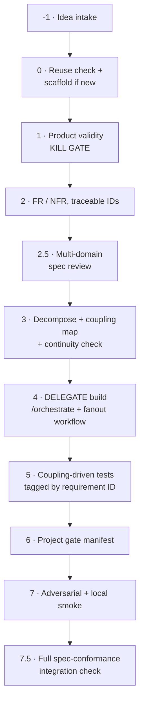
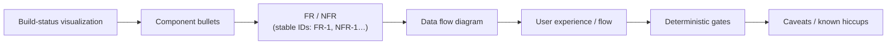
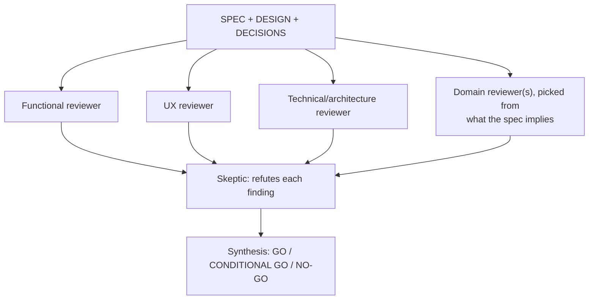

# dark-factory

**This skill does not replace `/orchestrate` or `fanout-design-build-audit`. It wraps them.**

Those two already handle *how* to build well: role sequencing, per-component design review,
adversarial audit, convergence. What they assume is that the feature **should exist** and that
you know what "done" means. This skill supplies everything they do not: idea validation,
spec authoring with traceable requirements, a multi-domain review of the *spec itself*, and a
final check that what got built actually satisfies what was asked.



Phases -1, 0–3, and 5–7.5 are this skill. **Phase 4 is a delegation, not a reimplementation.**

---

## Entry modes — decomposable, not all-or-nothing

**The full chain above is one mode, not the only mode.** Any subset is independently invocable —
say the mode explicitly when starting, or infer it from what's being asked (a follow-up on an
existing project reads as `feature-add`, a bare idea with nothing built yet reads as `new-product`).

| Mode | Runs | Skips | Use when |
|---|---|---|---|
| **`new-product`** (default) | -1 → 7.5, full chain | nothing | Building something from zero |
| **`feature-add`** | 0 → 7.5; kill gate (1) scoped to the increment; phase 2's FR/NFR are appended to the existing `SPEC.md` with new IDs, not a fresh document; phase 2.5 reviews only the diff | -1 (idea intake), repo scaffold | Iterating a new feature onto a product this pipeline (or anything else) already built |
| **`spec-only`** | -1 → 2.5 | 3 onward | Want a validated, reviewed, locked spec, not ready to build yet — e.g. queuing work, or handing the spec to a human |
| **`review-only`** | 2.5 only, against an already-written doc suite | everything else | Retrofitting the multi-domain review onto a spec authored outside this pipeline |
| **`build-only`** | 3 → 7.5 | -1, 0, 1, 2, 2.5 | Spec already locked (by a prior `spec-only` run, or by hand); resume straight into decomposition |
| **`integration-check`** | 7.5 only | everything else | Periodic health check on an already-shipped project — re-verify it still matches its spec, refresh `docs/TRACE.md` |
| **`gap-log`** | nothing — appends one row to the Spec-Gap Ledger | everything | A follow-up just revealed a spec miss; record it without running the pipeline |

Record which mode ran and which phases it covered in `docs/STATE.md`'s `pipelineMode` /
`phasesRun` fields (schema below) — this is what makes a later `build-only` or
`integration-check` run know where a previous partial run left off, and what makes the mode
itself part of the traceability story instead of an undocumented shortcut.

---

## `docs/STATE.md` — machine-readable header (every mode writes this)

`STATE.md` carries a small YAML front-matter block ahead of its prose/Mermaid content, so both
this pipeline and Catwalk (the build-status dashboard, below) can read it without parsing English:

```yaml
---
project: <name>
category: <D:\repo category, e.g. AI | web | Bot | Data | Experiment | _Misc>
deploymentTier: pre-traffic | live
rigor: mvp | production
status: proposed | validated | spec-drafted | spec-locked | decomposing | building | poc |
        integration-checked | shipped | blocked | awaiting-human-approval | killed
pipelineMode: new-product | feature-add | spec-only | review-only | build-only |
              integration-check
phasesRun: [ "-1", "0", "1", "2", "2.5" ]
lastCompletedPhase: "2.5"
updatedAt: <ISO timestamp>
blockers: []
---
```

Update this block at the end of **every** phase, in every mode — it is the single source both
the pipeline's own resumption logic and Catwalk (below) read from.

**Also append one line to `docs/PHASE-LOG.jsonl`** at the end of every phase, in every mode —
added 2026-09-08 (FR-D3/D5, `D:/repo/AI/foreman/docs/VISUALIZATION-REQUIREMENTS.md`) after a
real dispatch made clear that STATE.md's single phase number can't answer "what did this phase
actually produce" or "is this really sequential or does it fan out into parallel components."
One JSON object per line (same convention as this codebase's other JSONL logs —
`corrections.jsonl`, `reasoner_failures.jsonl`):

```json
{"phase": "<id>", "completedAt": "<ISO>", "summary": "<one sentence, what actually happened>", "artifacts": [{"label": "<name>", "path": "<repo-relative>"} , {"label": "<name>", "url": "<link>"}], "graph": {"nodes": [{"id": "<component key>", "label": "<short>", "status": "done|live|queued|pending|failed", "dependsOn": ["<other component key>"], "satisfies": ["FR-1"]}]}}
```

`summary` + `artifacts` are a pointer, never a duplicate of the real content (the same
"backlink instead of explaining" principle the Terse-Output Contract applies to chat, applied
here for a machine/UI consumer) — link to the real spec section, build output, or PR, don't
paste it. `graph` is populated **only** for phase 3 (from the decomposition table you already
wrote — `id`/`dependsOn`/`satisfies` map directly onto its Component/Depends-on/Satisfies
columns) and phase 4 (same nodes, `status` updated as each component's build/review/audit/fix
cycle actually progresses) — every other phase omits `graph` entirely. **Only write what
actually happened** — an artifact that doesn't exist yet (e.g. a build-record file a sub-step
was supposed to produce but didn't) does not get a fabricated entry; note the gap in `summary`
honestly instead.

---

## Visualizing build status — Catwalk, reuse not a new dashboard

**Superseded 2026-09-07 (D13/D14, `~/.claude/docs/DECISIONS.md`):** this section previously
described syncing `STATE.md` into Helm's "Nexus" workspace via generated `helm-*.json` files.
Helm was verified dormant (3 commits ever, no runtime data since build day) and archived.
Its design was extracted into requirements for a purpose-built replacement, **Catwalk**
(`D:\repo\AI\catwalk`), which shipped 2026-09-07.

**No file generation needed — this is simpler than the section it replaced.** Catwalk polls
`~/.foreman/repos.json` (the project registry) and each registered project's `docs/STATE.md`
directly every 5s; there is no intermediate JSON to keep in sync. The only actions this pipeline
takes:

- **Phase -1, when scaffolding a `new-product`:** register the repo once — `foreman repos add
  <path>` (see `D:\repo\AI\foreman\docs\SPEC.md`) — so it appears in Catwalk's sidebar.
- **Every phase, every mode:** keep `STATE.md`'s YAML block and build-status Mermaid current
  (already required above). That alone is what Catwalk renders — the phase highlighting comes
  straight from `phasesRun` / `lastCompletedPhase` / `status`.

---

## -1 · Idea intake

Two entry shapes — handle both:

1. **From the idea bank** (`Life/notion ideas/*.md`, deep dives in `context/top-5/*.md` when they
   exist) — read the deep dive as the seed for phases 1–2. It is context, not a rubber stamp: the
   kill gate in phase 1 still runs for real.
2. **From a raw ask** with no prior idea-bank entry (someone just describes what they want built) —
   write a minimal entry into the idea bank first, following its existing schema
   (`Life/notion ideas/SCHEMA.md`), so everything built stays traceable back to an idea record even
   when it started as a one-off request. Skip this for a feature inside an already-existing,
   already-tracked project — only new, from-zero ideas need a bank entry (this is the
   `feature-add` mode).

If phase 1 says **BUILD** and this is a new idea (not a feature in an existing repo): scaffold its
home now, per the standing Repository Organization rule — `D:\repo\<Category>\<project>`, never
bare at the root. State the chosen category. `git init`. Create `docs/SPEC.md`, `docs/DESIGN.md`,
`docs/DECISIONS.md`, `docs/STATE.md` from "Spec template" below, plus the `Repo path` +
`CLAUDE.md` "Helm Integration" step from "Syncing to Helm's Nexus workspace" above.

---

## Spec template — the one source-of-truth sheet

Every project's `docs/SPEC.md` (features inside an existing repo may fold this into the Feature
Decision Record instead) **must** carry these sections, in this order. Phase 2.5 below rejects a
spec that is missing one:



- **Build-status visualization** — a Mermaid flowchart/state diagram, ≤5 nodes per row, each
  component tagged `✅ built` / `🚧 in progress` / `⬜ not started`. Lives in `docs/STATE.md`,
  refreshed at the end of every session that touches this project (mirrors Bifrost's `STATE.md`
  pattern — now standard for every Dark Factory project, not just that one).
- **Component bullets** — one line per component, what it does, no implementation detail.
- **FR / NFR with stable IDs** — assigned in phase 2 below, never renumbered; a dropped requirement
  is struck through with a pointer to the `DECISIONS.md` entry that superseded it, not deleted.
- **Data flow** — `sequenceDiagram` or `flowchart`, ≤5 participants.
- **UX** — the user-visible flow, step by step, even for a single-user personal tool.
- **Deterministic gates** — named unit / integration / E2E-happy scenarios; this is what phase 5's
  tests are written against.
- **Caveats** — known risks and deliberately deferred items, same shape as a `DECISIONS.md` row
  (decision · rationale · revisit-when).

---

## 0 · Reuse check — mandatory, and must be stated

Before designing anything, per the global rule:

1. `ls` the directory you would add to, and `grep` for the **role** (not the name you have in mind).
2. **State the result in one line**: *"Searched `<dir>` for `<role>` — found `<X>`; extending `<X>` / none fit because `<reason>`."*
3. Two implementations of the same role already existing is a **defect to consolidate**, not a menu.

Also run the `/orchestrate` pre-flight: real test/build/typecheck commands read from the repo,
real interpreter path, worktree-by-default for parallel writers.

---

## 1 · Product validity — the kill gate

**The gate the other skills do not have.** Answer before any design:

1. **Which persona use case does this resolve?** Quote it from the project's persona doc.
2. **What measured evidence says that use case is real?** Cite a number and where it came from.
3. **What would we observe if this feature worked?** A metric, named now, before building.

**Three failure modes that stop the pipeline here:**

- **No use case maps** → do not build. Say so plainly and stop.
- **The persona is unvalidated** → proceed only as an explicit bet, and label it. A persona
  derived from the team's own usage, or from personally-recruited users, is **not evidence** —
  it describes who was recruited, not who would adopt.
- **The binding constraint is elsewhere.** If the project's actual bottleneck is traffic, trust,
  or distribution, a feature does not move it. **Building product when the problem is
  distribution is the most expensive way to avoid the real question.**

Record the verdict. A "no" here is the highest-value output this skill produces.

---

## 2 · Requirements — functional, non-functional, and extension points

**Check the Spec-Gap Ledger first** (`docs/SPEC-GAP-LEDGER.md` at the session docs root — see
"Spec-Gap Ledger" near the end of this file). It is a running list of categories that past
projects' specs *missed*, discovered only after a post-ship follow-up pointed it out. Walk the
list before calling requirements complete — this is the mechanism that stops the same category of
miss from recurring project after project.

**Every FR and NFR gets a stable ID** (`FR-1`, `FR-2`, …, `NFR-1`, …), assigned here and never
reused or renumbered for the life of the project. These IDs are the traceability spine: phase 3
tags each component with the IDs it satisfies, phase 5 tags each test with the ID it verifies,
and phase 7.5 rebuilds the full requirement → component → test → status table from them. A
requirement with no ID cannot be traced later — assign one even for a one-line NFR.

**Functional (FR)** — each written as a *testable statement*, not a description. If you cannot
imagine the assertion, the requirement is not yet a requirement.

**Non-functional (NFR)** — minimum set, every time:

| NFR | Question it must answer |
|---|---|
| Failure behaviour | What does the user see when each dependency fails? |
| Observability | How would we know this broke **in production, without a user reporting it**? |
| Performance | What is the expected volume, and what breaks at 10×? |
| Security | What is the trust boundary and what crosses it? |
| Data | Retention, migration, and what happens to existing rows? |
| **Extensibility** | **What is the next likely addition, and what does it cost?** |
| **Probabilistic-call reliability** (only if the feature calls an LLM/reasoner/any non-deterministic model) | **Is there a real E2E test against the REAL model** (never fake-only), a bounded retry with failure tracing, and does the spec name the model's known failure shapes (malformed output, wrong-field placement, transient error) explicitly? |
| **Creative/domain-direction anchoring** (only if the feature generates subjective/creative output — copy, a story, an edit, a design) | **Does the prompt/spec state the concrete domain/audience explicitly** (not just the output format), and does the spec name a judged example the output must resolve correctly — not just "valid schema, 200 OK"? |

Both rows above exist because they were missed in production and cost a real user-visible failure
before being caught — see `~/.claude/docs/SPEC-GAP-LEDGER.md`'s `nuwa-m3` rows (2026-09-07): a
reasoner call that passed every unit/integration/E2E test still failed on first real interactive
use (a markdown-fence-wrapped response no test exercised), and a schema-valid, 200-OK output that
was *semantically* wrong (a domain-ambiguous word resolved to the wrong subject entirely, because
the prompt never stated the account's real content domain). **Schema validity and a green test
suite are necessary, never sufficient, for a probabilistic or creative-output feature** — this is
the standing lesson, not a one-off fix.

**Extension points, named explicitly.** For each, state the seam and how a future addition plugs
in without editing existing logic:

- Prefer a **registry/manifest** over a switch statement.
- Prefer a **typed union + exhaustive check** over an if-chain, so the compiler names every site
  a new case must touch.
- Prefer **config-as-data** over config-as-code.
- **Test the seam, not just the instance:** add a test that registers a *fake* second
  implementation and asserts it works. That test is what proves the thing is actually extensible
  rather than merely intended to be.

---

## 2.5 · Multi-domain adversarial review of the spec itself — the lock gate

**This runs on the doc suite (SPEC/DESIGN/DECISIONS), before any component is decomposed or
built.** It is the global CLAUDE.md's "adversarial review of the complete documentation suite"
step, made a mandatory pipeline phase instead of a principle to remember.



- **Functional, UX, and Technical reviewers always run.** Add **Security** if the spec touches
  auth/PII/money, **Data** if it defines a schema or migration, **GTM** if it has users beyond the
  builder. State which dimensions ran and why.
- **A weak review is not a pass.** The skeptic pass must genuinely attempt to refute each finding;
  "found little" only counts as approved if refutation was actually attempted, not skipped. This
  is the step most likely to get rubber-stamped when nothing forces a human to read it — say
  explicitly what the skeptic tried and why it failed to break each surviving finding.
- **Rate every finding R / F / H** (Real-now-fix / Future-deferred / Hardening) — Bifrost's scale.
  Route every **R** finding back to phase 2, not forward.
- **Auto-advance rule — this is what makes unattended operation real, not aspirational:**
  - `deploymentTier: pre-traffic` (read from the project's `CLAUDE.md` / `STATE.md`; default if
    unstated) — a synthesis of **GO**, or **CONDITIONAL GO with zero unresolved R-findings**,
    sets `docs/STATE.md`'s `status: spec-locked` automatically and the pipeline continues into
    phase 3 with no human click.
  - `deploymentTier: live` — the synthesis is recorded, but `status: spec-locked` requires an
    explicit human-set `approvedBy` / `approvedAt` field in `STATE.md`. This is the one place a
    human is structurally required for a `live` project; a `pre-traffic` project never stops here.

**Human checkpoint modality — wireframe, not prose (added 2026-09-07, Nüwa M3 pilot).** The
4 adversarial reviewers above read the full spec text; the human does not, reliably — asked
directly during this pilot, the answer was that reading a written FR/NFR list is not how
alignment actually gets checked. **If any FR in this slice defines a new or changed UI surface,
produce a low-fidelity wireframe artifact (an Artifact-tool HTML page, schematic — placeholder
blocks and real field names, not a finished visual design) before phase 2.5 closes**, and get the
human's yes/redirect on *that*, not on the prose. This is the human's actual review surface;
the written spec stays the reviewers' and phase 7.5's. A redirect at this point (something looks
wrong, missing, or not what was pictured) routes back into phase 2 like any other R finding —
cheaper here than after phase 4 has already spent build effort against the wrong shape.

---

## 3 · Decomposition + coupling map

Split into components that are **file-disjoint** so agents can run in parallel worktrees.

For each component state: **owned files · public interface (schema first) · dependencies ·
whether it can be built in isolation · which FR/NFR IDs from phase 2 it satisfies.** The last item
is not optional — a component with no requirement ID attached cannot be traced later.

**Continuity check — before phase 4 starts, not after.** For every component's stated `requires`,
confirm some other component's stated `produces` actually covers it. This is a static pass over
the coupling map you are about to write, and it is cheap: Bifrost's own adversarial review found
its single highest-value bug here (a dependency the design *claimed* was threaded through that the
code could not actually see). A component with an unmet `requires` is not buildable yet —
decomposition is not done until every edge resolves.

Then the part most often skipped — **the coupling map**:

> For every point where new code touches existing code, name the file, what assumption the new
> code makes about the old, and how that assumption is verified.

**Coupling points are where regressions live.** New code in new files rarely breaks anything;
new code that *changes an assumption* in old files is what breaks production. This map becomes
the test plan in phase 5.

**Branch strategy:** one branch per component, cut from a clean base, developed in parallel
worktrees, merged one at a time with the suite green between merges. Shared integration files
(the ones every component touches) are reconciled in a **single serial pass**, never in parallel.

**Parallel build and per-component verification are not in tension — this is worth stating
explicitly, it was asked directly during the Nüwa M3 pilot (2026-09-07).** Parallelism here means
*where the work happens* (agents in separate worktrees, simultaneously); verification happens at
*merge*, which is already serial ("merged one at a time, suite green between merges"). Gating each
component's merge on its own checkpoint does not serialize the building — it only serializes the
one-at-a-time integration step that was already serial. Do not "simplify" this into either building
everything in one pass with a single end checkpoint (loses the per-component fault localization
below) or fully serializing the builds themselves (gives up the parallelism this skill exists to
provide, for no verification benefit — the checkpoint was never the bottleneck).

---

## 4 · Build — delegate, do not reimplement

- **Multi-component** → `fanout-design-build-audit` workflow. It already does Design → Design
  Review → Build → (Build Review + Adversarial Audit → Fix) per component until converged.
- **Single component** → `/orchestrate` `feature` flow.
- **Author and reviewer are never the same agent.** Never let the agent that wrote code certify it.

Hand each agent: its component spec from phase 3 (including the FR/NFR IDs it must satisfy), an
explicit deliverable, and a **stop condition**.

**Every component's merge includes a durable, inspectable build-record — not just green tests
(added 2026-09-07, Nüwa M3 pilot).** Green tests are evidence assertions pass; they are not
evidence of what the component actually produces, and a later regression needs to see the last-known-
good output to know which component broke, not just which suite is currently red. At merge, each
component writes one real sample of its own output — a real generated file, a real API response
body, a real rendered frame, whatever the component's actual artifact is — to
`docs/build-records/<component-id>.md` (or the project's equivalent location), timestamped and
committed alongside the code. This is the per-component instance of the global Observability &
Self-Validating Output rule, applied at build time instead of at runtime: the artifact that lets
phase 7.5's `TRACE.md` point at *evidence*, not just a test-name string.

**RigorPolicy governs the loop's patience, by tier** (ported from Bifrost's `RigorPolicy`,
formalized as a `STATE.md` field instead of left as prose):

| Tier | `rigor` | Repair-loop budget before escalating to a human | Continuity failure |
|---|---|---|---|
| `pre-traffic` | `mvp` | 3 fix iterations | Warn, do not block |
| `live` | `production` | 1 iteration, escalate fast | Blocks phase 4 outright |

**Human-approval is a state, not a reminder — `live` tier only.** When a component's build reaches
a point that would normally need a human look (a `live`-tier project's phase 4 completion, or any
point the project's own gate manifest names), set `STATE.md`'s `status: awaiting-human-approval`
explicitly and stop. Do not rely on remembering to ask — the halted state is what stops this
pipeline from advancing past it, and it resumes on the approval event itself (see "Continuous
execution" below), never on a timer. `pre-traffic` projects never enter this state; gate-green is
the approval.

---

## 5 · Test strategy — derived from the coupling map

| Layer | Derived from | Must include |
|---|---|---|
| **Unit** | Each FR | Happy path · validation rejection · **error path** · boundary values |
| **Integration** | Each **coupling point** from phase 3 | The old code's assumption, asserted |
| **E2E** | Each persona use case from phase 1 | The user-visible flow, end to end |
| **Extensibility** | Each extension point from phase 2 | A fake second implementation registers and works |

**Tag every test with the FR/NFR ID it verifies** (in its name or a one-line docstring/comment —
`test_retry_on_timeout  # verifies NFR-2`). This is what lets phase 7.5 rebuild the traceability
table mechanically instead of re-deriving it by memory.

**Deterministic fixtures, always.** Seed every generator; a fixture that changes between runs
makes failures unreproducible.

**When fixtures must resemble production data, synthesize from aggregate statistics — never
copy and scrub real rows.** Scrubbed records stay re-identifiable through combinations of values
that look innocuous individually. Generating from statistics means there is no underlying record
to re-identify: safe **by construction, not by redaction**. Preserve the properties that matter
(volume, distribution, outliers) rather than the records.

---

## 6 · Audit gates — from the project's gate manifest

**Read `.claude/feature-gates.md` in the project root** and apply every gate. If it does not
exist, apply the universal set below and propose creating one.

**This is the extension seam of this skill itself.** New hard-won lessons become new rows in a
project's manifest — the pipeline does not change.

**Universal gates (apply even with no manifest):**

| Gate | Why |
|---|---|
| **No silent failures** | Every `catch` reports or rethrows. A swallowed error shows the user success and shows you nothing |
| **Guards fail closed, and prove they ran** | A checker that skips what it cannot parse reports green over its own gaps. Assert the *match count*, not just zero findings |
| **Reached, not merely installed** | Verify at the END of the chain: installed → initialised → called → on the routes that matter → data arriving. Each link passing says nothing about the others |
| **Graceful degradation** | Every external dependency failing leaves a usable page |
| **No dead code** | Unreferenced code still carries dependencies, and dependencies carry CVEs |
| **State over events** | If a fact is derivable from stored state, derive it. Reserve events for what leaves no trace |
| **Durable build evidence** | Does every merged component have a real-output build-record committed (phase 4), not just a passing test name — so a regression can be localized to a component without re-running the world? |

---

## 7 · Adversarial review, then a real smoke test

1. **Adversarial pass with a fresh context** whose mandate is to *break it*, not confirm it.
   Findings ranked by whether they can happen in production, not by how clever they are.
2. **Run it locally against the real application** — build, start, exercise the actual user flow
   with the phase-5 fixtures. Green tests are not evidence the feature works; they are evidence
   the assertions pass.
3. **Verify the specific claim.** If you say a file changed, assert that file is staged. If you
   say an event fires, query the destination. **An exit code of 0 is not evidence.**
4. **A feature wrapping a probabilistic call (LLM/reasoner/any model) needs its real-model E2E
   test run here, not just its fake-backed unit tests.** A test against a fake reasoner structurally
   cannot catch the real reasoner's actual failure modes (a malformed response shape, a field
   mix-up, a transient error) — only a genuine call to the real model does. This is not optional
   for such a feature; treat a missing real-model E2E the same as a missing smoke test.

---

## 7.5 · Full spec-conformance integration check

**Re-read the original `docs/SPEC.md` line by line — not the coupling-map smoke test, the whole
document — and check the built system against every requirement it states**, whether or not phase
3 remembered to assign it to a component. This is the step that catches a requirement that
silently fell out of decomposition.

Produce `docs/TRACE.md`, one row per FR/NFR ID:

| ID | Requirement | Owning component | Verifying test | Status |
|---|---|---|---|---|

`Status` is `met` / `partial` / `failed` — never a bare checkmark; `partial` and `failed` both
need one sentence saying what's missing. **This table is what answers "what broke" by pointing at
a node**, the next time something regresses — the fix locates the owning component via `TRACE.md`
first, instead of re-deriving it from scratch. Refresh `TRACE.md` on every future phase-7.5 run
(a re-run after a fix, or a scheduled re-check), not just the first one.

Update `docs/STATE.md`'s build-status visualization to match reality at the same time.

---

## The Feature Decision Record — written at every gate, not at the end

**Every run of this skill produces a persistent document in the repo**, at
`docs/features/<feature>.md` (or the project's equivalent — check before creating a new home).
It is written **incrementally as gates are passed**, not reconstructed afterwards.

**Why it must be attached to the codebase and not left in a chat log or a chronological
decision journal:** the question a future reader asks is *"why is this the way it is?"* or
*"did we consider X?"* — both scoped to a feature, not to a date. A chronological log answers
"what happened in September"; it does not answer "why does the free tier work like this."

**A record is written even when phase 1 says NO.** That is the highest-value case: without it,
a rejected idea returns every few months and is re-argued from zero, because the reasoning
died with the conversation. **Record the rejection and its evidence, so the next person
re-opens it on new evidence rather than on fresh enthusiasm.**

Required sections:

| Section | Written at | Must contain |
|---|---|---|
| **Verdict** | Phase 1 | BUILD / DEFER / NO · the persona use case · the measured evidence · **the metric that will confirm it worked** |
| **Requirements** | Phase 2 | FR as testable statements · NFR table · named extension points |
| **Design** | Phase 3 | Components · schemas · **coupling map** · branch plan |
| **Gates** | Phase 6 | Each gate: passed / failed / deliberately skipped **with the reason** |
| **Traceability** | Phase 7.5 | Link to `docs/TRACE.md` |
| **Outcome** | Post-ship | Did the phase-1 metric move? **Answered honestly, including "no"** |

**Two properties that make it worth keeping:**

- **Reviewable by a non-engineer.** The Verdict and Outcome sections must be readable by
  whoever owns the product decision. If they cannot check your reasoning, the record is an
  engineering artifact pretending to be a decision.
- **Revisit triggers, not open questions.** A deferred item states the condition that re-opens
  it (*"≥25 signups"*), never *"revisit later"*. A trigger without a threshold never fires.

Cross-link it from the chronological decision log rather than duplicating the content there.

---

## Spec-Gap Ledger — the forward-feeding loop

`docs/SPEC-GAP-LEDGER.md` at the session docs root (cross-project, not per-repo). Every time a
**post-ship follow-up** reveals the original spec should have caught something — a correction, a
"why doesn't this handle X", a scope the user had to point out manually that phase 2's FR/NFR pass
missed — add one row:

| Date | Project | What was missed | Category | Now checked in phase 2 as |
|---|---|---|---|---|

This is not optional bookkeeping — it is the literal mechanism for "front-load what was missed
into the next spec": phase 2 of every future run reads this ledger **first**, before calling its
own FR/NFR complete. Append-only; a category is marked resolved-by-convention only after 3+
consecutive specs checked it with no repeat miss, never deleted outright.

---

## Continuous execution — event-driven, not polled

**Once phase 2.5 auto-advances a `pre-traffic` project, do not stop between phases.** Phase 3 → 4
→ 5 → 6 → 7 → 7.5 run back to back in the *same* pipeline run, each phase's completed gate being
the only "trigger" the next phase needs — this is just the existing Autonomous Execution Contract
loop (identify next unblocked step → do it → repeat until done or a hard blocker), applied to this
pipeline specifically. There is no gap between a dependency being satisfied and the next phase
starting, so there is nothing to poll for and nothing to schedule. An earlier version of this
design proposed a scheduled cron tick to advance phases — that was wrong: it would insert exactly
the delay this section says to avoid. Corrected 2026-09-07 per explicit user pushback.

**Phase 4's delegation is already event-driven, not polled.** `fanout-design-build-audit` runs as
a background `Workflow`; the harness sends a task-notification the instant it converges — resume
from that notification, never by scheduling a check-back. The `Agent`/`Workflow` tools' own
completion signaling *is* the event-driven mechanism; nothing new is needed here.

**Kickoff is a deliberate act, not a background watcher.** Going from "an idea exists" to "the
pipeline is running" still means invoking `/dark-factory` (with a mode, per "Entry modes" above)
— manually, or from another skill/agent that decided to. That is not a gap in the design: it is
the one point a human (or an
upstream agent) actually chooses to start work, and it happens the instant it's asked for, which
is already as fast as this can go. A fully unattended kickoff (idea appears in the bank → pipeline
starts with nobody asking) is a separate, later capability, not required for "front-load into the
spec, autonomous after" — the point that needed to be autonomous is the phase-to-phase transitions
above, and those already are.

**The one genuine suspend point: `awaiting-human-approval` (`live` tier only).** This is the one
place real-world wall-clock time passes for a reason Claude Code cannot resolve itself — a human
has to actually look. Resume **on the approval event**, not on a timer: the human setting
`approvedBy`/`approvedAt` in `STATE.md` and re-invoking (or replying in whatever channel surfaced
the request) *is* the trigger. Do not schedule a recurring check for this either — a `pre-traffic`
project never reaches this state at all, so in practice this almost never fires.

## Reporting

Close with: the phase-1 verdict and its evidence · what shipped · gates passed/failed · what
was deliberately deferred and why · the metric named in phase 1 that will confirm it worked · the
`docs/TRACE.md` link · any new Spec-Gap Ledger rows added.

**If phase 1 said no, that is a complete and successful run of this skill.**
