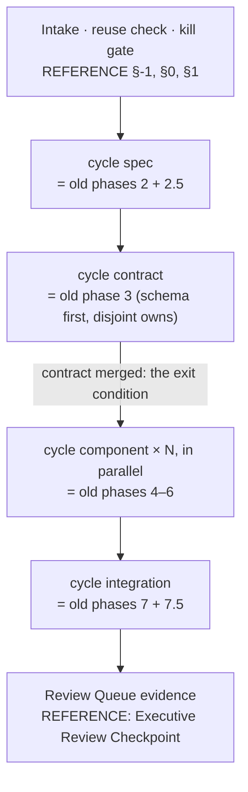

# dark-factory: operating core

**One unit, replicated.** Everything this skill builds is composed of **cycles** (`CYCLE.md`, implemented by `C:/Users/Michael/.claude/workflows/cycle.js`). The long-form rules, incidents and rationale live in `REFERENCE.md` under the same section headings they always had. Read a REFERENCE section when this core points you to it; do not re-derive it.


```mermaid
flowchart TD
  A["Intake · reuse check · kill gate<br/>REFERENCE §-1, §0, §1"] --> B["cycle spec<br/>= old phases 2 + 2.5"]
  B --> C["cycle contract<br/>= old phase 3 (schema first, disjoint owns)"]
  C -->|contract merged: the exit condition| D["cycle component × N, in parallel<br/>= old phases 4–6"]
  D --> E["cycle integration<br/>= old phases 7 + 7.5"]
  E --> F["Review Queue evidence<br/>REFERENCE: Executive Review Checkpoint"]
```

## Phase-number map (Foreman dispatch prompts still use these numbers)

| Old phases | Now | Notes |
|---|---|---|
| -1, 0, 1 | intake, reuse check, kill gate | REFERENCE §-1/§0/§1. A NO still writes a record |
| 2, 2.5 | **cycle `scope=spec`** | Design = requirements plus the assumptions ledger. Design review = the multi-domain adversarial review (REFERENCE §2.5 dimensions). Pre-traffic GO sets `status: spec-locked` automatically; live requires `approvedBy` |
| 3 | **cycle `scope=contract`** | One contract artifact, child items with pairwise-disjoint `owns`, and a coupling map (REFERENCE §3). A small slice skips this and runs one component cycle |
| 4, 5, 6 | **cycle `scope=component`** per child | One worktree each, in parallel. Tests are written alongside (REFERENCE §5), and gates come from the project manifest (REFERENCE §6) |
| 7, 7.5 | **cycle `scope=integration`** | Contract tests, e2e, the smoke test, TRACE.md, and demo or before/after evidence (REFERENCE §7/§7.5) |

## Entry modes

| Mode | Runs |
|---|---|
| `feature-add` (default) / new product | everything above |
| `spec-only` | intake plus the spec cycle, with **no design review under Foreman**: Foreman chains a separate `review-only` dispatch, so the author never grades itself |
| `review-only` | the design-review step of a spec cycle against the existing docs |
| `contract-only` | the contract cycle. Its merged PR unblocks the children (Foreman `contract-first-parallel-dispatch`) |
| `build-only` | component cycles, then the integration cycle, from an already-locked spec and contract |
| `integration-check` | the integration cycle only |
| `research` | REFERENCE "`research` mode" (R1–R4), which chains into spec-only |
| `gap-log`, `consolidate` | REFERENCE sections of the same names |

## Non-negotiables (details in REFERENCE)

- **State is always current.** `docs/STATE.md` header and `docs/PHASE-LOG.jsonl` get one entry per cycle step. `completedAt` is a real `date -u` reading, and `needsAttention` carries an `attentionClass` (REFERENCE "`docs/STATE.md`").
- **Attention budget.** The owner is pulled in only for a typed hard blocker or review evidence (a demo video or a before/after pair). A budget-exhausted cycle is `repair-budget-exhausted`. Everything else is self-healing.
- **Work items are folders.** `docs/work/<id>/` holds a README, per-layer before→after files, and `cycles/` (WORK-ITEM-STANDARD.md, including the DESIGN.md diagram contract and the `owns` lines).
- **Tier gate.** `live` needs human `approvedBy` at spec lock and never auto-merges without the label ladder. `pre-traffic` runs unattended with build and test green.
- **Backlog, not scope creep.** Found work goes to `STATE.md backlogItems` (REFERENCE "Spec-Gap Ledger"), never inline.

## Calling a cycle

```text
Workflow({ scriptPath: "C:/Users/Michael/.claude/workflows/cycle.js",
           args: { repo, workItem, scope, cycleId: <new UUID>, startedAt: <now ISO>,
                   testCommand, owns, contract, size?, parentCycleId? } })
```

Run parallel component cycles as parallel Workflow calls, **each with its own worktree `repo`**. After each cycle, write its `cycle.json` outcome into PHASE-LOG, and act on `outcome`: `passed` continues, and `budget-exhausted` escalates.
