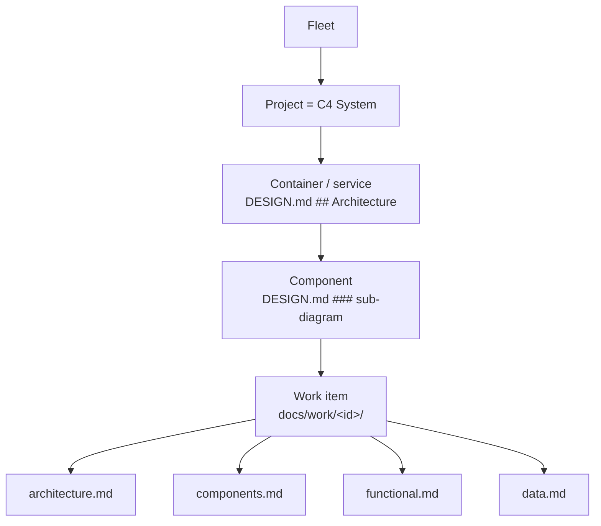
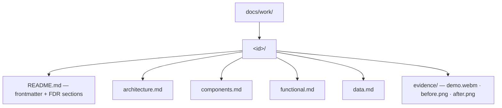

# Work-Item Standard — one C4 spine, per-layer change impact, per-type profiles

Adopted 2026-09-25 (global: every dark-factory repo). It is rendered by Catwalk (`D:/repo/AI/catwalk/docs/work/c4-change-impact/`).



**One hierarchy spine.** The C4 tree already authored in `docs/DESIGN.md` (`## Architecture` root plus `### <component>` sub-diagrams) is the only containment model. A work item attaches to it with `touches: [<arch node id>]`. A roadmap node's `partOf` names an architecture node id, not another roadmap node. Before this, three unrelated hierarchies existed (roadmap `partOf`, DESIGN.md diagrams, STATE.md `components:`), and the roadmap one was never populated (0 of 39 nodes).

## Folder layout (replaces the single-file Feature Decision Record for new work)



A folder, not one file, because each layer is a stable address that Catwalk opens as a drill level, parallel agents edit different files without colliding, and a diff shows which layer moved. `docs/features/*.md` stays as legacy history and is not migrated.

### README.md frontmatter (machine-read by Catwalk)

```yaml
id: <slug>                 # matches roadmap node id / backlogItems id
type: feature | experiment | research | bugfix | refactor | integration | data-collection
status: draft | spec-locked | building | shipped | killed | promoted
touches: [<DESIGN.md node id>, ...]   # where on the C4 spine this lands
layers:                    # EVERY layer declared, including "none"; silence is not allowed
  architecture: added | modified | removed | none
  component:    added | modified | removed | none
  functional:   added | modified | removed | none
  data:         added | modified | removed | none
evidence: { demo: evidence/demo.webm, before: evidence/before.png, after: evidence/after.png }
```

### Each layer file = before → after, visual-first

| File | C4 level | Must show |
|---|---|---|
| `architecture.md` | System / Container | Mermaid `flowchart` **before** and **after**: containers, external systems, new edges |
| `components.md` | Component | Mermaid before/after of the touched container's components, plus the owned-files and interface table (the Phase 3 decomposition) |
| `functional.md` | Behaviour | FR/NFR delta (added, changed, removed IDs), a `stateDiagram`/`sequenceDiagram` for changed flows, and the acceptance criteria |
| `data.md` | Data / contracts | `erDiagram`/`classDiagram` before/after, schema-file diff pointer, migration and back-compat note |

A layer declared `none` has no file. A layer declared changed with no file fails the Phase 7.5 check.

## Per-type profiles

| type | architecture | component | functional | data | type-specific section (README) | review evidence (Attention budget) |
|---|---|---|---|---|---|---|
| **feature** | required (may be `none`) | required | **required** | required (may be `none`) | acceptance criteria | demo video **or** before/after |
| **experiment** | forbidden on main until promoted | optional | optional | optional | hypothesis · metric · control vs variant · kill/adopt threshold · timebox · **result** | result table or chart. On adopt, status becomes `promoted` and a **new feature item** is opened carrying the real layer deltas |
| **research** | none | none | none | none | question · sources · findings · recommendation | findings doc (not a review item) |
| **bugfix** | only if the root cause is structural | the layer that held the bug | observed vs expected | only if the data was wrong | root cause (mechanism, not instance) | failing → passing regression test |
| **refactor** | **required** before/after | **required** before/after | must be `none` (behaviour-preserving, asserted by unchanged tests) | `none` or migration | motivation · what got simpler (measured) | before/after diagrams |
| **integration** | **required** (a new external edge) | required | required | **required** (the contract) | the external system's contract and failure mode | contract test + demo |
| **data-collection** | none | optional | optional | **required** (collected schema, source, retention) | sample size · stopping rule | sample + row count |

Why experiments differ: an experiment is allowed to be wrong. It records a hypothesis and a verdict, never a permanent architecture change. If it wins, the real change is a new `feature` item, so experiment code never becomes the architecture of record without the full four-layer treatment.

## Roll-up (what "add up each hierarchy level" means)

At every C4 level, Catwalk aggregates the work items whose `touches` fall under that node. It shows counts by `status` and a per-layer change badge (A/C/F/D). Clicking in narrows the view, and the breadcrumb climbs back out. The fleet level rolls up across projects.
