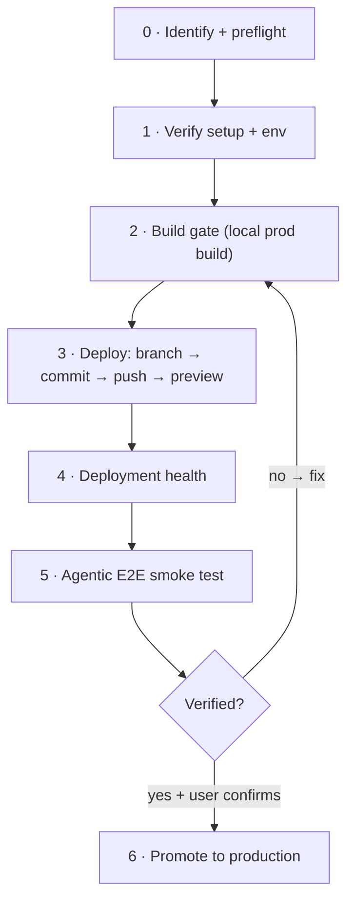

# deploy-web — the safe production deploy loop

Goal: take a web change from working tree → verified preview → (on confirmation) production, without breaking a build,
leaking an outward-facing change, or shipping a dead route. **Preview-first, never push `main` directly.**



## Phase 0 — Identify + preflight (do NOT skip — repo identity bites)
- **Confirm the repo identity**, don't trust the directory name. Read `package.json` `name`. (Lesson: `cashcow/` is
  package `tarive`; `Tarive/` is the incomplete Expo mobile app. The dir name lied.)
- **Detect the stack** from deps + scripts: Next.js (`next` + `next build`), Vite (`vite`), Expo/RN (`expo`,
  `expo-router`), monorepo (`turbo`, `packages/*`). This picks the build/deploy commands.
- **Find the Vercel project**: read `.vercel/project.json` (`projectId`/`orgId`), else `vercel link` / `list_projects`.
  Note: the Vercel project name may differ from the repo (cashcow → Vercel project "tarive").
- **Git state**: current branch, remote (`git remote -v`), `git status --short`. If on `main`/`master`, you will branch.
- **Reuse existing patterns** (grep before adding UI): design tokens, shared `SiteHeader`/`Navbar`/`Footer`, the CSP in
  `middleware.ts`, existing `StructuredData`/`sitemap.ts`/`llms.txt`. Match, don't reinvent.

## Phase 1 — Verify setup + env
- **Env vars**: diff `.env.example` ↔ what code reads (`process.env.X`); for the deployed side run `vercel env ls`.
  Flag anything missing. Price IDs / keys that gate a flow (checkout, webhook) are the usual culprits.
- **External wiring** (via MCP, read-only):
  - Stripe: `GetProducts`/`GetPrices` — does the catalog the code references actually exist (right account, right
    currency)? Prices are **immutable** — to change an amount you create a new price + archive the old (`active:false`).
  - Supabase: `list_tables` / tenant rows exist.
- **CSP gotcha**: if the page embeds a third-party script/widget, the site's `Content-Security-Policy` (often in
  `middleware.ts`) must allow the origin in **`script-src`** (load) AND **`connect-src`** (its API calls). A strict CSP
  silently blocks the widget → it never renders. (Lesson: the Miko bubble was invisible on cashcow until pythia's
  origin was added to both directives; si8 had no CSP so it "just worked" there.)

## Phase 2 — Build gate (never deploy a broken build)
- Run the **real production build locally**: `pnpm build` (or the detected framework's). Vercel's build lint catches
  what `tsc` misses — always build before pushing. Fix every failure inline.
- Run tests if present: `pnpm test`. Green before proceeding.
- Many of these repos have a **pre-push hook** that re-runs the build — good, but run it yourself first for a fast loop.

## Phase 3 — Deploy (safe, preview-first)
- **Branch first** — never commit/push straight to `main` (production auto-deploys from it). `git checkout -b feat/<x>`.
- **Stage specific files** (not `git add -A`) — the change you intend.
- **Commit message**: conventional prefix + required trailers. Write the message to a file and use
  `git commit -F <file>` — PowerShell here-strings (`@'…'@`) break on embedded quotes/`&` and mangle the message.
- **Push** → Vercel auto-builds a **preview** (the branch alias `<proj>-git-<branch>-<team>.vercel.app` is **stable**
  per branch — useful if you need to CORS-allow the preview origin in a backend).
- Get the deploy: `list_deployments(projectId, teamId)` → find your commit SHA → `url` / `branchAlias`.

## Phase 4 — Deployment health
- Confirm `state: READY` (`get_deployment`).
- `get_runtime_errors(projectId, teamId, since)` — no new error clusters.
- **Deployment protection**: preview URLs often sit behind Vercel SSO (a raw fetch 302s to `sso-api`). To view/inspect,
  `get_access_to_vercel_url(url)` → returns a `?_vercel_share=…` link that sets an access cookie for the **whole
  deployment** (so one link covers all routes; a second call may 409 — expected). Use `web_fetch_vercel_url` on the
  share link to read a route. Hand the share link to the user so "can't load the preview" isn't just the auth wall.

## Phase 5 — Agentic end-to-end smoke test
Prove the critical flows actually work, don't assume:
- **Pages render**: fetch key routes via the share link → assert expected copy is present (not blank / not an error
  boundary). A clean build + zero runtime errors + a 302→SSO usually means "protected, not broken".
- **API probes** (harmless, definitive):
  - checkout `POST` → expect a real `cs_…` session URL (proves secret key + price env wired).
  - webhook `POST` with a bad signature → expect **400 "invalid signature"**, NOT 503 "not configured". 503 = an env
    is missing; 400 = secrets present + verifier live. (This distinction is the whole test.)
  - health/`GET` endpoints → 200.
- **Embedded widgets**: confirm the third-party script isn't CSP-blocked (Phase 1) and its origin is allow-listed
  server-side (CORS) for this deployment's origin.

## Phase 6 — Env management (when a var is missing)
The machine is usually already `vercel`-authenticated (`vercel whoami`) and the repo linked — so set envs directly, no
dashboard needed:
```
"<value>" | vercel env add <NAME> production   # repeat for preview, development
```
Pipe the value via stdin (non-interactive; the CLI trims the trailing newline). Verify with `vercel env ls`.
**Env changes only apply to NEW deployments** — redeploy (push again, or `vercel deploy`) to activate them.
CLI install note: `npm i -g vercel` works; `scoop install vercel` has failed here — prefer npm.

## Phase 7 — Promote to production (outward-facing → confirm first)
Merging to `main` / `vercel --prod` publishes to real users and (for shared backends) redeploys the live API + may
touch a prod DB (e.g. a corpus ingest). **These are outward-facing: get explicit user confirmation.** Then merge/deploy,
and re-run Phase 4–5 against production.

## Return contract (what to hand back)
- **Preview URL + share link** (past SSO), and what to verify on it.
- **Health**: build ✓/✗, tests ✓/✗, runtime errors, smoke-test results per flow.
- **Env**: what was set / still missing (and that a redeploy is needed to activate).
- **Remaining manual / outward steps**: promotion, prod ingest, credentials with no agentic path.

## Gotchas checklist (hard-won)
- [ ] Repo identity verified via `package.json name` (dir name can lie).
- [ ] Local `pnpm build` passes before any push.
- [ ] Branch first; never push `main` for a preview.
- [ ] `git commit -F <file>` (not `-m @'…'@`).
- [ ] Third-party widget → CSP `script-src` + `connect-src` + backend CORS all allow it.
- [ ] Preview 302→SSO is protection, not a bug → hand over a `_vercel_share` link.
- [ ] Env change → redeploy to take effect.
- [ ] Stripe prices are immutable → new price + archive old, never "edit amount".
- [ ] Promotion / prod-DB writes are outward-facing → confirm before firing.
