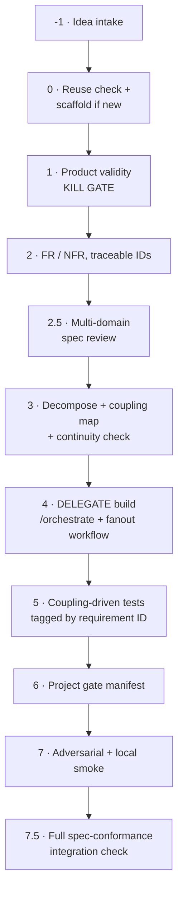
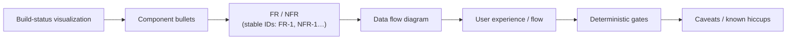
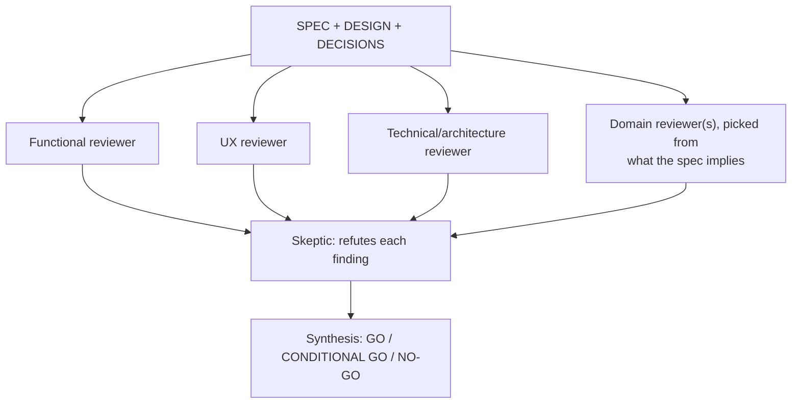

# feature-pipeline

**This skill does not replace `/orchestrate` or `fanout-design-build-audit`. It wraps them.**

Those two already handle *how* to build well: role sequencing, per-component design review,
adversarial audit, convergence. What they assume is that the feature **should exist** and that
you know what "done" means. This skill supplies everything they do not: idea validation,
spec authoring with traceable requirements, a multi-domain review of the *spec itself*, and a
final check that what got built actually satisfies what was asked.

Phases -1, 0–3, and 5–7.5 are this skill. **Phase 4 is a delegation, not a reimplementation.**

---

## -1 · Idea intake

Two entry shapes — handle both:

1. **From the idea bank** (`Life/notion ideas/*.md`, deep dives in `context/top-5/*.md` when they
   exist) — read the deep dive as the seed for phases 1–2. It is context, not a rubber stamp: the
   kill gate in phase 1 still runs for real.
2. **From a raw ask** with no prior idea-bank entry (someone just describes what they want built) —
   write a minimal entry into the idea bank first, following its existing schema
   (`Life/notion ideas/SCHEMA.md`), so everything built stays traceable back to an idea record even
   when it started as a one-off request. Skip this for a feature inside an already-existing,
   already-tracked project — only new, from-zero ideas need a bank entry.

If phase 1 says **BUILD** and this is a new idea (not a feature in an existing repo): scaffold its
home now, per the standing Repository Organization rule — `D:\repo\<Category>\<project>`, never
bare at the root. State the chosen category. `git init`. Create `docs/SPEC.md`, `docs/DESIGN.md`,
`docs/DECISIONS.md`, `docs/STATE.md` from the template in "Phase 0 template" below.

---

## Spec template — the one source-of-truth sheet

Every project's `docs/SPEC.md` (features inside an existing repo may fold this into the Feature
Decision Record instead) **must** carry these sections, in this order. Phase 2.5 below rejects a
spec that is missing one:

- **Build-status visualization** — a Mermaid flowchart/state diagram, ≤5 nodes per row, each
  component tagged `✅ built` / `🚧 in progress` / `⬜ not started`. Lives in `docs/STATE.md`,
  refreshed at the end of every session that touches this project (mirrors Bifrost's `STATE.md`
  pattern — now standard for every Dark Factory project, not just that one).
- **Component bullets** — one line per component, what it does, no implementation detail.
- **FR / NFR with stable IDs** — assigned in phase 2 below, never renumbered; a dropped requirement
  is struck through with a pointer to the `DECISIONS.md` entry that superseded it, not deleted.
- **Data flow** — `sequenceDiagram` or `flowchart`, ≤5 participants.
- **UX** — the user-visible flow, step by step, even for a single-user personal tool.
- **Deterministic gates** — named unit / integration / E2E-happy scenarios; this is what phase 5's
  tests are written against.
- **Caveats** — known risks and deliberately deferred items, same shape as a `DECISIONS.md` row
  (decision · rationale · revisit-when).

---

## 0 · Reuse check — mandatory, and must be stated

Before designing anything, per the global rule:

1. `ls` the directory you would add to, and `grep` for the **role** (not the name you have in mind).
2. **State the result in one line**: *"Searched `<dir>` for `<role>` — found `<X>`; extending `<X>` / none fit because `<reason>`."*
3. Two implementations of the same role already existing is a **defect to consolidate**, not a menu.

Also run the `/orchestrate` pre-flight: real test/build/typecheck commands read from the repo,
real interpreter path, worktree-by-default for parallel writers.

---

## 1 · Product validity — the kill gate

**The gate the other skills do not have.** Answer before any design:

1. **Which persona use case does this resolve?** Quote it from the project's persona doc.
2. **What measured evidence says that use case is real?** Cite a number and where it came from.
3. **What would we observe if this feature worked?** A metric, named now, before building.

**Three failure modes that stop the pipeline here:**

- **No use case maps** → do not build. Say so plainly and stop.
- **The persona is unvalidated** → proceed only as an explicit bet, and label it. A persona
  derived from the team's own usage, or from personally-recruited users, is **not evidence** —
  it describes who was recruited, not who would adopt.
- **The binding constraint is elsewhere.** If the project's actual bottleneck is traffic, trust,
  or distribution, a feature does not move it. **Building product when the problem is
  distribution is the most expensive way to avoid the real question.**

Record the verdict. A "no" here is the highest-value output this skill produces.

---

## 2 · Requirements — functional, non-functional, and extension points

**Check the Spec-Gap Ledger first** (`docs/SPEC-GAP-LEDGER.md` at the session docs root — see
"Spec-Gap Ledger" near the end of this file). It is a running list of categories that past
projects' specs *missed*, discovered only after a post-ship follow-up pointed it out. Walk the
list before calling requirements complete — this is the mechanism that stops the same category of
miss from recurring project after project.

**Every FR and NFR gets a stable ID** (`FR-1`, `FR-2`, …, `NFR-1`, …), assigned here and never
reused or renumbered for the life of the project. These IDs are the traceability spine: phase 3
tags each component with the IDs it satisfies, phase 5 tags each test with the ID it verifies,
and phase 7.5 rebuilds the full requirement → component → test → status table from them. A
requirement with no ID cannot be traced later — assign one even for a one-line NFR.

**Functional (FR)** — each written as a *testable statement*, not a description. If you cannot
imagine the assertion, the requirement is not yet a requirement.

**Non-functional (NFR)** — minimum set, every time:

| NFR | Question it must answer |
|---|---|
| Failure behaviour | What does the user see when each dependency fails? |
| Observability | How would we know this broke **in production, without a user reporting it**? |
| Performance | What is the expected volume, and what breaks at 10×? |
| Security | What is the trust boundary and what crosses it? |
| Data | Retention, migration, and what happens to existing rows? |
| **Extensibility** | **What is the next likely addition, and what does it cost?** |

**Extension points, named explicitly.** For each, state the seam and how a future addition plugs
in without editing existing logic:

- Prefer a **registry/manifest** over a switch statement.
- Prefer a **typed union + exhaustive check** over an if-chain, so the compiler names every site
  a new case must touch.
- Prefer **config-as-data** over config-as-code.
- **Test the seam, not just the instance:** add a test that registers a *fake* second
  implementation and asserts it works. That test is what proves the thing is actually extensible
  rather than merely intended to be.

---

## 2.5 · Multi-domain adversarial review of the spec itself — the lock gate

**This runs on the doc suite (SPEC/DESIGN/DECISIONS), before any component is decomposed or
built.** It is the global CLAUDE.md's "adversarial review of the complete documentation suite"
step, made a mandatory pipeline phase instead of a principle to remember.

- **Functional, UX, and Technical reviewers always run.** Add **Security** if the spec touches
  auth/PII/money, **Data** if it defines a schema or migration, **GTM** if it has users beyond the
  builder. State which dimensions ran and why.
- **A weak review is not a pass.** The skeptic pass must genuinely attempt to refute each finding;
  "found little" only counts as approved if refutation was actually attempted, not skipped. This
  is the step most likely to get rubber-stamped when nothing forces a human to read it — say
  explicitly what the skeptic tried and why it failed to break each surviving finding.
- **Rate every finding R / F / H** (Real-now-fix / Future-deferred / Hardening) — Bifrost's scale.
  Route every **R** finding back to phase 2, not forward.
- **Auto-advance rule — this is what makes unattended operation real, not aspirational:**
  - `deploymentTier: pre-traffic` (read from the project's `CLAUDE.md` / `STATE.md`; default if
    unstated) — a synthesis of **GO**, or **CONDITIONAL GO with zero unresolved R-findings**,
    sets `docs/STATE.md`'s `status: spec-locked` automatically and the pipeline continues into
    phase 3 with no human click.
  - `deploymentTier: live` — the synthesis is recorded, but `status: spec-locked` requires an
    explicit human-set `approvedBy` / `approvedAt` field in `STATE.md`. This is the one place a
    human is structurally required for a `live` project; a `pre-traffic` project never stops here.

---

## 3 · Decomposition + coupling map

Split into components that are **file-disjoint** so agents can run in parallel worktrees.

For each component state: **owned files · public interface (schema first) · dependencies ·
whether it can be built in isolation · which FR/NFR IDs from phase 2 it satisfies.** The last item
is not optional — a component with no requirement ID attached cannot be traced later.

**Continuity check — before phase 4 starts, not after.** For every component's stated `requires`,
confirm some other component's stated `produces` actually covers it. This is a static pass over
the coupling map you are about to write, and it is cheap: Bifrost's own adversarial review found
its single highest-value bug here (a dependency the design *claimed* was threaded through that the
code could not actually see). A component with an unmet `requires` is not buildable yet —
decomposition is not done until every edge resolves.

Then the part most often skipped — **the coupling map**:

> For every point where new code touches existing code, name the file, what assumption the new
> code makes about the old, and how that assumption is verified.

**Coupling points are where regressions live.** New code in new files rarely breaks anything;
new code that *changes an assumption* in old files is what breaks production. This map becomes
the test plan in phase 5.

**Branch strategy:** one branch per component, cut from a clean base, developed in parallel
worktrees, merged one at a time with the suite green between merges. Shared integration files
(the ones every component touches) are reconciled in a **single serial pass**, never in parallel.

---

## 4 · Build — delegate, do not reimplement

- **Multi-component** → `fanout-design-build-audit` workflow. It already does Design → Design
  Review → Build → (Build Review + Adversarial Audit → Fix) per component until converged.
- **Single component** → `/orchestrate` `feature` flow.
- **Author and reviewer are never the same agent.** Never let the agent that wrote code certify it.

Hand each agent: its component spec from phase 3 (including the FR/NFR IDs it must satisfy), an
explicit deliverable, and a **stop condition**.

**RigorPolicy governs the loop's patience, by tier** (ported from Bifrost's `RigorPolicy`,
formalized as a `STATE.md` field instead of left as prose):

| Tier | `rigor` | Repair-loop budget before escalating to a human | Continuity failure |
|---|---|---|---|
| `pre-traffic` | `mvp` | 3 fix iterations | Warn, do not block |
| `live` | `production` | 1 iteration, escalate fast | Blocks phase 4 outright |

**Human-approval is a state, not a reminder — `live` tier only.** When a component's build reaches
a point that would normally need a human look (a `live`-tier project's phase 4 completion, or any
point the project's own gate manifest names), set `STATE.md`'s `status: awaiting-human-approval`
explicitly and stop. Do not rely on remembering to ask — the halted state is what the scheduled
trigger (see below) checks for and refuses to advance past. `pre-traffic` projects never enter
this state; gate-green is the approval.

---

## 5 · Test strategy — derived from the coupling map

| Layer | Derived from | Must include |
|---|---|---|
| **Unit** | Each FR | Happy path · validation rejection · **error path** · boundary values |
| **Integration** | Each **coupling point** from phase 3 | The old code's assumption, asserted |
| **E2E** | Each persona use case from phase 1 | The user-visible flow, end to end |
| **Extensibility** | Each extension point from phase 2 | A fake second implementation registers and works |

**Tag every test with the FR/NFR ID it verifies** (in its name or a one-line docstring/comment —
`test_retry_on_timeout  # verifies NFR-2`). This is what lets phase 7.5 rebuild the traceability
table mechanically instead of re-deriving it by memory.

**Deterministic fixtures, always.** Seed every generator; a fixture that changes between runs
makes failures unreproducible.

**When fixtures must resemble production data, synthesize from aggregate statistics — never
copy and scrub real rows.** Scrubbed records stay re-identifiable through combinations of values
that look innocuous individually. Generating from statistics means there is no underlying record
to re-identify: safe **by construction, not by redaction**. Preserve the properties that matter
(volume, distribution, outliers) rather than the records.

---

## 6 · Audit gates — from the project's gate manifest

**Read `.claude/feature-gates.md` in the project root** and apply every gate. If it does not
exist, apply the universal set below and propose creating one.

**This is the extension seam of this skill itself.** New hard-won lessons become new rows in a
project's manifest — the pipeline does not change.

**Universal gates (apply even with no manifest):**

| Gate | Why |
|---|---|
| **No silent failures** | Every `catch` reports or rethrows. A swallowed error shows the user success and shows you nothing |
| **Guards fail closed, and prove they ran** | A checker that skips what it cannot parse reports green over its own gaps. Assert the *match count*, not just zero findings |
| **Reached, not merely installed** | Verify at the END of the chain: installed → initialised → called → on the routes that matter → data arriving. Each link passing says nothing about the others |
| **Graceful degradation** | Every external dependency failing leaves a usable page |
| **No dead code** | Unreferenced code still carries dependencies, and dependencies carry CVEs |
| **State over events** | If a fact is derivable from stored state, derive it. Reserve events for what leaves no trace |

---

## 7 · Adversarial review, then a real smoke test

1. **Adversarial pass with a fresh context** whose mandate is to *break it*, not confirm it.
   Findings ranked by whether they can happen in production, not by how clever they are.
2. **Run it locally against the real application** — build, start, exercise the actual user flow
   with the phase-5 fixtures. Green tests are not evidence the feature works; they are evidence
   the assertions pass.
3. **Verify the specific claim.** If you say a file changed, assert that file is staged. If you
   say an event fires, query the destination. **An exit code of 0 is not evidence.**

---

## 7.5 · Full spec-conformance integration check

**Re-read the original `docs/SPEC.md` line by line — not the coupling-map smoke test, the whole
document — and check the built system against every requirement it states**, whether or not phase
3 remembered to assign it to a component. This is the step that catches a requirement that
silently fell out of decomposition.

Produce `docs/TRACE.md`, one row per FR/NFR ID:

| ID | Requirement | Owning component | Verifying test | Status |
|---|---|---|---|---|

`Status` is `met` / `partial` / `failed` — never a bare checkmark; `partial` and `failed` both
need one sentence saying what's missing. **This table is what answers "what broke" by pointing at
a node**, the next time something regresses — the fix locates the owning component via `TRACE.md`
first, instead of re-deriving it from scratch. Refresh `TRACE.md` on every future phase-7.5 run
(a re-run after a fix, or a scheduled re-check), not just the first one.

Update `docs/STATE.md`'s build-status visualization to match reality at the same time.

---

## The Feature Decision Record — written at every gate, not at the end

**Every run of this skill produces a persistent document in the repo**, at
`docs/features/<feature>.md` (or the project's equivalent — check before creating a new home).
It is written **incrementally as gates are passed**, not reconstructed afterwards.

**Why it must be attached to the codebase and not left in a chat log or a chronological
decision journal:** the question a future reader asks is *"why is this the way it is?"* or
*"did we consider X?"* — both scoped to a feature, not to a date. A chronological log answers
"what happened in September"; it does not answer "why does the free tier work like this."

**A record is written even when phase 1 says NO.** That is the highest-value case: without it,
a rejected idea returns every few months and is re-argued from zero, because the reasoning
died with the conversation. **Record the rejection and its evidence, so the next person
re-opens it on new evidence rather than on fresh enthusiasm.**

Required sections:

| Section | Written at | Must contain |
|---|---|---|
| **Verdict** | Phase 1 | BUILD / DEFER / NO · the persona use case · the measured evidence · **the metric that will confirm it worked** |
| **Requirements** | Phase 2 | FR as testable statements · NFR table · named extension points |
| **Design** | Phase 3 | Components · schemas · **coupling map** · branch plan |
| **Gates** | Phase 6 | Each gate: passed / failed / deliberately skipped **with the reason** |
| **Traceability** | Phase 7.5 | Link to `docs/TRACE.md` |
| **Outcome** | Post-ship | Did the phase-1 metric move? **Answered honestly, including "no"** |

**Two properties that make it worth keeping:**

- **Reviewable by a non-engineer.** The Verdict and Outcome sections must be readable by
  whoever owns the product decision. If they cannot check your reasoning, the record is an
  engineering artifact pretending to be a decision.
- **Revisit triggers, not open questions.** A deferred item states the condition that re-opens
  it (*"≥25 signups"*), never *"revisit later"*. A trigger without a threshold never fires.

Cross-link it from the chronological decision log rather than duplicating the content there.

---

## Spec-Gap Ledger — the forward-feeding loop

`docs/SPEC-GAP-LEDGER.md` at the session docs root (cross-project, not per-repo). Every time a
**post-ship follow-up** reveals the original spec should have caught something — a correction, a
"why doesn't this handle X", a scope the user had to point out manually that phase 2's FR/NFR pass
missed — add one row:

| Date | Project | What was missed | Category | Now checked in phase 2 as |
|---|---|---|---|---|

This is not optional bookkeeping — it is the literal mechanism for "front-load what was missed
into the next spec": phase 2 of every future run reads this ledger **first**, before calling its
own FR/NFR complete. Append-only; a category is marked resolved-by-convention only after 3+
consecutive specs checked it with no repeat miss, never deleted outright.

---

## The autonomous trigger — running without a human clicking through each gate

Claude Code has no persistent daemon; the real primitive for "runs on its own" is a **scheduled
cloud agent** (`schedule` skill / `CronCreate`) — the same pattern already proven in this
environment by `Stock/Research 2026`'s every-6-hours auto-implementer. A scheduled tick:

1. Scans tracked projects' `docs/STATE.md` `status` fields.
2. `spec-locked` on a `pre-traffic` project → resumes this skill at the next uncompleted phase
   (`STATE.md`'s `lastCompletedPhase` makes this idempotent — a tick mid-pipeline continues, it
   does not restart at phase -1).
3. `awaiting-human-approval` → skipped, left for a human.
4. Nothing ready → no-op tick.
5. The existing Autonomous Execution Contract's three hard-blocker categories (missing creds with
   no agentic path, an irreversible action, genuine hard-to-reverse ambiguity) still apply inside
   a tick — set `status: blocked` with a one-line reason and stop that project's tick, rather than
   looping on it.

**Not wired up by default.** Turning this on for a given project needs two explicit inputs a human
must supply once — which project, and an acceptable tick cadence (a recurring scheduled agent
spends real tokens on every tick, unlike a one-shot run) — see the project's own `DECISIONS.md`
for whether it has opted in.

## Reporting

Close with: the phase-1 verdict and its evidence · what shipped · gates passed/failed · what
was deliberately deferred and why · the metric named in phase 1 that will confirm it worked · the
`docs/TRACE.md` link · any new Spec-Gap Ledger rows added.

**If phase 1 said no, that is a complete and successful run of this skill.**
