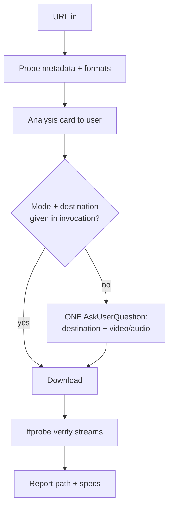

# /grab-media

Pull a clip or audio track off the web into `E:\Content`, with an analysis pass first so
the user sees what they're getting before bytes land on disk.

## When to use

- "Download this short / video / reel and save it as a helper"
- "Grab the audio from this" (sound effect, song bed, meme sting)
- Any time a URL should become a local asset in the content library

## Contract (state these to the user, then act)

1. **Analyze before downloading** — never download blind. The analysis card is the deliverable of step 2.
2. **Never overwrite** — if the target filename exists, stop and propose a suffixed name.
3. **Verify sound** — a video download that lands without an audio stream is a FAILURE, not a warning.

## Flow



## Environment (this machine — do not re-derive)

| Need | Invocation | Note |
|------|-----------|------|
| yt-dlp | `python -m yt_dlp` | NOT on PATH as a binary; it is a Python module |
| ffmpeg | `"$HOME/.spotdl/ffmpeg.exe"` | v4.4, bundled by spotifyDL |
| merge flag | `--ffmpeg-location "$HOME/.spotdl/ffmpeg.exe"` | **Mandatory.** Without it yt-dlp silently falls back to a progressive video-only stream and you ship a silent clip |
| noise | `--no-update` + `grep -viE "^WARNING\|deprecat"` | Suppresses the pip-update and JS-runtime warnings |

The "No supported JavaScript runtime" warning from YouTube is expected and non-fatal —
the avc1 rungs still resolve. Only escalate if `-F` returns no video formats at all.

## Destinations

Default is `E:\Content\helpers` — reusable meme inserts and sound effects, the overwhelmingly
common case. Other pools in `E:\Content`:

| Path | Holds |
|------|-------|
| `helpers/` | **default** — meme inserts, reaction clips, sound effects |
| `Bike/` | motorcycle capture pool (portrait, reframed) |
| `Hikes/` | hiking capture pool |
| `raw 360/` | pre-reframe Insta360 X5 footage |
| `Used clips/` | spent footage |

Ask (single `AskUserQuestion`, two questions, helpers + video pre-selected as Recommended)
**only when** the invocation named neither a destination nor a mode. If either was stated,
honour it and do not ask for the other — infer the sensible default and say which you picked.

## Steps

### 1. Probe

```bash
python -m yt_dlp --no-update --skip-download \
  --print "%(title)s|%(duration)s|%(uploader)s|%(resolution)s|%(ext)s" "<URL>" 2>&1 | tail -3
python -m yt_dlp --no-update --ffmpeg-location "$HOME/.spotdl/ffmpeg.exe" -F "<URL>" 2>&1 | grep -v WARNING | tail -20
```

For a **logged-in-only** source (private/age-gated, most TikTok and Instagram), add
`--cookies-from-browser chrome`. Try without cookies first; only add them if extraction 403s.

### 2. Analysis card

Report, in bullets, before touching the disk:

- **Title / uploader / duration**
- **Aspect** — derive from resolution and label it `portrait` / `square` / `landscape`, and say
  whether a reframe is needed (helpers are overlay inserts, so square and landscape are fine as-is;
  a *capture pool* asset must be portrait)
- **Best rung** — the top `avc1` video and best `m4a` audio, with size
- **Audio present?** — if the source has no audio stream at all, say so now, since audio mode is then impossible
- **Proposed filename** — see naming below

### 3. Naming

Helpers are named for **what the meme is**, lowercase, spaces allowed, no video IDs
(precedent: `gooning koala.mp4`, `mm-sully.gif`, `heh.jpg`). From the title, strip
`#shorts`, `meme`, `funny`, `original sound`, emojis, and channel handles; keep the
distinctive noun phrase. `"cold dog meme"` → `cold dog`. Propose it and let the user override.

Check for a collision before downloading:

```bash
ls "/e/Content/helpers/<name>."* 2>/dev/null
```

### 4. Download

**Video** (H.264 + AAC in MP4 — CapCut and Insta360 Studio ingest avc1 without transcoding;
VP9/AV1 rungs are smaller but stall the editor):

```bash
cd /e/Content/helpers && python -m yt_dlp --no-update \
  --ffmpeg-location "$HOME/.spotdl/ffmpeg.exe" \
  -f "bv*[vcodec^=avc1]+ba[ext=m4a]/b" --merge-output-format mp4 \
  -o "<name>.%(ext)s" "<URL>" 2>&1 | grep -viE "^WARNING|deprecat" | tail -12
```

**Audio** (mp3 — matches the existing sound-effect precedent in helpers):

```bash
cd /e/Content/helpers && python -m yt_dlp --no-update \
  --ffmpeg-location "$HOME/.spotdl/ffmpeg.exe" \
  -x --audio-format mp3 --audio-quality 0 \
  -o "<name>.%(ext)s" "<URL>" 2>&1 | grep -viE "^WARNING|deprecat" | tail -12
```

Add `--download-sections "*MM:SS-MM:SS" --force-keyframes-at-cuts` when the user wants a
sub-clip rather than the whole thing.

### 5. Verify (mandatory)

```bash
"$HOME/.spotdl/ffmpeg.exe" -hide_banner -i "/e/Content/helpers/<name>.mp4" 2>&1 | grep -E "Duration|Stream"
```

- Video mode must show **both** a `Video:` and an `Audio:` stream. Audio missing ⇒ the merge
  failed ⇒ re-run with `--ffmpeg-location` verified, do not hand over the file.
- Audio mode must show one `Audio:` stream and a plausible duration.

## Output

Terse bullets per the Terse-Output Contract:

- Final path, container, resolution, duration, codecs, audio confirmed
- Source URL + uploader (attribution — these are third-party clips)
- Anything the user must decide (reframe needed, collision renamed, cookies were required)

## Failure modes

| Symptom | Cause | Fix |
|---------|-------|-----|
| Silent video file | `--ffmpeg-location` omitted | Re-download with the flag; the merge needs ffmpeg |
| `HTTP 403` / "Sign in to confirm" | age-gate or platform login wall | Add `--cookies-from-browser chrome` |
| Only 360p available | JS runtime missing hid the high rungs | Accept it, or note that installing `deno` unlocks more formats |
| `ffmpeg not found` warning during probe | probe ran without the location flag | Cosmetic on `--skip-download`; the flag matters on the real pull |

## Legal note

These are third-party clips pulled for personal reference and transformative edit use.
Do not use this skill to bulk-rip a channel, and surface the source URL in the output so
attribution is always recoverable.
