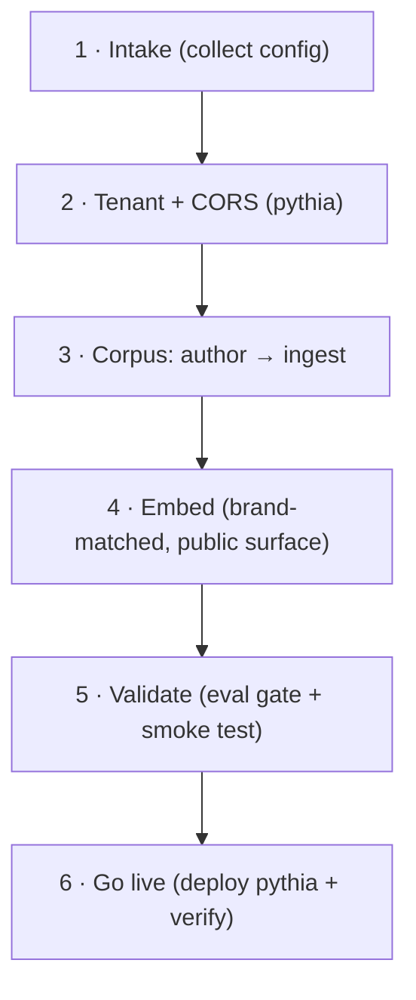

# miko-onboard — put Miko live on a new website

Miko is the guardrailed RAG assistant served by the **pythia** backend (`D:\repo\web\pythia`), embedded via a
`<script>`/`widget.js`. Onboarding a new site = a **tenant** (config + CORS + persona) + a **corpus** (its knowledge)
+ a **brand-matched embed**. Public marketing surface only.



## 1. Intake — collect the tenant config
Gather (ask the owner for anything not derivable from the site):

| Field | What | Example |
|---|---|---|
| `site_key` | stable id (usually the bare domain) | `tarive` |
| `kb` | knowledge-base id (own unless sharing a corpus) | `tarive` |
| brand name / title | widget header + self-name | `Miko` |
| origins | ALL front-end origins for CORS: prod + `www` + **stable preview alias** + `http://localhost:3000` | `https://tarive.vercel.app`, … |
| persona | role + tone; **state it's pre-sales and has NO access to user data** | see pythia `src/sites.ts` |
| CTA | label + url | `Start free` → `/auth/login` |
| brand tokens | the site's accent + surface CSS vars (for the embed) | `--primary`, `--background`, … |
| corpus source | URL(s) to crawl (SSR) or content to curate (SPA) | `/home`, `/pricing`, FAQ |
| coexistence | does the site already have its own bot? if so, Miko goes on the **marketing surface only** | Tarive has an in-app Gemini bot → Miko on `/home` only |

## 2. Tenant + CORS (in pythia `src/sites.ts`)
Add a `SITES` entry (`kb`, `title`, `persona`, `cta`, optional `face`) and a `FOUNDER_ORIGINS` entry (the origins
list). Founder sites resolve from `sites.ts`; self-serve tenants live in `pythia_tenants` (DB) — use the DB path for
customer sites, `sites.ts` for studio-owned ones.
- **CORS is exact-match** — list prod + `www` + the **stable branch preview alias** (`<proj>-git-<branch>-<team>.vercel.app`,
  which is stable per branch) + `localhost`. Ephemeral per-deploy URLs won't match; the branch alias will.
- Persona must forbid inventing facts and clarify Miko is pre-sales (no user data) — the shared GUARDRAILS append
  automatically.

## 3. Corpus — author → ingest
- **Author** `data/<site_key>.json` (schema = `ProfileBundleSchema`; only `documents[]` is indexed). One document per
  topic (about, how-it-works, features, pricing, security, FAQ). Set `access_tags: ["public"]` and `source_url` to the
  page it lives on (becomes a citation backlink). Keep prices/claims accurate — the bot quotes them.
- **Ingest**: `pnpm cli ingest-bundle data/<site_key>.json` (add `--replace` only when re-ingesting to reconcile edits
  — it purges the site's chunks first, since the content-hash upsert is insert-only). This is a **prod KB write**
  (outward) — additive for a brand-new `site_key`.
- Content-hash upsert makes re-runs idempotent (dedupe/normalize is built in). SPA sites return empty on crawl → curate
  docs by hand.

## 4. Embed — brand-matched, public surface only
Add the widget to the host site's **marketing** pages (never inside an authenticated app that has its own assistant —
one assistant per surface × per job). `widget.js` reads `--color-*` custom properties with a Plum fallback, so
**brand-match by aliasing the host's design tokens** onto `.pythia`:
```css
.pythia {
  --color-accent: hsl(var(--primary));
  --color-bg: hsl(var(--background));
  --color-surface: hsl(var(--card));
  --color-text-1: hsl(var(--foreground));
  --color-text-2: hsl(var(--muted-foreground));
  --color-border: hsl(var(--border));
}
```
(Map to whatever token system the host uses — shadcn HSL here; plain hex elsewhere. Or pass `data-pythia-accent`.)
This makes Miko adopt the site's accent/hero colors and follow its light/dark automatically. **Do this every time —
an off-brand Plum bubble on a blue site reads as third-party/untrusted.**
**Put the `.pythia` mapping in the host's GLOBAL stylesheet, NOT in the widget component/embed.** `widget.js`
attaches its bubble to `document.body`, which persists across client-side (SPA) navigation — so a component-scoped
`<style>` unmounts when you leave the page that renders it and the bubble reverts to the default color on other
routes. Global CSS always applies.
- **CSP**: if the host has a Content-Security-Policy (check `middleware.ts`/headers), add `https://pythia-iota.vercel.app`
  to **`script-src`** (load) and **`connect-src`** (ask API) — else the bubble is silently blocked and never renders.
- Set `data-pythia-site`, `data-pythia-api`, `data-pythia-title`, `data-pythia-contact`, `data-pythia-faq`.

## 5. Validate
- Run the **eval gate** (`pnpm test` / the golden set + leak gate) — deploys must not leak or drift.
- Smoke-test the live widget: ask 3–5 persona questions → answers are grounded in the corpus, quote correct
  prices/facts, and it **abstains** (no hallucination) on out-of-scope questions.

## 6. Go live (outward — confirm first)
Deploy pythia (push `main` — its deploy model) so the tenant resolves in prod, and confirm the corpus is ingested.
Then load the host site (prod domain, in the CORS list) and verify Miko answers. Deploying the shared API + writing the
prod KB are outward-facing — confirm before firing.

## Gotchas
- [ ] CORS is exact-match — include the stable branch preview alias, not just prod.
- [ ] CSP `script-src` + `connect-src` must allow the pythia origin (or the bubble won't render).
- [ ] Brand-match in the host's GLOBAL CSS (a component `<style>` unmounts on SPA nav → off-brand bubble on other routes).
- [ ] Marketing surface only if the site has its own in-app bot (coexistence).
- [ ] Corpus prices/claims must be accurate — the bot repeats them verbatim.
- [ ] `--replace` on re-ingest (edits) to avoid orphan chunks; omit for a fresh site.
- [ ] Prod ingest + pythia deploy are outward — confirm.
