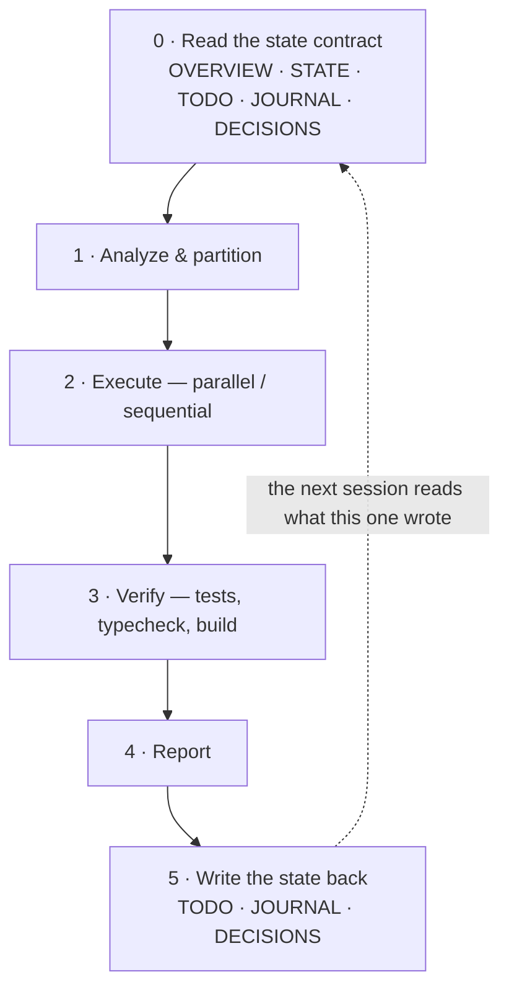

# orchestrate

Use this skill when the user wants autonomous background execution with parallelization, verification, and testing.

## The loop, and its bookends



**Steps 0 and 5 are the orchestration, not paperwork around it.** Skip 0 and the agent re-derives
context that was already written down; skip 5 and the next session re-derives it again. The dotted
edge is the only thing that makes a multi-session task cheaper than a single-session one.

Step 0 is automated: the `SessionStart` hook (`scripts/workspace-state.py`) finds the five files and
injects `TODO.md` `## Now` + `## Next`, the newest `JOURNAL.md` entry, and the last commits.
**Step 5 has no hook and never will** — deciding what counts as a change of direction is a
judgement, so it stays with you.

## When to Use

- User requests automatic parallel task execution
- Background subagent launch with verification
- Multi-step implementation with automatic validation
- Code changes that need automated testing/linting

## Workflow

### 0. Read the state contract

Never skip, never re-derive. Five files in `docs/`, in this order: `OVERVIEW.md` (what it is, and
the baseline it must beat) → `STATE.md` (where it is) → `TODO.md` (Now / Next / Backlog) →
`JOURNAL.md` (why the direction changed) → `DECISIONS.md` (decisions and assumptions).

Spot-check against `git log` and file existence before trusting any of it — the hook injects what
the files *say*, not what is *true*. A repo with none of these files is itself a finding: surface it.

### 1. Analyze & Partition

Identify which steps are:

- **Independent**: Can run in parallel (no shared dependencies)
- **Sequential**: Must run in order (output of N → input of N+1)
- **Shared resource**: Multiple steps write to same file(s)

### 2. Execute

For independent tasks:

```
Launch with the `Agent` tool, subagent_type="general-purpose", run_in_background=true
```

Prefer a specific agent type over `general-purpose` — see Skill-First Dispatch in `CLAUDE.md`.
Any agent that writes files gets `isolation: "worktree"`.

For sequential tasks:

```
Run sequentially, passing output as input to next step
```

### 3. Verify

After execution completes:

- Run tests: `pnpm test`
- Run typecheck: `pnpm type-check`
- Run build: `pnpm build`
- Verify actual output matches expected output

### 4. Report

Return structured summary:

- What was done
- What passed/failed
- Next steps needed

### 5. Write the state back

**Closing the session is part of the work.** Before the run ends, in the repo you worked in:

| File | Write when | What goes in |
|---|---|---|
| `TODO.md` | always | Move finished items out of `## Now`; promote from `## Next`; put anything deferred in `## Backlog` **with the reason** |
| `JOURNAL.md` | direction changed | A dated entry: what changed, why, what it superseded. Mark undocumented org context `TRIBAL` |
| `DECISIONS.md` | a choice or assumption was made | One row: decision, `assumed`/`confirmed`, rationale, **revisit-when** |

An assumption made to unblock belongs in `DECISIONS.md` with a revisit trigger, not in the run
summary only — the summary is scrollback, and scrollback does not survive the session.

`## Now` is the hot path: the hook injects it verbatim, so **a stale `Now` is worse than an empty
one**, because it is trusted.

## Example Invocation

```
/orchestrate implement feature: user authentication with OAuth
```

This would:

1. Analyze the codebase for OAuth patterns
2. Find existing auth hooks (if any)
3. Implement the feature in background
4. Run tests automatically
5. Report results

## Configuration

Set these in your AGENTS.md or prompt:

| Config          | Description                  | Default |
| --------------- | ---------------------------- | ------- |
| maxAgents       | Max parallel subagents       | 3-5     |
| verifyTests     | Auto-run tests after changes | true    |
| verifyTypecheck | Auto-run type-check          | true    |
| failFast        | Stop on first failure        | false   |

## Best Practices

1. **Partition first** — Don't just run tasks; identify dependencies
2. **Verify always** — Tests should pass before reporting success
3. **Report failures clearly** — Include error output, not just "failed"
4. **No worktree isolation** in this repo — All agents write to live working dir
