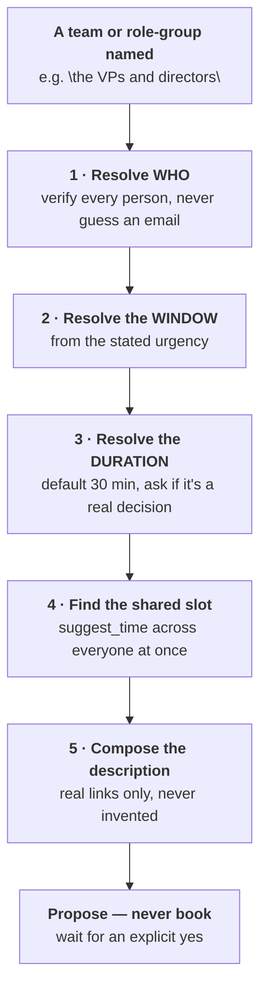

# Convening a team is three resolutions, not one lookup

**`blocker-meeting` answers "who is the one person I'm stuck on."** This skill answers a different
question: **"who is this whole team, when are they all actually free, and what does the invite say"**
— three separate things that get rushed into one guess if you're not careful. Never send anything
without an explicit yes; this skill's whole job ends at *finding and proposing* a slot.

## 1 · Resolve who the team actually is — verify every single person

**The failure this step exists to prevent: guessing an email from a name pattern.** The
organizer's own address (`jsmith@example.com`) tells you a *plausible* format, not another
person's real address — guessing wrong either silently fails (the tool reports no conflicts for an address nobody owns, which
reads as "they're free" when really nobody was checked) or, worse, resolves to a different real person
in a shared directory.

| Step | How |
|---|---|
| **Check local knowledge first** | A prior stakeholder table, org chart, or attendee list already in the project's own docs may name the group — but treat it as a lead, not a source, if it predates today |
| **Resolve every name/role through the real directory** | `slack_search_users` (or the workspace's equivalent) — by name if named, by role/department keywords if described as a group ("VPs", "engineering leadership"). One call per person, or a role query if the group is described by function |
| **A role query returns a LIST, not a person — confirm the resolved set with the reader before checking calendars** | "The VPs and directors" could resolve to 4, 6, or 12 people depending on the directory's own tagging. Show who it resolved to and let the reader catch a wrong inclusion before a meeting gets proposed around it |
| **No title matches what was asked?** | Say so plainly ("no 'President' title exists here") rather than quietly substituting the nearest-sounding role |

**Every resolved person needs their real, directory-confirmed email before step 4.** A name with no
confirmed email is a gap to report, not a slot to fill with a guess.

## 2 · Resolve the window from the stated urgency

| The reader said | The window |
|---|---|
| "As soon as possible" / "urgent" | Today through the next 1–2 business days |
| "Next two or three days" | Exactly that — don't quietly widen or narrow it |
| "This week" / "before [date]" | Now through that date, business days only unless told otherwise |
| Nothing stated | Ask, or default to the next 3 business days and say that's the default being used |

**Business hours and weekends are defaults, not universal facts.** State the hours assumed
(`09:00–17:00` is this skill's default) so a reader who works different hours can correct it, and
exclude weekends unless the ask implies otherwise.

## 3 · Resolve the duration

**Default: 30 minutes**, matching the shortest slot `suggest_time` will size for. Adjust up when the
ask names a real decision, a demo, or a working session — the same "does the length fit the
questions" test `blocker-meeting` §3 applies here too: don't propose 30 minutes for something that
needs a real working session, and say so if the ask's own framing implies more time is needed.

## 4 · Find the shared slot — check everyone at once, not one at a time

Use a multi-attendee free/busy tool (e.g. `suggest_time`) with **every resolved email**, the
window from step 2, and the duration from step 3. Report the result precisely:

| Result | Report it as |
|---|---|
| **One or more slots found** | The exact date/time, in the reader's time zone, and how many alternatives exist |
| **Zero slots in the window** | Say so, and say the window was too narrow before proposing a wider one — don't silently widen it yourself and report only the wider result, which hides how tight the real constraint is |
| **A slot exists but is tight** (e.g. only one option, or early/late in the day) | Flag that explicitly — a single 8am slot buried in an otherwise-clear week is worth naming as tight, not just reporting as "found" |

## 5 · Compose the description — real references only

If the invite needs a description (agenda, links, background): include only references that
actually exist — a published artifact URL from this session, a real doc path, a real prior
decision. **Never invent or guess a link to make the description look more complete.** If no real
reference exists yet for a point the description wants to make, say the reference is missing rather
than filling the gap with a plausible-sounding one.

## The hard rule, shared with `blocker-meeting`

- **Propose, then wait for an explicit yes.** This skill's output is a found slot and a drafted
  description — never a sent invite or a created event, however clearly the ask calls for one.
  Permission is per-meeting, not standing.
- **Never add a resolved-but-unconfirmed person to the invite list.** If step 1 turned up a role
  match the reader hasn't confirmed, list it as a question, not as a silent inclusion.

## What this skill will not do

- **Guess an email address from a naming pattern.** Every attendee is directory-confirmed or the
  gap is reported.
- **Book, send, or create anything** without an explicit yes on that specific meeting.
- **Silently widen a search window** after finding zero slots — report the empty result first.
