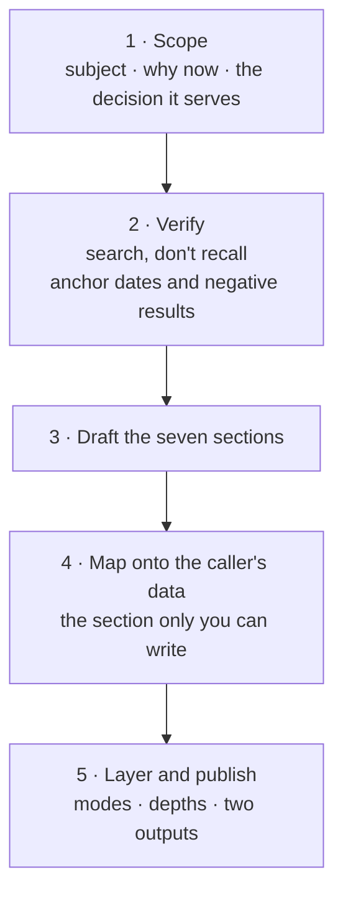

# /tech-dossier

Produce a **capability-envelope brief** for a technology: where it came from, what problem it was
actually invented to solve, what stuck, what died, and — the part that earns the effort — **what it
is structurally bad at and why no amount of tuning fixes that.**

## Why this exists

The recurring need is not a feature list. It is the ability to say *"this technology cannot do that,
and here is the structural reason"* before committing a design to it. A feature list tells you what
a technology claims; a lineage tells you which of those claims were contested, which alternatives
were tried and abandoned, and which failure modes are inherent rather than incidental.

**The load-bearing output is the capability envelope (spine section 5).** Everything before it exists to
make that section trustworthy.

## When this is the right shape

Use it when:

- A design decision depends on whether a technology fits a **data shape** or **problem class**.
- Someone needs working fluency, not a tutorial — enough to argue with a vendor or a colleague.
- The same "what about X?" question has come up more than once.
- A technology is being adopted by default and nobody has stated its failure region.

**Don't** use it for: how-to instructions (that is documentation), API reference, or a build-vs-buy
comparison of named products at the same layer (that is a vendor evaluation — a different shape).

Assets in this skill directory:

| File | What it is |
|---|---|
| `references/layered-disclosure.md` | The information architecture for a dossier that outgrew one linear read — two reading modes, three disclosure depths, decision provenance, and the reference-list contract. Read it before designing the page. |

## The workflow

### 1 · Scope

Pin three things before researching:

| | |
|---|---|
| **Subject** | One technology, technique, or field. Not a product |
| **Why now** | The decision this serves. A dossier with no decision behind it becomes a Wikipedia summary |
| **Local context** | What data, system, or constraint the conclusion has to land against |

**Check local sources first** — the project's knowledge base may already carry half of it, and the
local-first rule applies.

### 2 · Verify, don't recall

**Always search, even when confident.** Timelines are exactly where model knowledge is most
plausibly wrong: dates drift, attribution gets muddled, and anything past the knowledge cutoff is
invisible. Three to five searches is usually enough:

1. Origin and timeline — the founding papers and their years.
2. **Current state** — deliberately scoped to the present year, to catch what changed recently.
3. **Limitations and failure modes** — search for these *explicitly*. They are underrepresented in
   promotional material and are the highest-value part of the dossier.
4. Best-practice consensus — what practitioners actually kept.
5. The specific data shape the caller cares about, if it is unusual.

**Search for the negative results by name.** Fields are defined by their disconfirmations — the
benchmark that showed the new approach generalises worse, the ablation that removed a component
without hurting anything. Those papers are the ones that shaped practice, and they rarely appear in
overviews.

### 3 · The seven sections

Every dossier has the same spine. Skip a section only if the subject genuinely has nothing there,
and say so rather than padding it.

| # | Section | What it must contain |
|---|---|---|
| **1** | **Motivation** | The problem it was invented to solve — **which is usually not the problem it is used for now.** Name the gap between the two; it is where most misuse comes from |
| **2** | **Timeline** | Eras, not a flat list. Each entry says what it *contributed*, not just what it was. Mark the inflection point where the field changed character |
| **3** | **What survived** | The practices still standing, each with *why it held* — and a matching list of **what did not survive**, which is more informative |
| **4** | **Alternatives** | What else was tried, and the outcome of each. Note where the winner won on modularity or cost rather than on merit; that pattern predicts future contests |
| **5** | **Capability envelope** | **The point of the document.** For each strength: *what makes it strong*, and what supplementary technology strengthens it further. For each weakness: the *mechanism*, plus **how to supplement or replace it** — naming the specific technique and who built it. Plus a suitability table by data or problem type |
| **6** | **What it means here** | The caller's actual data and decision, mapped against section 5. **Where the caller has a system, add a column naming the module, table or component each row lands on** — that is what turns an assessment into a work item. End in conclusions that change the plan |
| **7** | **Improvements worth making** | Two to four concrete moves, each with an explicit **value statement**: why it is underpriced, what it unblocks, what failure it removes. This is the difference between a survey and advice |

**Section 5's asymmetry is deliberate.** A strength with no explanation is a claim; a weakness with
no supplement is a dead end presented as a verdict. **Structural does not mean unaddressable** —
almost every structural weakness in a mature field has someone's paper attached to working around
it, and finding that paper is the job.

### 4 · Distinguish structural from incidental

The discipline that makes a dossier useful rather than decorative:

- **Structural weakness** — follows from the mechanism. No tuning, no bigger model, no better
  library removes it. *State the mechanism.*
- **Incidental weakness** — current tooling, cost, or maturity. Will plausibly change.

Conflating them produces either false pessimism (dismissing something for a fixable problem) or
false optimism (planning around a limit that is permanent). **When you name a weakness, say which
kind it is.**

### 5 · Layer the output, don't flatten it

Once a dossier's content outgrows a single linear read — roughly past 1,500 words — it needs an
information architecture, not just good prose. **Read
[`references/layered-disclosure.md`](references/layered-disclosure.md) before designing the page.**

The short version, because it changes how you write every section:

| Axis | Values | Why it is separate |
|---|---|---|
| **Mode** | **Decide** (claims, verdicts, recommendations, provenance) · **Learn** (a prerequisite-ordered lesson path) | Different readers, same facts, different order |
| **Depth** | **L1** the claim · **L2** the mechanism · **L3** the evidence and counter-argument | Independent of mode — someone can want decide-at-L3 or learn-at-L1 |

**The defect this fixes: most technical writing fuses L1 and L3** — a claim wrapped in its own
justification — which is exactly why it reads as dense. The claim and the defence of the claim are
different documents. If your three layers read as one idea getting longer, the split is cosmetic.

Two artifacts the decide mode owes the reader, both specified in the reference:

- **A decision-provenance table** — per recommendation: the evidence, its *kind* (`measured` /
  `published` / `stated` / `inference`), the confidence and *why it is not higher*, and the concrete
  falsifier. **A recommendation with no falsifier is an opinion.**
- **A reference list** built from one data source and rendered twice — inline markers with
  hover-and-focus tooltips, and an expandable section. Each entry says what it does, why it is
  useful, **how it bears on this subject specifically**, and where to read more. Write that third
  field for every term or drop the term; a definition anyone could copy from Wikipedia adds length
  without adding orientation.

### 6 · Two outputs, deliberately different

| Output | Where | Contains |
|---|---|---|
| **Detailed document** | The project's knowledge base or research repo | All six sections, front matter, sourced claims, the full tables |
| **At-a-glance artifact** | A published Artifact | **Only the decision-changing content**, led by the lineage graph |

**These are not long and short versions of each other.** The document is a reference to return to.
The artifact answers *"what do I need to know to make the call?"* — the lineage graph, the
strong/weak split, the suitability table, and the local mapping. Everything else stays in the
document.

Load `artifact-design` before writing the artifact; if it carries diagrams beyond the graph, load
`artifact-diagramming` too. **Register the artifact in the project's artifact index in the same
turn** — an unregistered URL is lost.

### The lineage graph is required, not optional

**A timeline table is not a lineage.** A dossier's central visual is a **graph** — because the thing
being explained is descent and divergence, and a list flattens exactly the information that matters:
which idea came out of which, what branched off and lost, and what quietly influenced something in a
different family years later.

Minimum specification:

| Element | Requirement |
|---|---|
| **Horizontal time axis** | Time runs **left to right**, families stack as horizontal lanes. A vertical timeline forces the reader to scroll past a branch to see what it became; horizontal keeps a lineage readable along its own row |
| **Wheel scrolls the graph** | With the pointer over the graph, the mouse wheel must pan it **horizontally** — hand scrolling back to the page at either end so the reader is never trapped. Add drag-to-pan too |
| **Branch families** | Parallel lanes by lineage — **colour encodes family**, so a branch is trackable without reading labels. Make lanes individually toggleable; a dense graph is unreadable without a way to subset it |
| **Two edge kinds** | **Descent** (solid) and **cross-influence** (dashed). Influence edges are where the real intellectual history lives and are what a timeline loses — the refutation pointing back at what it refuted, the idea reaching forward five years into another family |
| **Survival status per node** | Encoded in the node's own form — dashed outline for what did not survive. **Show the dead ends; they are half the lesson.** Offer a toggle to hide them, defaulting to shown |
| **Expandable detail** | Selecting a node reveals its contribution, **pros and cons**, status, and lineage position (descends from / led to / influenced by / influenced) |
| **A source backlink per node** | To the primary paper or announcement. **Link a canonical URL you have verified** — a guessed identifier landing on the wrong paper is worse than no link |
| **Comprehensiveness** | Include the **niche and largely-abandoned** options, not just the canon. A dossier that lists only the winners cannot tell you what was already tried and failed — which is most of its value. Expect a real lineage to run to **100+ nodes**; that is what a fan-out is for |

**Accessibility is not optional here:** nodes are focusable and operable by keyboard, the graph
carries a text alternative, and colour is never the *only* carrier of a distinction — pair it with
outline style and state the status in words in the detail panel.

**Verify every source link before shipping.** One search covering several identifiers at once is
usually enough. Where you cannot verify, link a title search rather than a guessed identifier.

## Quality bar

A dossier is finished when it can answer these without hedging:

- What was this invented for, and is that what we are using it for?
- Which of its limitations are permanent?
- What would we use instead for the parts it cannot do?
- Which of our data shapes suit it, and which do not?
- What did the field try that failed, so we do not retry it?

**And one test that catches a shallow dossier:** if section 5 contains no weakness the caller did
not already suspect, the research was too shallow — go back to step 2 and search the failure modes
harder.

## Anti-patterns

| Don't | Do |
|---|---|
| Write the timeline from memory | Search; verify dates; note the cutoff gap explicitly |
| Ship a timeline table as the visual | Ship a **branching graph** with descent and influence edges |
| Guess a paper identifier for a backlink | Verify it, or link a title search that cannot misdirect |
| Hide the dead ends | Encode survival status per node — the failures are half the lesson |
| List features | Name failure modes and their mechanisms |
| Present the current consensus as inevitable | Show which alternatives lost, and on what grounds |
| Treat all weaknesses as tuning problems | Separate structural from incidental |
| Duplicate the document in the artifact | Artifact = decision-changing only |
| Stop at the general case | Section 6 — the local mapping — is the deliverable |
| Classify a data modality by its module or table | Read it at the **column** — a "tabular" module can hold a prose corpus |

## Worked example

A completed dossier on **retrieval-augmented generation** is the reference for this shape. Machine-
and client-specific paths live in `~/.claude/CLAUDE.local.md` under reference implementations, per
the usual split.

Two things in it are worth copying:

- **Section 5 separates structural from incidental weaknesses**, with the mechanism stated for each
  — "a sampled aggregate is not an aggregate", "you cannot retrieve a fragment that does not exist."
- **Section 6 concluded that one of the two target use cases was mostly not a retrieval problem at
  all**, because it decomposed into four of the technology's five structural failures. That finding
  reordered the project plan, and **a feature-list comparison would never have surfaced it.** That
  is the return this skill exists to produce.
