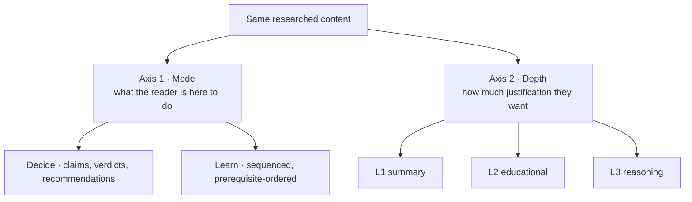

# Layered disclosure — the information architecture for a dossier

A dossier fails in one of two ways. It is too shallow to act on, or too dense to read. Both are the
same defect: **one document trying to serve a reader deciding and a reader learning.** Those are
different readers, sometimes the same person on different days, and they want the same facts in a
different order at a different depth.

This reference is the architecture that separates them. Load it when a dossier's content grows past
what a single linear read can carry.

## Two axes, not one

Mode and depth are **independent**. A reader can want the decide view at full reasoning depth (they
are about to defend the recommendation) or the learn view at summary depth (they are orienting).
Collapsing the two axes into one "beginner/advanced" toggle loses that.

## Axis 1 — mode

| Mode | The reader's question | Ordering principle | What leads |
|---|---|---|---|
| **Decide** | "What should we do, and how confident are we?" | By consequence — biggest decision first | Conclusions, the capability envelope, recommendations, **decision provenance** |
| **Learn** | "How do I understand this well enough to argue about it?" | By prerequisite — nothing referenced before it is introduced | A lesson path, each step one claim deep |

**Both modes share the graph, the reference list, and the underlying facts.** Only sequence and
emphasis change. Do not write two sets of content — that guarantees drift.

## Axis 2 — depth, and the test for each layer

| Layer | Question | Content | Test for belonging |
|---|---|---|---|
| **L1 · Summary** | *What should I do or know?* | The claim, the verdict, and **only** numbers that change a decision | Would a reader who read only this make the same call? |
| **L2 · Educational** | *What must I understand to trust that?* | Mechanism in plain terms, the vocabulary, what class of thing this is | Does this let them argue the point with a vendor? |
| **L3 · Reasoning** | *Why is it true, and how do we know?* | Evidence with its source, the counter-argument, what would falsify it | Is this what I'd need if someone pushed back? |

**The defect this fixes:** most technical writing fuses L1 and L3 — a claim wrapped in its own
justification — which is exactly why it reads as dense. **The claim and the defence of the claim are
different documents.** Splitting them costs nothing and makes both readable.

### Worked example

The same finding at three depths:

- **L1** — "Retrieval cannot aggregate. Use SQL `GROUP BY`."
- **L2** — "Retrieval returns the top-k passages by similarity. An aggregate needs every row, not the
  k most similar ones, so the result is computed over a sample."
- **L3** — "Formalised as a corpus-level benchmark in 2025; no approach scores well, which is the
  signature of a mechanism problem rather than a tuning target. TAG measured standard methods
  answering under 20% of the class. Counter-argument: agentic retrieval can iterate toward
  completeness, but has no termination guarantee, so it trades a wrong answer for an unbounded one."

Three genuinely different kinds of content. If your three layers read as one idea getting longer,
the split is cosmetic — redo it.

## Decision provenance — the decide mode's payload

A recommendation is worth what its evidence is worth. Give the decide mode a table that makes the
basis of each recommendation explicit, using a fixed vocabulary:

| Column | Content |
|---|---|
| **Recommendation** | The claim, verbatim as stated elsewhere |
| **Evidence** | What specifically supports it |
| **Kind** | `measured` (our data) · `published` (someone else's study) · `stated` (a named person, dated) · `inference` (derived or projected) |
| **Confidence** | And *why* it is not higher |
| **What would overturn it** | The concrete falsifier. **A recommendation with no falsifier is an opinion** |

Two patterns this surfaces reliably, and both are worth calling out in the table's own commentary:

- **Inference stacked on an average** that is nonetheless load-bearing for sizing. Name it rather
  than letting it read as measurement.
- **Single-source `stated` rows.** Not a criticism of the source — a note that a design resting on
  one sentence from one conversation should have that sentence re-confirmed before it becomes
  structural.

## The reference list — one definition, two surfaces

Mark domain terms inline, and render the **same data** as an expandable reference section. One
source object, two presentations; never two hand-maintained lists.

Each entry carries four fields, and the third is the one that makes it a dossier rather than a
dictionary:

| Field | Content |
|---|---|
| **What it does** | The mechanism, plainly |
| **Why it is useful** | What problem it solves, and what it costs |
| **Bearing here** | **How it relates to *this* subject** — the local consequence, the specific number, the trap |
| **Go deeper** | One to three verified backlinks |

Behaviour: bold with a dotted underline · tooltip on hover **and keyboard focus** · click opens and
scrolls to the full entry · the list is filterable, with expand-all and collapse-all.

**Write "bearing here" for every term or drop the term.** A definition anyone could copy from
Wikipedia adds length without adding orientation.

## Implementation notes

- **Use `
`/`
`** for disclosure. Native, keyboard-accessible, no state to manage —
  a platform feature beats a JS accordion.
- **A depth dial** opens and closes all blocks of a level at once, so the reader sets depth globally
  rather than clicking through a page.
- **Mode is a body attribute** plus `data-only` on sections. Both modes stay in the DOM so nothing
  drifts and in-page links keep working.
- **Frozen lane headers.** In a horizontally-scrolling graph, put lane labels in a **separate
  non-scrolling gutter** beside the scroll container, rendered from the same lane geometry. Do not
  reposition labels on scroll — it jitters, and it fails when the scroll is momentum-based.
- **Default to L1 in decide mode.** The page should be short on arrival and deep on request; the
  reverse trains readers to skim past the parts that matter.

## When to skip this

A dossier under roughly 1,500 words does not need modes — it needs to be a good linear document.
Reach for this architecture when the content has genuinely outgrown one read, not to signal rigour.
