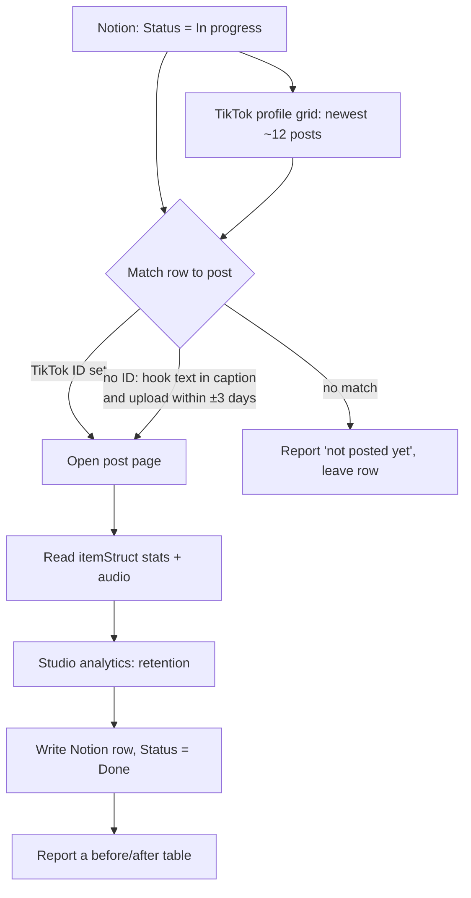

# tiktok-sync

Procedure source of truth: `D:/repo/AI/nuwa/docs/work/own-style-analysis/STATS-PLAYBOOK.md` (how to read TikTok without the API). This skill is the in-progress → Done slice of it.

## Store
- Notion data source `collection://20a5eed4-845d-80c8-8551-000b195bd10b` (Motorcycle Content Bank).
- Account `@chase.ride`. Times are America/Vancouver. Notion stores datetimes in UTC.

## Steps
1. **Rows.** SQL query: `Status = 'In progress'`. Take Name, TikTok ID, TikTok URL, Upload Time, and current metrics (to show the before values).
2. **Posts.** Use Claude in Chrome (the user's logged-in browser) in a new tab:
   - Open `https://www.tiktok.com/@chase.ride`. If it shows "Something went wrong", click Refresh once.
   - Read the newest posts from the page's embedded data, or from the grid links. You need each video's id, caption (`desc`) and `createTime`.
3. **Match.** A row matches a post when either:
   - the row's TikTok ID equals the post id, or
   - with no ID set, the hook line (Name, lowercased, punctuation stripped) is contained in the caption, or shares most of its words with it, **and** the post's createTime is within ±3 days of the row's planned Upload Time (or there is no planned time).
   If the match is ambiguous, ask instead of guessing.
4. **Read stats.** Open `https://www.tiktok.com/@chase.ride/video/<id>` and use `javascript_tool` on `__UNIVERSAL_DATA_FOR_REHYDRATION__` → `__DEFAULT_SCOPE__["webapp.video-detail"].itemInfo.itemStruct`. Take:
   - `stats.playCount`, `diggCount`, `commentCount`, `collectCount`, `shareCount`
   - `video.duration`, `createTime`, `desc`
   - `music.title`, `music.authorName`, `music.original`
   Pause about 2.5 s between pages. Never replay TikTok's signed API calls.
5. **Retention.** Open `https://www.tiktok.com/tiktokstudio/analytics/<id>` and wait about 4.5 s. From the page text, read "Average watch time", "Watched full video" and "New followers". Posts under 24 h old may not have these yet; leave them blank.
6. **Write** (an explicit `/tiktok-sync` request authorizes these writes on matched rows only). Use `update_properties`:
   - `Status` = Done; `TikTok ID`; `TikTok URL`
   - `date:Upload Time:start` = createTime in UTC ISO, with `is_datetime` = 1
   - `Caption` = desc
   - `Max View Count`, `Likes`, `Comments`, `Saves`, `Shares`, `Duration (s)`
   - `Audio` = "title / author"
   - `Audio type`: `own original` if music.original is true and the author is chase.ride; `music track` if it's a commercial song; otherwise `borrowed sound`
   - `Avg watch time (s)`, `Watched full (%)`, `New followers`
   - `date:Stats updated:start` = now (UTC), with `is_datetime` = 1; `Stats check` = updated
   Leave everything else alone (Format, Mechanic, Subtext, Tags, body).
   - Gotcha: write `TikTok URL` as-is. The `userDefined:` prefix applies only to properties named exactly "id" or "url"; using it here fails validation.
   - The Notion `Name` is the on-screen hook and often differs from the caption. Don't overwrite it.
7. **Report.** One row per in-progress item showing matched or not, the metrics before → after, and the status change. Rows that aren't posted yet stay "In progress"; if their planned upload time has already passed, flag them as overdue.

## Rules
- Read-only on TikTok, and act like a normal user: one tab, with pauses.
- Never mark a row Done without a matched post id.
- Close the tab when finished.
