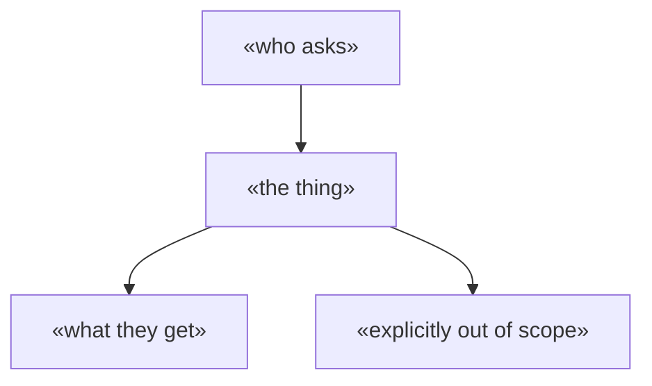

# Template — `docs/SPEC.md`

Copy this to `docs/SPEC.md` and fill it in **before writing implementation code**. It is node 2 of
the graph in [`docs/SPEC-DRIVEN.md`](../docs/SPEC-DRIVEN.md), and `scripts/state-health.py --spec`
fails a repo declaring `deploymentTier: live` without it.

**Four questions this file must answer.** A section that cannot be filled says why — an admitted
gap is information, an omitted one is a trap.

| # | Question | Section |
|---|---|---|
| 1 | What is it for, and what is it deliberately not? | §1 |
| 2 | What are the exact shapes crossing every boundary? | §2 |
| 3 | How will we know it is right? | §3 acceptance criteria |
| 4 | What machine-checkable thing blocks the deploy? | §4 gate rows |

**Delete this header block once filled in.** Placeholders are in `«guillemets»`. Keep §3 and §4 in
lockstep: **every acceptance criterion compiles to at least one gate row**, or it is an aspiration.

---
purpose: The contract «project» is built against — scope, data shapes, acceptance criteria and the gate they compile to
update-trigger: A criterion is added, met or refuted; a boundary shape changes; the gate gains a row
last-verified: «YYYY-MM-DD»
status: draft
---

# «Project» — specification

> **Written before the code, and treated as law during implementation.** A change here is a
> decision, and gets a row in [`DECISIONS.md`](DECISIONS.md).

## 1 · Scope

**Tier**: `«pre-traffic | live»` — «one line on the blast radius: who is on it, whose data, whose money».



| | |
|---|---|
| **It exists to** | «the one outcome, in the user's words» |
| **Non-goals** | «what it will not do — the list that stops scope creep at review time» |
| **Baseline it must beat** | «the status quo done by hand · the ungrounded model given the same input · the trivial version» |
| **Metric that decides** | «the number, and the threshold» |

## 2 · Contracts — the shapes that cross a boundary

**Define the runtime-validated type before the implementation, derive the static type from it.**
Validate at every boundary: input in, response out, external API back.

```«ts|py»
«the zod schema / TypedDict / JSON schema — the single source the types derive from»
```

| Boundary | Shape | Validated where |
|---|---|---|
| «API route in» | «Schema» | «file:line» |
| «external response» | «Schema» | «file:line» |

## 3 · Acceptance criteria

**Checkable statements, not intentions.** `/qa` returns MET / PARTIAL / FAILED against this table.

| id | Criterion — a statement that is true or false | Gate row (§4) |
|---|---|---|
| `AC-1` | «when «input», the system «observable outcome»» | `G-1` |
| `AC-2` | | |

## 4 · Deterministic gate — designed now, not after

**A deploy blocker.** Every new feature adds its rows. Green before complete.

| id | Layer | What it asserts | Command |
|---|---|---|---|
| `G-1` | sanity / unit | «the function returns X for Y» | «pnpm test …» |
| `G-2` | regression | «golden output unchanged for the fixture set» | |
| `G-3` | integration | «the boundary round-trips against a mocked service» | |

## 5 · Open questions

| id | Question | Blocks | Default taken to unblock |
|---|---|---|---|
| `OQ-1` | | | «recorded as `assumed` in DECISIONS.md with a revisit trigger» |
