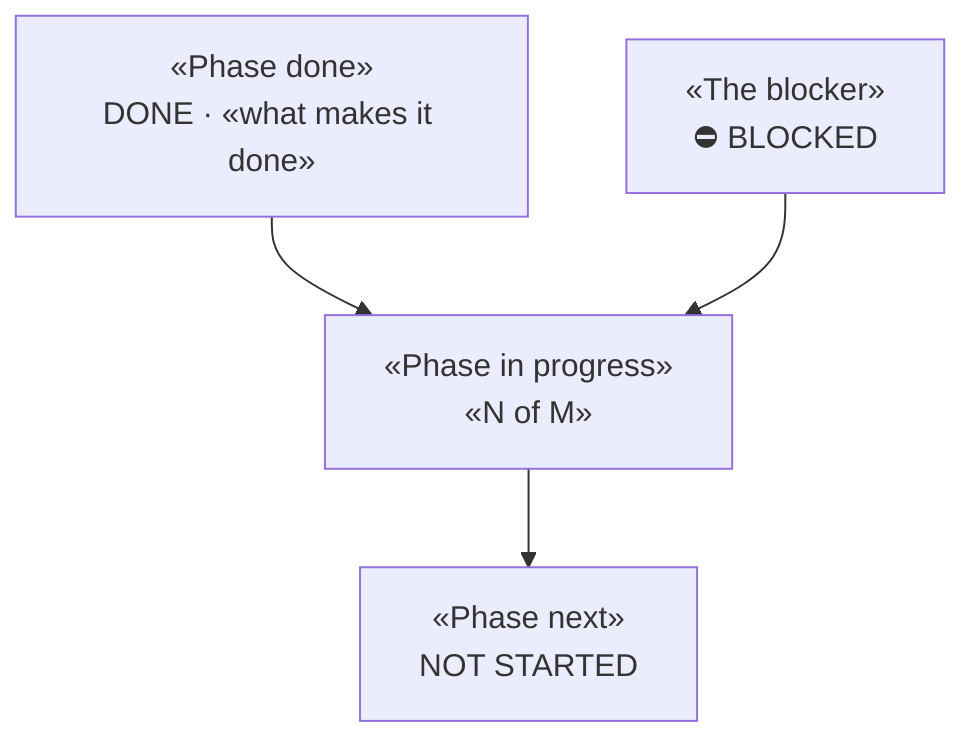
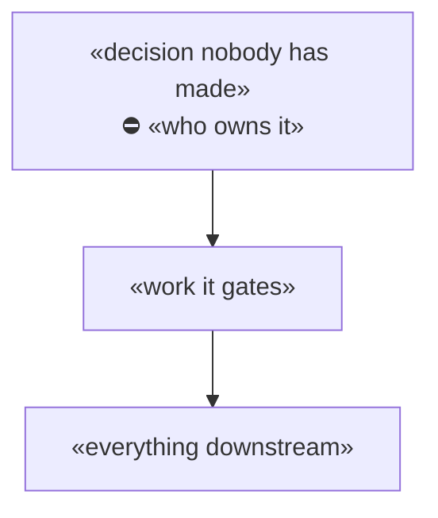

# Template — `docs/STATE.md`

Copy this to `docs/STATE.md` in a new project and fill it in. It is the **live state reflection**
of the project: the one page a reader opens to learn where things stand, and the page
`scripts/open-workspace.sh` opens in the right pane when the workspace launches.

**Six questions this file must answer.** If a section cannot be filled, say why — an admitted gap
is information, an omitted one is a trap.

| # | Question | Section below |
|---|---|---|
| 1 | Where is it now — past, present, next? | §1 phase diagram + §6 progress log |
| 2 | What must it do? | §2 functional requirements |
| 3 | What must be true of how it does it? | §2 non-functional requirements |
| 4 | What is blocked on what? | §3 dependency graph + §4 horizon chart |
| 5 | What decisions got us here? | §5 register, backlinked to `DECISIONS.md` |
| 6 | What is outstanding? | `TODO.md`, linked — **not duplicated here** |

**Delete this header block once filled in.** Everything below the line is the template proper.
Placeholders are in `«guillemets»`. Keep it to one page: a section past ten lines belongs in its
own document, backlinked from §7.

---
purpose: The one-page state of «project» — requirements at a glance, what is blocked on what, and backlinks to the detailed scope
update-trigger: A phase changes, a spike or milestone returns a verdict, a dependency clears or appears, or a requirement is accepted or refuted
last-verified: «YYYY-MM-DD»
status: current
---

# «Project» — state of the project

> **One page, by design.** Every section is a glance; the detail lives behind the backlinks in §7.

## 1 · Where the project is



«Two or three sentences: what exists, what does not, and where the critical path runs. Name the
one thing that would change this diagram most. Do not narrate the diagram — say what it implies.»

## 2 · Requirements at a glance

**Every row carries a source.** A requirement with no source is a preference, and preferences do
not survive contact with a stakeholder who disagrees.

| # | Functional — must | Source |
|---|---|---|
| F-a | «what it must do» | «doc §, ticket, or a dated conversation» |
| F-b | | |

| # | Non-functional — must | Anchor |
|---|---|---|
| N-a | «latency / cost / isolation / portability budget» | «the incident or measurement that sets it» |
| N-b | | |

**Non-functional rows are the ones that get skipped and then sink the project.** Anchor each to a
measurement or an incident, never to a round number someone liked.

## 3 · The blocking dependency



«What cannot proceed until this clears, and — explicitly — what *can* proceed in parallel. A
dependency section that does not name the unblocked work sends everybody home.»

## 4 · Time horizon

**Dates are review points, not estimates.** «Start «date» · 30-day «date» · 60-day «date» ·
90-day «date».»

```mermaid
gantt
  title «Project» — dependency chain against the review points
  dateFormat YYYY-MM-DD
  axisFormat %b %d

  section Blocked on a person
  «decision»            :crit, dec, «YYYY-MM-DD», 7d

  section Unblocked now
  «work needing nobody» :active, now1, «YYYY-MM-DD», 10d

  section Gated
  «downstream work»     :later, after dec, 5d

  section Deliverables
  «30-day review»       :milestone, m30, «YYYY-MM-DD», 0d
```

**Read the chart for one thing: which bars are blocked on a person, and which can proceed today.**
Say which is which in a sentence — the colours alone do not survive being screenshotted.

## 5 · Milestone decisions

The full register with rationale and revisit triggers is [`DECISIONS.md`](DECISIONS.md). Here, only
the ones that shaped the current design:

| id | Decision | Status | Why it mattered |
|---|---|---|---|
| «DL-001» | «what was decided» | `assumed` / `confirmed` | «what it ruled out» |

## 6 · Progress

**Newest first, dated.** The reasoning is in [`JOURNAL.md`](JOURNAL.md); this is the index.

| Date | Milestone reached |
|---|---|
| «YYYY-MM-DD» | «what became true, in one line» |

## 7 · Detailed scope — backlinks

| Document | Its single concern |
|---|---|
| [`TODO.md`](TODO.md) | Outstanding work — Now / Next / Backlog. **The only home for task state** |
| [`DECISIONS.md`](DECISIONS.md) | Every decision and assumption, with revisit triggers |
| [`JOURNAL.md`](JOURNAL.md) | Why the direction changed, newest first |
| «`SPEC.md`» | «use cases, scope boundaries» |

## 8 · Risks, with evidence

| Risk | Evidence |
|---|---|
| «what could sink it» | «the measurement, incident, or dated report — not a hunch»  |

**Speculation does not belong in this table.** A risk with no evidence is anxiety; move it to
`TODO.md` as "measure this" instead.
