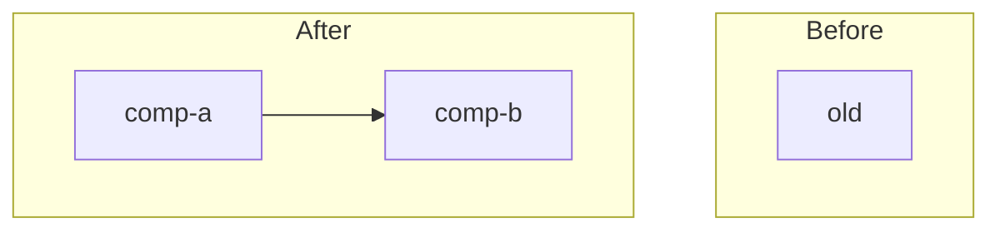
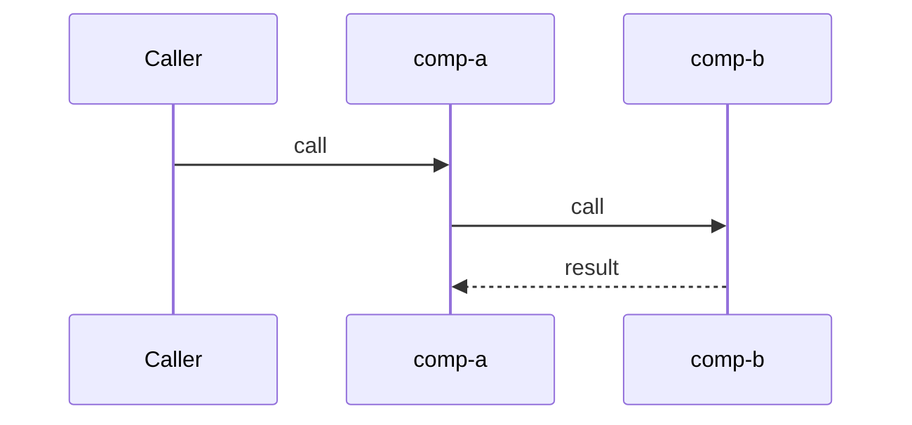

# demo: L1 architecture

```mermaid
flowchart TD
  subgraph Before
    B1[old]
  end
  subgraph After
    A1[comp-a] --> A2[comp-b]
  end
```

## Components
| Component | Role | Spec |
|---|---|---|
| comp-a | front | components.md |
| comp-b | back | components.md |

## Call chains
### Main

```mermaid
sequenceDiagram
  participant C as Caller
  participant A as comp-a
  participant B as comp-b
  C->>A: call
  A->>B: call
  B-->>A: result
```
